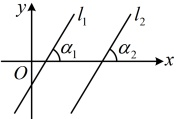
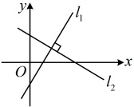

重合)，有 $ l_{1}\parallel l_{2}\Leftrightarrow k_{1}=k_{2} $。当 $ \alpha_{1}=\alpha_{2}=90^{\circ} $时，两条直线的斜率都不存在，此时也有 $ l_{1}\parallel l_{2} $。

注：若直线 $ l_{1} $， $ l_{2} $重合，此时仍有 $ k_{1}=k_{2} $或斜率不存在，因此在利用斜率翻译平行条件求参数时，需检验两直线是否重合．用斜率证明三点共线时，也常用到此结论.

### 2. 两条直线垂直的判定

如图，设两条直线  $ l_1 $， $ l_2 $ 的斜率分别为  $ k_1 $， $ k_2 $，则直线  $ l_1 $， $ l_2 $ 的方向向量分别是  $ \boldsymbol{a} = (1, k_1) $， $ \boldsymbol{b} = (1, k_2) $，于是有  $ l_1 \perp l_2 \Leftrightarrow \boldsymbol{a} \perp \boldsymbol{b} \Leftrightarrow \boldsymbol{a} \cdot \boldsymbol{b} = 0 \Leftrightarrow 1 \times 1 + k_1 k_2 = 0 \Leftrightarrow k_1 k_2 = -1 $，这就表明， $ l_1 \perp l_2 \Leftrightarrow k_1 k_2 = -1 $。

当直线 $ l_{1} $或 $ l_{2} $的倾斜角为 $ 90^{\circ} $时，若 $ l_{1}\perp l_{2} $，则另一条直线的倾斜角为 $ 0^{\circ} $；反之亦然.

综上可知，如果两条直线都有斜率且互相垂直，那么它们的斜率之积等于-1；反之，如果两条直线的斜率之积等于-1，那么它们互相垂直，即 $ l_1 \perp l_2 \Leftrightarrow k_1 k_2 = -1 $。

注：当两条直线的斜率都存在时，若两条直线垂直，则可用一条直线的斜率表示另一条直线的斜率.

A.  $ 30^{\circ} $ B.  $ 60^{\circ} $

C.  $ 120^{\circ} $ D.  $ 150^{\circ} $

解析：设直线 $l$ 的斜率为 $k$，倾斜角为 $\alpha$，

由题意，$k = \frac{-\sqrt{3}}{1} = -\sqrt{3} \Rightarrow \tan \alpha = -\sqrt{3}$，

结合 $0^\circ \leq \alpha < 180^\circ$ 可得 $\alpha = 120^\circ$。

答案：C

## 知识点4

【例 8】已知直线  $ l_1 $ 的倾斜角为  $ 45^\circ $，

直线  $ l_2 $ 经过  $ M(2,2) $， $ N(-2,-2) $ 两点，

且与  $ l_1 $ 不重合，判断  $ l_1 $ 与  $ l_2 $ 是否平行。

解：由题意， $ l_1 $ 的倾斜角为  $ 45^\circ $，

所以直线  $ l_1 $ 的斜率  $ k_1 = \tan 45^\circ = 1 $，

又  $ l_2 $ 过  $ M(2,2) $ 和  $ N(-2,-2) $，

所以  $ l_2 $ 的斜率  $ k_2 = \frac{-2 - 2}{-2 - 2} = 1 $，

因为  $ k_1 = k_2 $，且  $ l_1 $ 与  $ l_2 $ 不重合，

所以  $ l_1 $ 与  $ l_2 $ 平行。

【例 9】已知直线  $ l_1 $ 经过  $ A(2,-3) $， $ B(4,0) $ 两点，若直线  $ l_2 $ 与  $ l_1 $ 垂直，则直线  $ l_2 $ 的斜率为___。

解析：直线  $ l_1 $ 的斜率  $ k_1 = \frac{0 - (-3)}{4 - 2} = \frac{3}{2} $，

设直线  $ l_2 $ 的斜率为  $ k_2 $，因为  $ l_1 \perp l_2 $，

所以  $ k_1k_2 = -1 $，即  $ \frac{3}{2} \cdot k_2 = -1 $，故  $ k_2 = -\frac{2}{3} $。

答案： $ -\frac{2}{3} $

## 本节核心题型

本节的核心内容是直线的倾斜角、斜率的计算，以及用斜率判断直线的平行、垂直，为了巩固这些基础知识，我们设计了类型Ⅰ和类型Ⅱ这两组关于直线的倾斜角、斜率的计算题，又设计了类型Ⅲ和类型Ⅳ两组题来为大家分别讲解如何用斜率判断直线的平行、垂直.