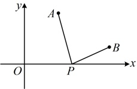
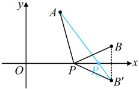

解：（1）由题意，直线 AC 的两点式方程为  $ \frac{y-3}{1-3}=\frac{x-2}{-2-2} $，化为一般式方程得  $ x-2y+4=0 $。

（2）解法1：（已有B的坐标，只要求出E的坐标，就能写出l的方程，怎么求？可先设E的坐标，翻译|BE|=3建立方程求所设坐标.注意到E在直线AC上，所以可利用其方程将点E的坐标设为单变量形式）直线AC的方程可化为x=2y-4，由题意，点E是直线l与AC的交点，所以点E在直线AC上，故可设其纵坐标y=a，则其横坐标x=2a-4，即E(2a-4,a)，

 $$ \left|BE\right|=\sqrt{(2a-4-0)^{2}+\left[a-(-1)\right]^{2}}=\sqrt{5a^{2}-14a+17} $$ 

由题意， $ |BE|=3 $，所以 $ \sqrt{5a^{2}-14a+17}=3 $，解得： $ a=\frac{4}{5} $或2，所以点E的坐标为 $ \left(-\frac{12}{5},\frac{4}{5}\right) $或 $ (0,2) $，

（两个解都可行吗？没有其它条件限制，都可行，下面分别求对应的直线 l 的方程）

当点 E 的坐标为  $ \left(-\frac{12}{5}, \frac{4}{5}\right) $ 时，直线 l 的斜率为  $ \frac{\frac{4}{5} - (-1)}{-\frac{12}{5} - 0} = -\frac{3}{4} $，所以其方程为  $ y = -\frac{3}{4}x - 1 $，即  $ 3x + 4y + 4 = 0 $；

当点 E 的坐标为  $ (0, 2) $ 时，B，E 两点都在 y 轴上，所以直线 l 即为 y 轴，故其方程为 x = 0；

 $$ 3x+4y+4=0 $$ 

解法2：（有 $B$ 的坐标，若能求出 $l$ 的斜率，也能求出 $l$ 的方程，故考虑设斜率，下面先看斜率不存在的情况）

当直线 $l$ 的斜率不存在时，其方程为 $x=0$，联立 $\begin{cases} x=0 \\ x-2y+4=0 \end{cases}$ 解得：$x=0$，$y=2$，所以 $E(0,2)$，

此时 $|BE|=|2-(-1)|=3$，满足题意；

当直线 $l$ 的斜率存在时，可设其方程为 $y = kx - 1$，联立 $\begin{cases} y = kx - 1 \\ x - 2y + 4 = 0 \end{cases}$ 解得：$x = \frac{6}{2k - 1}$，$y = \frac{4k + 1}{2k - 1}$，

所以 $E\left(\frac{6}{2k - 1}, \frac{4k + 1}{2k - 1}\right)$，故 $|BE| = \sqrt{\left(\frac{6}{2k - 1} - 0\right)^2 + \left[\frac{4k + 1}{2k - 1} - (-1)\right]^2} = \sqrt{\frac{36 + 36k^2}{(2k - 1)^2}}$，

由题意，$|BE| = 3$，所以 $\sqrt{\frac{36 + 36k^2}{(2k - 1)^2}} = 3$，解得：$k = -\frac{3}{4}$，故直线 $l$ 的方程为 $y = -\frac{3}{4}x - 1$，即 $3x + 4y + 4 = 0$；

综上所述，直线 $l$ 的方程为 $x = 0$ 或 $3x + 4y + 4 = 0$。

【例 9】已知函数  $ f(x)=\sqrt{x^2-4x+13}+\sqrt{x^2-10x+26} $，则  $ f(x) $ 的最小值为___.

解析：本题看着像是函数问题，与两点间的距离有关吗？可以想象，用函数的方法求  $ f(x) $ 的最小值不易，但观察发现  $ f(x) $ 的解析式中有两个根号，由此联想到平面两点间的距离公式，故尝试按此凑形式，

由题意， $ f(x)=\sqrt{(x-2)^2+9}+\sqrt{(x-5)^2+1} $，要凑出平面两点间距离公式的形式，需把根号内的 9 和 1 也化为两数之差的平方，怎么化？为了让问题的模型更简单，且结构统一，可将 9 看成  $ (0-3)^2 $，1 看成  $ (0-1)^2 $，

所以  $ f(x)=\sqrt{(x-2)^2+(0-3)^2}+\sqrt{(x-5)^2+(0-1)^2} $，记  $ P(x,0) $， $ A(2,3) $， $ B(5,1) $，则  $ f(x)=\left|PA\right|+\left|PB\right| $，

可发现 P 是 x 轴上的动点，A，B 是定点，故可尝试画图分析  $ \left|PA\right|+\left|PB\right| $ 的最小值。如图 1，A，B 两点在 x 轴同侧，不易看出 P 在何处时  $ \left|PA\right|+\left|PB\right| $ 最小，怎么办呢？我们知道，如果 A，B 在 x 轴两侧，则容易找到  $ \left|PA\right|+\left|PB\right| $ 何时最小，故可考虑把 B 对称到 x 轴下方来分析，

图1

图2

