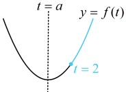
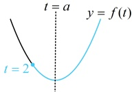

如图2，设$B'(5,-1)$为$B$关于$x$轴的对称点，则$|PB|=|PB'|$，所以$f(x)=|PA|+|PB|=|PA|+|PB'|$ ①，当$P$为线段$AB'$与$x$轴的交点$P_0$时，$|PA|+|PB'|$最小，且最小值为$|AB'|=\sqrt{(5-2)^2+(-1-3)^2}=5$，结合①可得$f(x)_{\min}=5$。

## 答案：5

【反思】①有时距离是隐藏在题干中的，没有明确给出（例如本题 $ f(x) $的解析式隐含了距离），需要自己去发现；②求直线上的一动点到该直线同侧两定点距离之和的最小值，常将其中一个定点对称到直线的另一侧去分析，这是初中学过的典型的“将军饮马”模型.

【变式】（多选）在平面直角坐标系 xOy 中，有一定点  $ A(a,a) $，点 P 是函数  $ y=\frac{1}{x}(x>0) $ 图象上的一个动点，若点 P，A 之间的最短距离为  $ 2\sqrt{2} $，则满足条件的 a 可以为（ ）

A. -1          B. 3          C.  $ \sqrt{10} $        D.  $ -2\sqrt{5} $

解析：条件给出  $ |PA|_{\min} = 2\sqrt{2} $，故考虑研究何时  $ |PA| $ 最小， $ A $ 的坐标已给，于是先设  $ P $ 的坐标，表示  $ |PA| $，因为点  $ P $ 是函数  $ y = \frac{1}{x}(x > 0) $ 图象上的一点，所以可设  $ P\left(x, \frac{1}{x}\right) $， $ x > 0 $，故  $ |PA| = \sqrt{(x-a)^2 + \left(\frac{1}{x}-a\right)^2} = \sqrt{x^2 + \frac{1}{x^2} - 2a\left(x + \frac{1}{x}\right) + 2a^2} $ ①，如何研究上式的最小值？只需看根号内的部分，注意到  $ \left(x + \frac{1}{x}\right)^2 = x^2 + \frac{1}{x^2} + 2 $，所以可通过将  $ x + \frac{1}{x} $ 换元成  $ t $，把根号内的部分化为关于  $ t $ 的二次函数来分析，设  $ t = x + \frac{1}{x} $，则  $ t^2 = x^2 + \frac{1}{x^2} + 2 $，所以  $ x^2 + \frac{1}{x^2} = t^2 - 2 $，代入①得  $ |PA| = \sqrt{t^2 - 2 - 2at + 2a^2} = \sqrt{t^2 - 2at + 2a^2 - 2} $，因为  $ x > 0 $，所以  $ t = x + \frac{1}{x} \geq 2\sqrt{x \cdot \frac{1}{x}} = 2 $，取等条件是  $ x = \frac{1}{x} $，即  $ x = 1 $，故  $ t $ 的取值范围是  $ [2, +\infty) $，对于二次函数  $ f(t) = t^2 - 2at + 2a^2 - 2 $，其对称轴为  $ t = a $，开口向上，那么  $ a $ 与 2 大小关系不同， $ f(t) $ 取最小值的地方也就不同，故据此讨论，当  $ a < 2 $ 时，如图 1，在  $ [2, +\infty) $ 上， $ f(t)_{\min} = f(2) = 2a^2 - 4a + 2 $，所以  $ \left|PA\right|_{\min} = \sqrt{f(t)_{\min}} = \sqrt{2a^2 - 4a + 2} $，由题意， $ \left|PA\right|_{\min} = 2\sqrt{2} $，所以  $ \sqrt{2a^2 - 4a + 2} = 2\sqrt{2} $，解得： $ a = -1 $ 或 3，结合  $ a < 2 $ 可得  $ a = -1 $；当  $ a \geq 2 $ 时，如图 2，在  $ [2, +\infty) $ 上， $ f(t)_{\min} = f(a) = a^2 - 2 $，所以  $ \left|PA\right|_{\min} = \sqrt{a^2 - 2} $，故  $ \sqrt{a^2 - 2} = 2\sqrt{2} $，解得： $ a = \pm\sqrt{10} $，结合  $ a \geq 2 $ 得  $ a = \sqrt{10} $；综上所述，实数  $ a $ 的值可以为 -1 或  $ \sqrt{10} $。

图2

答案：AC

类型III：点到直线距离公式的应用

【例 10】若点  $ A(3,4) $， $ B(5,3) $ 到直线  $ l: 2x + ay + 1 = 0 $ 的距离相等，则  $ a = (\quad) $