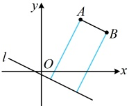
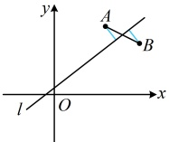

A. 4 B. -4 C.  $ 4 \pm \frac{18}{7} $ D. -4 或  $ \frac{18}{7} $

解法1：条件给出 $A, B$ 到直线 $l$ 距离相等，该距离又能用点到直线的距离公式计算，故由此可建立方程求 $a$。

由题意，$\frac{|2\times3+a\cdot4+1|}{\sqrt{2^2+a^2}}=\frac{|2\times5+a\cdot3+1|}{\sqrt{2^2+a^2}}$，所以 $|4a+7|=|3a+11|$，

故 $4a+7=3a+11$ 或 $4a+7=-3a-11$，解得：$a=4$ 或 $-\frac{18}{7}$。

解法2：可以想象，A，B两点到直线l的距离相等，有两种情况：AB∥l，如图1；或AB中点在l上，如图2；故也可分这两种情况来考虑，

若为图1，则  $ AB \parallel l $，由题意， $ k_{AB} = \frac{3 - 4}{5 - 3} = -\frac{1}{2} $，所以  $ l $ 的斜率存在，即  $ a \ne 0 $

此时 $l$ 的方程可化为 $y = -\frac{2}{a}x - \frac{1}{a} \Rightarrow l$ 的斜率为 $-\frac{2}{a}$，所以 $-\frac{2}{a} = -\frac{1}{2}$，解得：$a = 4$；

若为图2，则直线 $l$ 过 $AB$ 中点，由题意，$AB$ 中点为 $\left(4,\frac{7}{2}\right)$，代入 $l$ 的方程得 $2\times4+a\cdot\frac{7}{2}+1=0\Rightarrow a=-\frac{18}{7}$；

综上所述，$a=4$ 或 $-\frac{18}{7}$。

图1

图2

答案：C

【反思】若有点的坐标 $ (x_0, y_0) $和直线的方程 $ Ax + By + C = 0 $，可考虑代点到直线的距离公式 $ d = \frac{|Ax_0 + By_0 + C|}{\sqrt{A^2 + B^2}} $计算点到直线的距离，我们通过下面两个变式来巩固一下。另外，在一些涉及面积的问题中，也可能会用到这一公式，比如后面的例11及其变式。

【变式 1】点  $ P(3,2) $ 到直线  $ l: \lambda x + y - 2\lambda + 1 = 0 (\lambda \in \mathbb{R}) $ 的距离的最大值为（ ）

A. 10 B.  $ \sqrt{26} $ C. 4 D.  $ \sqrt{10} $

解法1：题干涉及点到直线的距离，可先代公式表示出该距离，再研究最大值，

解法1：题干涉及点到直线的距离，可先代公式表示出该距离，再研究最大值，由题意，点P到直线l的距离 $ d=\frac{\left|\lambda\cdot3+2-2\lambda+1\right|}{\sqrt{\lambda^{2}+1^{2}}}=\frac{\left|\lambda+3\right|}{\sqrt{\lambda^{2}+1}} $，

如何求上式的最大值？分子分母都含有  $ \lambda $，可考虑将分子的  $ |\lambda+3| $ 拿进根号，放到一起来看，所以  $ d=\frac{|\lambda+3|}{\sqrt{\lambda^2+1}}=\sqrt{\frac{(\lambda+3)^2}{\lambda^2+1}}=\sqrt{\frac{\lambda^2+6\lambda+9}{\lambda^2+1}} $ ①，

根号内为“ $ \frac{二次函数}{二次函数} $”的结构，可通过折项化为“ $ \frac{一次函数}{二次函数} $”的形式，再换元处理，

由①得  $ d = \sqrt{\frac{\lambda^2 + 1 + 6\lambda + 8}{\lambda^2 + 1}} = \sqrt{1 + \frac{2(3\lambda + 4)}{\lambda^2 + 1}} $，令  $ t = 3\lambda + 4 $，则  $ \lambda = \frac{t - 4}{3} \Rightarrow d = \sqrt{1 + \frac{2t}{\left(\frac{t - 4}{3}\right)^2 + 1}} = \sqrt{1 + \frac{18t}{t^2 - 8t + 25}} $。

观察发现  $ t^2 - 8t + 25 > 0 $，于是  $ d $ 的最大值肯定在  $ t > 0 $ 时取得，所以重点分析这种情况，