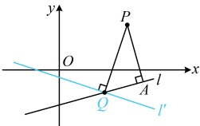
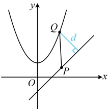

当  $ t \leq 0 $ 时， $ d \leq 1 $；当  $ t > 0 $ 时， $ d = \sqrt{1 + \frac{18t}{t^2 - 8t + 25}} = \sqrt{1 + \frac{18}{t + \frac{25}{t} - 8}} $，

因为  $ t + \frac{25}{t} \geq 2\sqrt{t \cdot \frac{25}{t}} = 10 $，所以  $ d = \sqrt{1 + \frac{18}{t + \frac{25}{t} - 8}} \leq \sqrt{1 + \frac{18}{t - 8}} = \sqrt{10} $，取等条件是  $ t = \frac{25}{t} $，即  $ t = 5 $；

因为  $ \sqrt{10} > 1 $，所以点  $ P $ 到直线  $ l $ 的距离的最大值为  $ \sqrt{10} $。

解法2：观察发现直线/是过定点的直线，其图形特征比较清晰，故也可尝试画图分析，

直线 l 的方程可化为  $ \lambda(x-2)+(y+1)=0 $

直线  $ l $ 的方程可化为  $ x(x-2)+(y+1)=0 $，

令  $ \begin{cases} x-2=0 \\ y+1=0 \end{cases} $ 得  $ \begin{cases} x=2 \\ y=-1 \end{cases} $，所以直线  $ l $ 过定点  $ Q(2,-1) $，

如图， $ l $ 绕点  $ Q $ 旋转的过程中，作  $ PA \perp l $ 于点  $ A $，

则在  $ \triangle PAQ $ 中，斜边  $ PQ $ 比直角边  $ PA $ 长，

所以当  $ l $ 与  $ l' $ 重合时，点  $ P $ 到直线  $ l $ 的距离最大，

且最大值为  $ |PQ| = \sqrt{(2-3)^2 + (-1-2)^2} = \sqrt{10} $。

答案：D

【反思】当直线 $l$ 绕定点 $Q$ 旋转时，直线外的点 $P$ 到 $l$ 的距离的最大值等于 $|PQ|$（原因见上面的解析），这一模型比较常见，可以熟悉。

【变式 2】若动点 $P$ 在直线 $l: y = x - 1$ 上，动点 $Q$ 在曲线 $C: y = x^2 + 1$ 上，则 $|PQ|$ 的最小值为___。

解析：直线 $l$ 和曲线 $C$ 都容易画出，可先画图看看。如图，$P$，$Q$ 都是动点，不易直接看出何时 $|PQ|$ 最小，怎么办呢？涉及两个动点，可考虑先固定一个，固定谁？定点到直线上的动点的距离最小值更好分析，于是固定 $Q$，对曲线 $C$ 上任意的点 $Q$，当 $P$ 在 $l$ 上运动时，总有 $PQ \perp l$ 时，$|PQ|$ 最小，此时 $|PQ|$ 即为点 $Q$ 到直线 $l$ 的距离，故只需求点 $Q$ 到直线 $l$ 距离的最小值，

涉及到直线的距离，可考虑设 $Q$ 的坐标，用点到直线的距离公式来表示该距离，再作分析，因为点 $Q$ 在曲线 $y = x^2 + 1$ 上，所以可设 $Q(a, a^2 + 1)$，直线 $l$ 的方程可化为 $x - y - 1 = 0$，因此点 $Q$ 到直线 $l$ 的距离 $d = \frac{|a - (a^2 + 1) - 1|}{\sqrt{1^2 + (-1)^2}} = \frac{|a^2 - a + 2|}{\sqrt{2}} = \frac{(a - \frac{1}{2})^2 + \frac{7}{4}}{\sqrt{2}}$，因为 $\left(a - \frac{1}{2}\right)^2 + \frac{7}{4} \geq \frac{7}{4}$，所以 $d = \frac{\left(a - \frac{1}{2}\right)^2 + \frac{7}{4}}{\sqrt{2}} \geq \frac{\frac{7}{4}}{\sqrt{2}} = \frac{7\sqrt{2}}{8}$，当且仅当 $a = \frac{1}{2}$ 时取等号，所以 $|PQ|$ 的最小值为 $\frac{7\sqrt{2}}{8}$。答案：$\frac{7\sqrt{2}}{8}$【例 11】已知四边形 $ABCD$ 的顶点分别为 $A(1, -1)$，$B(2, 2)$，$C(-1, 5)$，$D(-2, 2)$，则四边形 $ABCD$ 的面积为（ ）

A. 24

B. $12\sqrt{2}$

C. 12

D. 6

解析：求面积前应先分析四边形 ABCD 的形状，可考虑将 A, B, C, D 四点画出来，再作观察。如图，可猜测四边形 ABCD 是平行四边形，故尝试证明，怎么证？只需证 AB∥CD，AD∥BC，