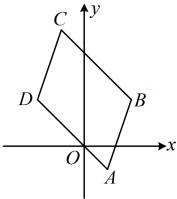

由题意， $ k_{AB} = \frac{2 - (-1)}{2 - 1} = 3 $， $ k_{CD} = \frac{2 - 5}{-2 - (-1)} = 3 $， $ k_{AD} = \frac{2 - (-1)}{-2 - 1} = -1 $， $ k_{BC} = \frac{5 - 2}{-1 - 2} = -1 $，

所以  $ k_{AB} = k_{CD} $， $ k_{AD} = k_{BC} $，且  $ k_{AB} \neq k_{AD} $，从而  $ AB \parallel CD $， $ AD \parallel BC $，故四边形  $ ABCD $ 是平行四边形，求平行四边形的面积，需要其底边长和高，不妨以  $ AD $ 为底边，则底边长可由平面两点间距离公式计算，那高呢？高可看成点  $ B $ 到直线  $ AD $ 的距离，可由点到直线的距离公式计算，

 $ \left| AD \right| = \sqrt{(-2 - 1)^2 + [2 - (-1)]^2} = 3\sqrt{2} $， $ AD $ 的方程为  $ y - (-1) = -1 \cdot (x - 1) $，即  $ x + y = 0 $，

由点到直线的距离公式，点  $ B $ 到直线  $ AD $ 的距离  $ d = \frac{|2 + 2|}{\sqrt{1^2 + 1^2}} = 2\sqrt{2} $，

所以四边形  $ ABCD $ 的面积  $ S = |AD| \cdot d = 3\sqrt{2} \times 2\sqrt{2} = 12 $。

答案：C

【变式】在平面直角坐标系 xOy 中，已知  $ \triangle ABC $ 的三个顶点分别为  $ A(m,n) $， $ B(4,-1) $， $ C(2,1) $。

（1）求直线 BC 的方程；

（2）若 $ \triangle ABC $的面积为2，且点 $ A $在直线 $ l:x-y-5=0 $上，求点 $ A $的坐标.

解：（1）由题意，直线 BC 的两点式方程为  $ \frac{y-(-1)}{1-(-1)}=\frac{x-4}{2-4} $，化为一般式方程得  $ x+y-3=0 $。

（2）（点 $A$ 的坐标中有 2 个未知数，需要建立两个方程，由 $A$ 在 $l$ 上可建立一个，另一个呢？条件给出 $\triangle ABC$ 的面积，可以 $BC$ 为底边，点 $A$ 到直线 $BC$ 的距离为高计算该面积，从而建立第二个方程）

因为点 $A(m,n)$ 在直线 $l: x - y - 5 = 0$ 上，所以 $m - n - 5 = 0$ ①，

又 $|BC| = \sqrt{(2-4)^2 + [1-(-1)]^2} = 2\sqrt{2}$，点 $A$ 到直线 $BC$ 的距离 $d = \frac{|m+n-3|}{\sqrt{1^2+1^2}} = \frac{|m+n-3|}{\sqrt{2}}$，

所以 $S_{\triangle ABC} = \frac{1}{2}|BC| \cdot d = \frac{1}{2} \times 2\sqrt{2} \times \frac{|m+n-3|}{\sqrt{2}} = |m+n-3|$，由题意，$S_{\triangle ABC} = 2$，所以 $|m+n-3| = 2$，

从而 $m+n-3=2$ 或 $m+n-3=-2$，故 $m+n-5=0$ 或 $m+n-1=0$，

若 $m+n-5=0$，则结合①可解得 $m=5$，$n=0$，所以 $A(5,0)$；

若 $m+n-1=0$，则结合①可解得 $m=3$，$n=-2$，所以 $A(3,-2)$；

综上所述，点 A 的坐标为 (5,0) 或 (3,-2).

## 类型IV：两条平行线间距离公式的应用

【例 12】已知直线  $ l_1: 6x + (t-1)y - 8 = 0 $， $ l_2: (t+4)x + (t+6)y - 16 = 0 $，若  $ l_1 \parallel l_2 $，求实数  $ t $ 的值，并求出此时两直线间的距离。

解： $ (l_{1}//l_{2} $ 可翻译为  $ l_{1} $ 与  $ l_{2} $ 的斜率相等，由此建立关于 t 的方程，但观察发现这里  $ l_{1} $， $ l_{2} $ 都可能斜率不存在，故需单独考虑这种特殊情况）

当t-1=0或 $ t+6=0 $，即t=1或t=-6时，经检验，直线 $ l_{1} $与 $ l_{2} $不平行，不合题意；

当$t \ne 1$且$t \ne -6$时，将直线$l_1$与$l_2$化为斜截式方程可得$l_1: y = \frac{6}{1-t}x - \frac{8}{1-t}$，$l_2: y = -\frac{t+4}{t+6}x + \frac{16}{t+6}$，所以直线$l_1$与$l_2$的斜率分别为$\frac{6}{1-t}$，$-\frac{t+4}{t+6}$，因为$l_1 \parallel l_2$，所以$\frac{6}{1-t} = -\frac{t+4}{t+6}$，解得：$t = 8$或$-5$；

当t=8时， $ l_{1}:6x+7y-8=0 $， $ l_{2}:6x+7y-8=0 $，所以 $ l_{1} $与 $ l_{2} $重合，不合题意；

当t=-5时， $ l_{1}:3x-3y-4=0 $， $ l_{2}:x-y+16=0 $，所以 $ l_{1} $与 $ l_{2} $不重合，故 $ l_{1}\parallel l_{2} $