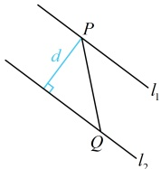

（再求  $ l_1 $ 与  $ l_2 $ 之间的距离，注意到二者方程中  $ x $ 和  $ y $ 的系数不同，故代公式前应先化为相同）

 $ l_2 $ 的方程可化为  $ 3x - 3y + 48 = 0 $，由两平行线间的距离公式， $ l_1 $ 与  $ l_2 $ 之间的距离  $ d = \frac{|-4 - 48|}{\sqrt{3^2 + (-3)^2}} = \frac{26\sqrt{2}}{3} $；

综上所述，实数  $ t $ 的值为 -5，此时两直线间的距离为  $ \frac{26\sqrt{2}}{2} $。

【反思】若两平行直线的方程分别为  $ Ax + By + C_1 = 0 $ 与  $ Ax + By + C_2 = 0 $，则可利用两平行线间的距离公式  $ d = \frac{|C_1 - C_2|}{\sqrt{A^2 + B^2}} $ 求它们之间的距离。再次提醒，在使用该公式时一定要把两直线方程中  $ x $,  $ y $ 的系数对应调整一致。本题是直接让求两平行线间的距离，有的题不会这么直白，而是将该距离隐藏在问题中，我们来看两个变式。

【变式 1】已知动点  $ P $， $ Q $ 分别在直线  $ l_1: 3x + 4y - 5 = 0 $ 和直线  $ l_2: 3x + 4y + 10 = 0 $ 上运动，则  $ |PQ| $ 的最小值为___.

解析：观察发现直线  $ l_1 $， $ l_2 $ 中  $ x $ 和  $ y $ 的系数对应相同，且常数项不同，所以两直线平行，我们不妨先画图，看能否找到何时  $ |PQ| $ 最小，

如图，$P$，$Q$ 分别在 $l_1$，$l_2$ 上运动时，总有 $PQ \perp l_1$ 和 $l_2$ 时，$|PQ|$ 最小，

此时 $|PQ|$ 即为平行线 $l_1$ 与 $l_2$ 之间的距离 $d$，所以 $|PQ|_{\min} = d = \frac{|-5-10|}{\sqrt{3^2 + 4^2}} = 3$。

答案：3

【反思】当两个点分别在两条平行线上运动时，它们之间距离的最小值等于这两条平行线之间的距离.

【变式 2】已知 m, n, p, q 均为实数，则  $ \sqrt{(m-p)^2 + (n-p-1)^2} + \sqrt{(m-q)^2 + (n-q-3)^2} $ 的最小值为（ ）

A. 1 \quad B.  $ \sqrt{2} $ \quad C.  $ \sqrt{3} $ \quad D. 2

解析：由目标式的形式联想到两点之间的距离公式，于是我们先把对应的点写出来，再作观察，

设  $ P(m,n) $， $ A(p,p+1) $， $ B(q,q+3) $，则  $ \sqrt{(m-p)^2+(n-p-1)^2} + \sqrt{(m-q)^2+(n-q-3)^2} = |PA| + |PB| $，

故只需求  $ |PA| + |PB| $ 的最小值，怎么求？先看  $ P $，其横坐标  $ m $ 和纵坐标  $ n $ 无关，所以点  $ P $ 可任意运动，再看  $ A $， $ B $，与  $ P $ 不同，它们的横、纵坐标有关系，故尝试翻译此关系，找到  $ A $， $ B $ 的运动规律，如何翻译？以  $ A $ 为例，我们可以设  $ A $ 的坐标为  $ (x, y) $，结合所给坐标寻找  $ x $， $ y $ 满足的关系，

设  $ A(x,y) $，与  $ A(p,p+1) $ 对比可得  $ \begin{cases} x=p\tag{①} \\ y=p+1\end{cases} $，将①代入②消去 p 得  $ y=x+1 $，即  $ x-y+1=0 $，

所以  $ A $ 为直线  $ l_1:x-y+1=0 $ 上的动点，同理， $ B $ 为直线  $ l_2:x-y+3=0 $ 上的动点，

不难发现  $ l_1 \parallel l_2 $。图形比较特殊，故接下来可尝试画图分析何时  $ |PA|+|PB| $ 最小。

如图1，当P在平面内运动时，由三角形的两边之和大于第三边， $ |PA| + |PB| \geq |AB| $ ③，

 $$ \left|A B\right| $$ 

直线  $ l_{1} $ 与  $ l_{2} $ 之间的距离  $ d = \frac{|1 - 3|}{\sqrt{1^{2} + (-1)^{2}}} = \sqrt{2} $，由图 1 可知， $ \left|AB\right| \geq d = \sqrt{2} $。

结合③得 $ |PA| + |PB| \geq \sqrt{2} $，取等条件是P在线段AB上，且 $ AB \perp l_1 $和 $ l_2 $，如图2，所以 $ \sqrt{(m-p)^2 + (n-p-1)^2} + \sqrt{(m-q)^2 + (n-q-3)^2} $的最小值为 $ \sqrt{2} $。