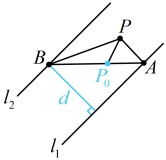
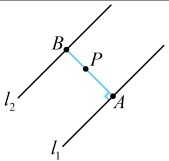

图1

图2

答案：B

## 补充、拓展

本节有的题涉及的条件较多，需要画出图形综合分析，才能找到解题的思路，我们通过下面的类型V来给大家拓展这类题.

类型V：综合大题

【例 13】在$\triangle ABC$中，已知$B(-4,0)$，$AB$边上的中线$CD$所在直线的方程是$x+2y-1=0$，边$BC$上的高$AE$所在直线的方程是$7x-y-12=0$。

（1）求点C的坐标；

（2）判断 $ \triangle ABC $的形状.

解：（1）（题干比较抽象，不易找到解题方向，可尝试画出图形，标出已知条件，寻找思路.如图1，题干给出了直线CD的方程，故若能再找到一条过点C的直线的方程，就能求出C的坐标，选哪条？从图1上看，不外乎AC或BC，结合已知条件可发现BC过点B(-4,0)，其斜率又能由BC⊥AE求得，故选BC)

直线 $AE$ 的方程为 $y=7x-12$，所以 $k_{AE}=7$，由题意，$AE \perp BC$，所以 $k_{BC}=-\frac{1}{k_{AE}}=-\frac{1}{7}$，

结合点 $B$ 的坐标为 $(-4,0)$ 可得直线 $BC$ 的点斜式方程为 $y-0=-\frac{1}{7}[x-(-4)]$，整理得：$x+7y+4=0$，

联立 $ \left\{\begin{aligned}&x+2y-1=0\\ &x+7y+4=0\end{aligned}\right. $ 解得： $ \left\{\begin{aligned}x=3\\ y=-1\end{aligned}\right. $，所以点C的坐标为 $ (3,-1) $.

（2）（B，C的坐标都有了，若能再求出A的坐标，就能较为准确地画出△ABC，猜测其形状，再证明，怎样求A的坐标？由图1可知，A在直线7x-y-12=0上，由此可将A的坐标设成单变量形式，求出AB中点D的坐标，代入直线CD的方程，求解所设变量）

直线 AE 的方程可化为 y=7x-12，点 A 在该直线上，所以可设  $ A(a,7a-12) $，

因为D为AB中点，所以 $ D\left(\frac{a-4}{2},\frac{7a-12}{2}\right) $，又因为D在直线CD:x+2y-1=0上，

所以 $ \frac{a-4}{2}+2\cdot\frac{7a-12}{2}-1=0 $，解得：a=2，故 $ A(2,2) $，

（△ABC 在坐标系下的图形如图2，可猜测  $ AB \perp AC $，故尝试证明）

因为 $ k_{AB}=\frac{0-2}{-4-2}=\frac{1}{3} $， $ k_{AC}=\frac{-1-2}{3-2}=-3 $，所以 $ k_{AB}k_{AC}=\frac{1}{3}\times(-3)=-1 $，从而 $ AB\perp AC $，故 $ \triangle ABC $是直角三角形.