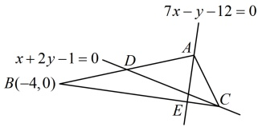
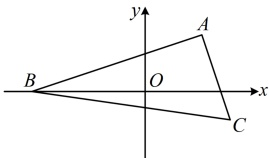
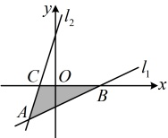

图1

图2

【反思】在一些综合问题中，题干涉及的条件较为复杂，此时往往难以找到解题的入口，可尝试画出草图、标出已知条件，寻找解题思路。

【例 14】已知直线  $ l_1: y = kx + b $， $ l_2: x = ky + b $， $ k \in (0,1) $， $ b \ne 0 $。

（1）证明： $ l_{1} $ 与  $ l_{2} $ 的交点不在 x 轴上；

（2）设 $ l_1 $与 $ l_2 $交于点 $ A $， $ l_1 $， $ l_2 $分别与 $ x $轴交于点 $ B $， $ C $，记 $ \triangle ABC $的面积为 $ S $，求 $ \frac{S}{b^2} $的最小值。

解：（1）（要证 $ l_1 $与 $ l_2 $的交点不在 $ x $轴上，可先求出交点的纵坐标，再证明其不为0）

将 $ x=ky+b $代入 $ y=kx+b $消去 $ x $整理得： $ (1-k^2)y=b(k+1) $①，

因为 $ k\in(0,1) $，所以 $ 1-k^2\neq0 $，故由①可得 $ y=\frac{b(k+1)}{1-k^2}=\frac{b(k+1)}{(1+k)(1-k)}=\frac{b}{1-k} $，

因为 $ b\neq0 $，所以 $ \frac{b}{1-k}\neq0 $，故 $ l_1 $与 $ l_2 $的交点不在 $ x $轴上。

（2）（目标式涉及$\triangle ABC$的面积$S$，为了找到如何计算$S$，可先画图看看。如图，可以$BC$为底边求$S$，则$|BC|$可由$B$，$C$两点的横坐标求得，高可由$A$的纵坐标求得，下面先求$B$，$C$的横坐标）

联立$\begin{cases}y=kx+b\\y=0\end{cases}$解得：$x=-\frac{b}{k}$，所以$B\left(-\frac{b}{k},0\right)$，联立$\begin{cases}x=ky+b\\y=0\end{cases}$解得：$x=b$，所以$C(b,0)$，

故$|BC|=\left|-\frac{b}{k}-b\right|=\left|\frac{b(1+k)}{k}\right|$，又点$A$到直线$BC$的距离$d=\left|\frac{b}{1-k}\right|$，

所以$\triangle ABC$的面积$S=\frac{1}{2}\left|BC\right|\cdot d=\frac{1}{2}\cdot\left|\frac{b(1+k)}{k}\right|\cdot\left|\frac{b}{1-k}\right|=\left|\frac{b^{2}(1+k)}{2k(1-k)}\right|=\frac{b^{2}(1+k)}{2k(1-k)}$

故$\frac{S}{b^{2}}=\frac{1+k}{2k(1-k)}$，（涉及“$\frac{\text{一次函数}}{\text{二次函数}}$”，可将“一次函数”换元成$t$，再上下同除以$t$）

令$t=1+k$，则$t\in(1,2)$，且$k=t-1$，所以$\frac{S}{b^{2}}=\frac{t}{2(t-1)[1-(t-1)]}=\frac{t}{2(t-1)(2-t)}=\frac{t}{2(3t-t^{2}-2)}=\frac{1}{2\left[3-\left(t+\frac{2}{t}\right)\right]}$

因为$t+\frac{2}{t}\geq2\sqrt{t\cdot\frac{2}{t}}=2\sqrt{2}$，所以$\frac{S}{b^{2}}\geq\frac{1}{2(3-2\sqrt{2})}=\frac{3+2\sqrt{2}}{2(3-2\sqrt{2})(3+2\sqrt{2})}=\frac{3+2\sqrt{2}}{2}$，

当且仅当$t=\frac{2}{t}$，即$t=\sqrt{2}$时取等号，满足$t\in(1,2)$，所以$\frac{S}{b^{2}}$的最小值为$\frac{3+2\sqrt{2}}{2}$。

## 强化训练

## A 组 夯实基础

1. (2025 · 贵州贵阳模拟)

直线 $ l_{1}:2x-y=1 $与直线 $ l_{2}:-3x+2y=1 $的交点坐标为___.