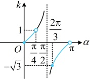

类型 I：直线的倾斜角、斜率的相互转化

【例 10】若  $ \theta \in \left(-\frac{\pi}{2}, \frac{\pi}{2}\right] $，则经过  $ O(0,0) $， $ P(\sin\theta, \cos\theta) $ 两点的直线  $ l $ 的倾斜角为___。

解析：给出直线上两点的坐标，可先求其斜率，再由斜率反推倾斜角，

因为直线 $l$ 过 $O(0,0)$，$P(\sin\theta,\cos\theta)$ 两点，所以其斜率 $k=\frac{\cos\theta-0}{\sin\theta-0}=\frac{\cos\theta}{\sin\theta}$ ①，

斜率是倾斜角的正切值，故要求1的倾斜角，考虑将上式化为正切，可用诱导公式实现，

由①可得  $ k = \frac{\sin\left(\frac{\pi}{2} - \theta\right)}{\cos\left(\frac{\pi}{2} - \theta\right)} = \tan\left(\frac{\pi}{2} - \theta\right) $，直线  $ l $ 的倾斜角一定是  $ \frac{\pi}{2} - \theta $ 吗？还要看  $ \frac{\pi}{2} - \theta $ 的范围是否在  $ [0,\pi) $ 上，因为  $ \theta \in\left(-\frac{\pi}{2}, \frac{\pi}{2}\right] $，所以  $ \frac{\pi}{2} - \theta \in[0,\pi) $，结合  $ k = \tan\left(\frac{\pi}{2} - \theta\right) $ 得直线  $ l $ 的倾斜角为  $ \frac{\pi}{2} - \theta $。

答案： $ \frac{\pi}{2}-\theta $

【反思】直线的倾斜角与斜率是紧密联系的，当直接求倾斜角不易时，可考虑先求斜率，再反推倾斜角。已知斜率的范围时，也可反推倾斜角的范围（如下面的变式）；由倾斜角也能求斜率（如后面的例11和变式）。

【变式】已知直线  $ l $ 的斜率为  $ k $，且  $ -\sqrt{3} \leq k < 1 $，则直线  $ l $ 的倾斜角的取值范围是___。

解析：所给斜率的范围中有正有负，则倾斜角有锐有钝，为了准确找到其范围，我们画正切函数的图象来看，设直线 $l$ 的倾斜角为 $\alpha$，则 $k = \tan \alpha$，函数 $k = \tan \alpha$ 在 $[0, \pi)$ 上的大致图象如图，由图可知，当 $-\sqrt{3} \leq k < 0$ 时，$\alpha \in \left[\frac{2\pi}{3}, \pi\right)$，当 $0 \leq k < 1$ 时，$\alpha \in \left[0, \frac{\pi}{4}\right)$，所以直线 $l$ 的倾斜角的取值范围是 $\left[0, \frac{\pi}{4}\right) \cup \left[\frac{2\pi}{3}, \pi\right)$。

答案： $ \left[0,\frac{\pi}{4}\right)\cup\left[\frac{2\pi}{3},\pi\right) $

【例 11】若经过两点  $ A(3,y+1) $， $ B(2,-1) $ 的直线 l 的倾斜角为  $ \frac{\pi}{4} $，则 y = （）

A. -3 B. 2 C. 0 D. -1

解析：已知倾斜角，可先求斜率，而斜率又能用所给的  $ A $， $ B $ 的坐标表示，故而能建立方程求  $ y $，因为直线  $ l $ 的倾斜角为  $ \frac{\pi}{4} $，所以  $ l $ 的斜率  $ k = \tan \frac{\pi}{4} = 1 $，

又因为直线 l 过  $ A(3,y+1) $， $ B(2,-1) $ 两点，所以  $ k=\frac{y+1-(-1)}{3-2}=y+2 $，故  $ y+2=1 $，解得：y=-1。

答案：D

【变式】已知直线 $l$ 经过 $P(2,1)$，$Q(4,5)$ 两点，直线 $m$ 的倾斜角是直线 $l$ 的倾斜角的 2 倍，则直线 $m$ 的斜率为（ ）

A. $-\frac{4}{3}$      B. $\frac{4}{3}$      C. $-\frac{4}{5}$      D. $\frac{4}{5}$