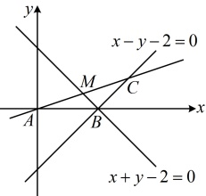
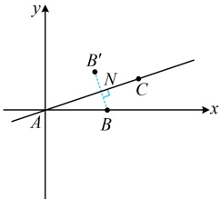

# 微专题2：直线有关的对称问题

习题：P1

## 内容提要

本节归纳与直线有关的对称问题，包括点关于直线对称、直线关于点对称、直线关于直线对称三个基础模型，以及入射光线与反射光线的对称问题，利用对称解决线段和、差的最值问题两个应用模型，请大家跟着例题和反思去学习吧。

## 典型例题

## 类型 I：点关于直线对称

【例 1】已知$\triangle ABC$的顶点$A$的坐标为$(0,0)$，边$BC$所在的直线方程为$x-y-2=0$，边$AC$上的中线$BM$所在的直线方程为$x+y-2=0$。

（1）求边 AC 所在的直线方程：

（2）求点B关于直线AC的对称点 $ B' $的坐标.

解：（1）（已知 $A$，还需 $AC$ 的斜率或点 $C$ 坐标才能求出 $AC$ 的方程．经尝试，前者不易求出，故考虑后者，怎么求？可设 $C(m,n)$，如图1，由点 $C$ 在直线 $BC$ 上可得到关于 $m,n$ 的一个方程，还差一个方程，怎么找？由 $A$，$C$ 的坐标可得到 $AC$ 中点 $M$ 的坐标，而 $M$ 又在直线 $BM$ 上，故又能得到一个方程）

设 $C(m,n)$，代入直线 $BC$ 的方程 $x-y-2=0$ 得 $m-n-2=0$ ①，

因为 $A(0,0)$，所以 $AC$ 中点为 $M\left(\frac{m}{2},\frac{n}{2}\right)$，代入直线 $BM$ 的方程 $x+y-2=0$ 得 $\frac{m}{2}+\frac{n}{2}-2=0$ ②，

联立①②解得：$m=3$，$n=1$，所以 $C(3,1)$，从而直线 $AC$ 的斜率 $k_{AC}=\frac{1-0}{3-0}=\frac{1}{3}$，

故直线 $AC$ 的方程为 $y=\frac{1}{2}x$，即 $x-3y=0$。

图1

图2

（2）（求  $ B' $ 的坐标肯定需要先求  $ B $ 的坐标，可通过联立题干所给的  $ BC $ 和  $ BM $ 的方程来求）联立  $ \begin{cases} x - y - 2 = 0 \\ x + y - 2 = 0 \end{cases} $ 解得： $ x = 2 $， $ y = 0 $，所以点  $ B $ 的坐标为  $ (2, 0) $，

（再求 $B'$ 的坐标，可设 $B'(a,b)$，则求该坐标需建立两个关于 $a$，$b$ 的方程，如何建立？如图 2，$B$，$B'$ 关于直线 $AC$ 对称意味着 $AC$ 垂直平分线段 $BB'$，于是一方面 $BB'$ 的中点 $N$ 在直线 $AC$ 上，另一方面，$BB' \perp AC$，翻译这两点，就能得到两个关于 $a$，$b$ 的方程）

设 $B'(a,b)$，则 $BB'$ 的中点为 $N\left(\frac{a+2}{2}, \frac{b}{2}\right)$，由（1）得直线 $AC$ 的方程为 $x-3y=0$，$k_{AC} = \frac{1}{3}$，