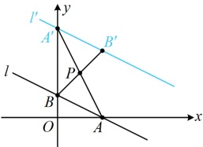
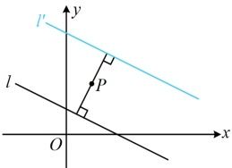
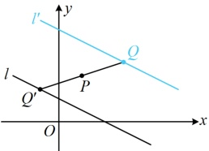

图1

图2

图3

解法2：如图2，可以看到，当 $ l' $与 $ l $关于点 $ P $对称时， $ l' \parallel l $，且点 $ P $到这两条直线距离相等，于是由 $ l' \parallel l $可以设出直线 $ l' $的方程（只含一个参数），再由点 $ P $到这两条直线距离相等建立方程求所设参数，

由题意，可设 $ l' $的方程为 $ x + 2y + m = 0 $，因为点 $ P $到 $ l' $和 $ l $的距离相等，所以 $ \frac{|1 + 2 \times 2 + m|}{\sqrt{1^2 + 2^2}} = \frac{|1 + 2 \times 2 - 2|}{\sqrt{1^2 + 2^2}} $，

解得： $ m = -8 $或 $ -2 $（此时 $ l' $与 $ l $重合，舍去），所以直线 $ l' $的方程为 $ x + 2y - 8 = 0 $。

解法3：如图3，当 $ l' $与 $ l $关于点 $ P $对称时， $ l' $上任意一点 $ Q $关于点 $ P $的对称点 $ Q' $都在 $ l $上，故可直接设点 $ Q $的坐标为 $ (x,y) $，求出它关于点 $ P $的对称点 $ Q' $的坐标，再代入 $ l $的方程，找到 $ x $， $ y $满足的关系，

设 $ Q(x,y) $为直线 $ l' $上的任意一点，则 $ Q $关于点 $ P $的对称点为 $ Q'(2-x,4-y) $，

因为 $ l' $与 $ l $关于点 $ P $对称，所以 $ Q' $在直线 $ l $上，故 $ 2-x+2(4-y)-2=0 $，整理得： $ x+2y-8=0 $，

所以直线 $ l' $的方程为 $ x+2y-8=0 $。

答案： $ x+2y-8=0 $

【反思】求直线 l 关于点 P 的对称直线  $ l' $，常有上面的找两点（解法 1）、设平行线（解法 2）、相关点法（解法 3）三个解法，但对比之下，解法 2 和解法 3 相对更简洁，所以后续有关问题中，我们就用这两个解法处理.

## 类型Ⅲ：直线关于直线对称

【例3】已知直线 $ l_{1}:x-2y+1=0 $与直线 $ l_{2}:x-2y+2=0 $关于直线 $ l:2x-4y+C=0 $对称，则C的值为（ ）

A. 1          B. 2          C. 3          D. 4

解析：观察发现三条直线 x, y 的系数对应成比例，所以它们应平行，如图，要使  $ l_{1} $ 与  $ l_{2} $ 关于直线 l 对称，应有直线 l 与  $ l_{1} $， $ l_{2} $ 之间的距离相等，由此可建立方程求 C，

由 $2x - 4y + C = 0$ 可得 $x - 2y + \frac{C}{2} = 0$，由题意，$\frac{\left|\frac{C}{2} - 1\right|}{\sqrt{1^2 + (-2)^2}} = \frac{\left|\frac{C}{2} - 2\right|}{\sqrt{1^2 + (-2)^2}}$，解得：$C = 3$。

答案：C

【反思】当三条直线 $ l_{1} \parallel l_{2} \parallel l $，且 $ l_{1} $与 $ l_{2} $关于直线l对称时，直线 $ l $与 $ l_{1} $， $ l_{2} $之间的距离相等，我们常抓住这一点来求解需要的量。那如果三条直线不平行，又怎么处理呢？我们来看下面的变式1.

【变式1】直线 $ l_{1}:x+y-1=0 $关于直线 $ l:3x-y-3=0 $对称的直线 $ l_{2} $的方程为___.

解法 1：如图 1， $ l_1 $ 与  $ l_2 $ 关于直线  $ l $ 对称，则这三条直线相交于同一点，我们先求出该点，再作观察，由图 1 可知直线  $ l_1 $， $ l_2 $ 与  $ l $ 相交于点  $ P $，联立  $ \begin{cases} x + y - 1 = 0 \\ 3x - y - 3 = 0 \end{cases} $ 解得： $ x = 1 $， $ y = 0 $，所以  $ P(1,0) $，

要求直线 $ l_2 $，只需找到直线上的一个点或求出该直线的斜率，先考虑前者，选哪个点？可在 $ l_1 $上任取除 $ P $外的一点 $ Q $，它关于直线 $ l $的对称点 $ Q' $都在直线 $ l_2 $上，方便起见，不妨选 $ l_1 $与 $ y $轴的交点，

在 $ x+y-1=0 $中令 $ x=0 $得 $ y=1 $，记 $ Q(0,1) $，设 $ Q'(a,b) $为点 $ Q $关于直线 $ l $的对称点，则 $ QQ' $的中点为 $ \left(\frac{a}{2},\frac{1+b}{2}\right) $，