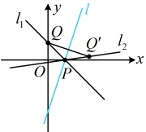
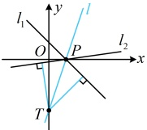
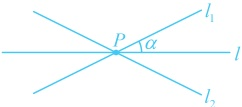

所以 $ \begin{cases}3\cdot\frac{a}{2}-\frac{1+b}{2}-3=0\left(\frac{QQ'}{Q}\right)\text{的中点在}l上\\\frac{b-1}{a-0}\cdot3=-1\left(\frac{QQ'}{Q}\right)\perp l\end{cases} $，解得： $ a=\frac{12}{5} $， $ b=\frac{1}{5} $，故 $ Q'=\left(\frac{12}{5},\frac{1}{5}\right) $，

由图1可知所求直线 $ l_{2} $经过P和 $ Q' $，所以其斜率为 $ \frac{\frac{1}{5}-0}{\frac{12}{5}-1}=\frac{1}{7} $，故其方程为 $ y-0=\frac{1}{7}(x-1) $，即 $ x-7y-1=0 $。

图1

图2

解法2：求点P的坐标的过程同解法1，若能求出直线 $ l_2 $的斜率，也能得到其方程，怎么求？可先设 $ l_2 $的斜率，写出 $ l_2 $的方程，如图2，在l上任取除P外的一点T，该点到 $ l_1 $和 $ l_2 $的距离应相等，由此可建立方程求所设斜率。方便起见，点T不妨选直线l与y轴的交点，

在 $l$ 上取点 $T(0,-3)$，由图 2 可知所求直线 $l_2$ 斜率存在，设为 $k$，则其方程为 $y-0=k(x-1)$，即 $kx-y-k=0$，由点 $T$ 到 $l_1$，$l_2$ 的距离相等可得 $\frac{|0+(-3)-1|}{\sqrt{1^2+1^2}}=\frac{|k\cdot0-(-3)-k|}{\sqrt{k^2+(-1)^2}}$，解得：$k=-1$ 或 $\frac{1}{7}$，当 $k=-1$ 时，$l_2$ 与 $l_1$ 重合，不合题意，所以 $k=\frac{1}{7}$，此时直线 $l_2$ 的方程为 $\frac{1}{7}x-y-\frac{1}{7}=0$，即 $x-7y-1=0$。

答案：x-7y-1=0

【反思】当直线 $ l_{1} $与直线l交于点P时，若要求 $ l_{1} $关于l的对称直线 $ l_{2} $，常有下面两个方法

方法1：在 $ l_{1} $上另取一点Q，求出Q关于l的对称点 $ Q' $，则P， $ Q' $都在所求直线 $ l_{2} $上，由此可得到 $ l_{2} $的方程；方法2：设 $ l_{2} $的斜率，结合点P写出 $ l_{2} $的方程，在l上另取一点T，根据T到 $ l_{1} $和 $ l_{2} $距离相等建立方程，求解所设斜率，得到 $ l_{2} $的方程.

一般情况下方法2计算量稍小一些，所以后续有关问题我们采用此法处理。但需注意两种特殊情况：

①若对称轴 $l$ 是水平线或竖直线，如图3，则 $l_2$ 与 $l_1$ 的倾斜角互补，所以 $l_2$ 的斜率 $k_2 = \tan(\pi - \alpha) = -\tan\alpha = -k_1$，故 $l_2$ 与 $l_1$ 的斜率互为相反数，由此可直接求出 $l_2$ 的斜率，得到 $l_2$ 的方程；

图3

②若对称轴 $l$ 斜率为 $\pm1$，则可按上面例 1 变式的解法 2 类似处理。举个例子，设 $l_1: x-3y+3=0$，$l: x-y-1=0$，则可由 $l$ 的方程得到 $\begin{cases} x=y+1 \\ y=x-1 \end{cases}$，代入 $l_1$ 的方程得 $(y+1)-3(x-1)+3=0$，即 $3x-y-7=0$，这就是 $l_2$ 的方程。

【变式2】已知直线 $ l_1:3x-4y-4=0 $关于直线 $ l $的对称直线为 $ y $轴，则 $ l $的方程为___.

解析：如图，与上一题不同，这里要求的是对称轴 $l$ 的方程，怎么办呢？$l$ 过点 $P$，可先求出 $P$ 的坐标，联立 $\begin{cases} 3x - 4y - 4 = 0 \\ x = 0 \end{cases}$ 解得：$\begin{cases} x = 0 \\ y = -1 \end{cases}$，所以 $l_1$ 与 $y$ 轴的交点为 $P(0, -1)$，所求直线 $l$ 也过点 $P$，

求 l 的方程还差斜率，可考虑设斜率，写出直线 l 的方程，由该方程在 l 上任取除 P 外的一点 Q，由点 Q 到  $ l_{1} $ 和 y 轴的距离相等建立方程求解所设斜率，