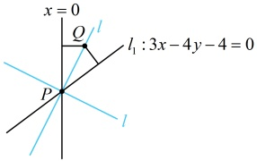
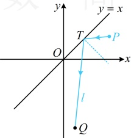
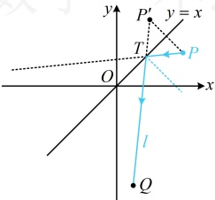

由图可知直线 l 的斜率存在，设为 k，则直线 l 的方程为 y = kx - 1

令x=1得y=k-1，所以 $ Q(1,k-1) $是直线l上的一点，

因为 $ l_{1} $与y轴关于直线l对称，所以点Q到 $ l_{1} $和y轴的距离相等，

即 $ \frac{|3\times1-4(k-1)-4|}{\sqrt{3^{2}+(-4)^{2}}}=1 $，解得：k=2或 $ -\frac{1}{2} $，

所以直线l的方程为y=2x-1或 $ y=-\frac{1}{2}x-1 $。

答案：y=2x-1 或  $ y=-\frac{1}{2}x-1 $

【反思】若相交直线 $ l_{1} $和 $ l_{2} $关于直线l对称，且给出 $ l_{1} $和 $ l_{2} $的方程，让求l的方程，则常分两步：①直线 $ l $过 $ l_{1} $与 $ l_{2} $的交点P，所以先求P的坐标；②设l的斜率为k，结合点P写出l的方程，用该方程在l上另取一点Q，根据Q到 $ l_{1} $和 $ l_{2} $的距离相等建立方程求解所设斜率，得到直线l的方程.请注意，满足条件的直线l有两条.

## 类型IV：入射光线与反射光线的对称问题

【例4】一条光线从点  $ P(4,2) $ 射出，经过直线 y = x 反射后过点  $ Q(1,-6) $，则反射光线所在直线 l 的方程为 ___.

解析：如图1，已有点Q，要求反射光线l的方程，还差一个要素（斜率或l上另一点）。由光学性质，入射光线与反射光线所在的直线过入射点T，且与y=x垂直的直线（图中蓝色虚线）对称，那它们也关于y=x对称，所以如图2，点P关于直线y=x的对称点P'在反射光线所在直线l上，于是先求P'的坐标，

由题意，点  $ P(4,2) $ 关于 y=x 的对称点为  $ P'(2,4) $，且  $ P' $ 在反射光线所在的直线 l 上，

又因为 $l$ 过点 $Q(1,-6)$，所以直线 $l$ 的斜率为 $\frac{-6-4}{1-2}=10$，故其方程为 $y-(-6)=10(x-1)$，即 $10x-y-16=0$。

图1

图2

答案： $ 10x - y - 16 = 0 $

【反思】涉及入射光线与反射光线的计算，本质上是入射光线与反射光线关于镜面所在直线（本题的 y=x）对称的问题，常抓住光源（本题的 P）关于镜面的对称点在反射光线所在的直线上来处理.

【变式1】光线沿着直线 $ l_1: y = -3x + b $射到直线 $ l: x + y = 0 $上，经反射后沿着直线 $ l_2: y = ax + 2 $射出，则 $ a = \underline{\quad} $， $ b = \underline{\quad} $.

解析：如图，已知条件可翻译为入射光线  $ l_1 $ 与反射光线  $ l_2 $ 关于直线  $ l: x + y = 0 $ 对称，怎样由此求  $ a $， $ b $？注意到对称轴  $ l $ 斜率为 -1，则  $ l_1 $ 关于  $ l $ 的对称直线好求，故可先求出该对称直线，与  $ l_2 $ 比较系数建立方程组求  $ a $， $ b $，由  $ x + y = 0 $ 得  $ x = -y $， $ y = -x $，将此二式代入  $ l_1 $ 的方程得  $ -x = -3(-y) + b $，即  $ y = -\frac{1}{3}x - \frac{b}{3} $，所以  $ l_1 $ 关于  $ l $ 的对称直线为  $ y = -\frac{1}{3}x - \frac{b}{3} $，