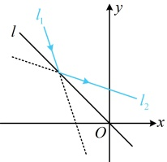
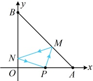
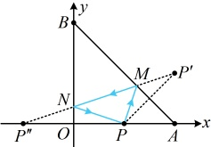

又由题意， $ l_1 $ 关于  $ l $ 的对称直线为  $ l_2: y = ax + 2 $，所以  $ \begin{cases} -\frac{1}{3} = a \\ -\frac{b}{3} = 2 \end{cases} $，

解得： $ a = -\frac{1}{3} $， $ b = -6 $。

答案： $ -\frac{1}{2} $，-6

【反思】可以看到，本题的问法与例4不同，但核心仍是抓住入射光线与反射光线关于镜面对称来处理。上述两题都只涉及一次反射，有时也会遇到多次反射的情况，此时的难度会更高，我们来看下面的变式2和变式3。

【变式2】已知两点  $ A(4,0) $， $ B(0,4) $，从点  $ P(2,0) $ 射出的光线经直线 AB 反射后射到直线 OB 上，再经直线 OB 反射后回到点 P，则光线所经过的路程等于 ___.

解析：如图1，所求即为 $ |PM|+|MN|+|NP| $，但入射点 $ M $， $ N $坐标不知道，所以不好直接求上述长度，怎么办呢？涉及入射光线与反射光线，仍考虑用它们关于镜面对称来处理，

如图2，作 $P$ 关于直线 $AB$ 的对称点 $P'$，作 $P$ 关于直线 $OB$ 的对称点 $P''$，则 $|PM|=|P'M|$，$|NP|=|NP''|$，所以 $|PM|+|MN|+|NP|=|P'M|+|MN|+|NP''|$，

由入射光线与反射光线关于镜面对称可知， $ P' $ 在直线 MN 上，同理， $ P'' $ 也在直线 MN 上，所以  $ P' $，M，N， $ P'' $ 四点共线，故  $ \left|PM\right| + \left|MN\right| + \left|NP\right| = \left|P'M\right| + \left|MN\right| + \left|NP''\right| = \left|P'P''\right| $ ①，

只要求出  $ P' $ 和  $ P'' $ 的坐标，问题就解决了，其中  $ P'' $ 容易由图直接获得，而  $ P' $ 可按点关于直线对称的问题处理，由题意，直线  $ AB $ 的斜率为  $ \frac{4-0}{0-4} = -1 $，所以  $ AB $ 的方程为  $ y = -x + 4 $，此方程可变形为  $ x = -y + 4 $，

将  $ P(2,0) $ 代入  $ \begin{cases} x = -y + 4 \\ y = -x + 4 \end{cases} $ 的右侧可得  $ \begin{cases} x = -0 + 4 = 4 \\ y = -2 + 4 = 2 \end{cases} $，所以  $ P'(4,2) $，由图 2 可知， $ P'(-2,0) $，所以  $ \left|P'P'\right| = \sqrt{(-2-4)^2 + (0-2)^2} = 2\sqrt{10} $，代入①得光线所经过的路程  $ \left|PM\right| + \left|MN\right| + \left|NP\right| = 2\sqrt{10} $。

图1

图2

答案： $ 2\sqrt{10} $

【变式 3】已知点  $ O(0,0) $， $ A(0,1) $， $ B(1,1) $， $ C(1,0) $，平面上仅在线段  $ OA $， $ AB $， $ BC $ 所在位置分别放置一个双面镜，现有一道光束沿向量  $ \vec{s}=(1,m)(m>0) $ 的方向从线段  $ OC $ 的中点  $ P $ 射入，若光束恰好依次在  $ BC $， $ AB $， $ OA $ 上（不含端点）各反射一次后从线段  $ OC $ 上的点  $ G $ 射出，则  $ m $ 的取值范围是___。

解析：如图，题干的要求是三个入射点 $M, N, T$ 分别在线段 $BC, AB, OA$ 上（不含端点），以及最后要从线段 $OC$ 上的点 $G$ 射出，故考虑求出 $M, N, T, G$ 的坐标，再进行翻译，怎么求？先看 $M$，可用 $P$ 的坐标和入射光线 $PM$ 的方向向量 $\vec{s}$ 写出直线 $PM$ 的方程，与直线 $BC$ 联立，

由题意，$P\left(\frac{1}{2}, 0\right)$，直线 $PM$ 的一个方向向量为 $\vec{s} = (1, m) \Rightarrow$ 其斜率 $k_{PM} = m$，所以其方程为 $y = m\left(x - \frac{1}{2}\right)$ ①，