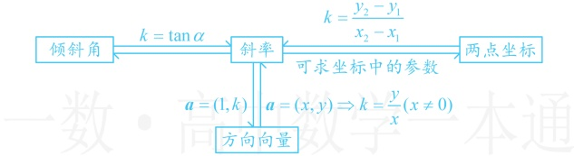

解析：直线 $m$ 与 $l$ 的倾斜角有 2 倍关系，可获得它们斜率的关系，故要求 $m$ 的斜率，只需求 $l$ 的斜率，题干刚好给了 $l$ 上两点的坐标，可由此求其斜率，设 $l$ 的倾斜角为 $\alpha$，则由题意，$m$ 的倾斜角为 $2\alpha$，因为直线 $l$ 经过 $P(2,1)$，$Q(4,5)$ 两点，所以 $l$ 的斜率 $\tan\alpha=\frac{5-1}{4-2}=2$，故直线 $m$ 的斜率为 $\tan2\alpha=\frac{2\tan\alpha}{1-\tan^{2}\alpha}=\frac{2\times2}{1-2^{2}}=-\frac{4}{3}$。

答案：A

【例 12】若经过  $ A(1,-2) $， $ B(m,6) $ 两点的直线 l 的方向向量为  $ (1,2) $，则实数 m = （）

A. -5 B. 5 C. 3 D. -17

解析：给了方向向量，可求出斜率，而斜率又能由  $ A, B $ 的坐标表示，故可建立方程求  $ m $，因为直线  $ l $ 的方向向量为  $ (1,2) $，所以  $ l $ 的斜率  $ k = \frac{2}{1} = 2 $，又因为直线  $ l $ 过  $ A(1,-2) $， $ B(m,6) $ 两点，所以  $ k = \frac{6 - (-2)}{m - 1} = \frac{8}{m - 1} $，故  $ \frac{8}{m - 1} = 2 $，解得： $ m = 5 $。

答案：B

【反思】从以上几题可以看出，直线的斜率容易与倾斜角、方向向量、两点坐标关联起来，故而斜率是联系这些量的纽带，如下图.

类型Ⅱ：由直线与线段相交求斜率的范围

【例 13】过点  $ P(-1,-1) $ 的直线 l 与线段 AB 有交点，若  $ A(2,4) $， $ B(5,-2) $，则直线 l 的斜率的取值范围是 ___.

解析：涉及过定点的直线与线段有交点，图形特征比较清晰，可先画图看看，寻找并计算临界状态，如图1，当且仅当直线l从 $ l_{1} $出发，绕点P逆时针旋转至 $ l_{2} $的过程中，始终与线段AB有交点，

由所给数据，直线 $ l_{1} $的斜率 $ k_{1}=\frac{-2-(-1)}{5-(-1)}=-\frac{1}{6} $，直线 $ l_{2} $的斜率 $ k_{2}=\frac{4-(-1)}{2-(-1)}=\frac{5}{3} $，

那直线 $l$ 的斜率的取值范围是取 $-\frac{1}{6}$ 和 $\frac{5}{3}$ 之间，还是两者之外呢？由于正切函数在 $\left[0, \frac{\pi}{2}\right) \cup \left(\frac{\pi}{2}, \pi\right)$ 上不单调，所以可考虑把旋转过程按倾斜角的锐、轴拆分成两部分要看

当直线  $ l $ 从  $ l_1 $ 旋转至水平线  $ l' $（不含  $ l' $）的过程中，倾斜角为钝角，且逐步增大到  $ \pi $（取不到），如图2，直线  $ l $ 的斜率  $ k $ 的变化范围是  $ \left[-\frac{1}{6}, 0\right) $；

当直线 l 从  $ l' $ （含  $ l' $ ）旋转至  $ l_{2} $ 的过程中，倾斜角为锐角（ $ l' $ 除外），且逐步增大，

如图3，直线 $ l $的斜率 $ k $的变化范围是 $ \left[0,\frac{5}{3}\right] $；

综上所述，直线  $ l $ 的斜率的取值范围是  $ \left[-\frac{1}{6}, 0\right) \cup \left[0, \frac{5}{3}\right] = \left[-\frac{1}{6}, \frac{5}{3}\right] $.