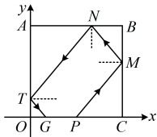
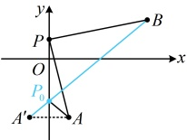

直线 $BC$ 的方程为 $x=1$，在①中令 $x=1$ 得 $y=\frac{m}{2}$，所以 $M\left(1,\frac{m}{2}\right)$，由题意，$0<\frac{m}{2}<1$，所以 $0<m<2$ ②，再求 $N$ 的坐标，观察图形可发现，$MN$ 与 $PM$ 关于水平线对称，所以它们斜率互为相反数，于是直线 $MN$ 的方程可求出，与直线 $AB$ 联立，就能求得 $N$ 的坐标，

直线 $AB$ 的方程为 $y=1$，$k_{MN}=-k_{PM}=-m$，所以直线 $MN$ 的方程为 $y-\frac{m}{2}=-m(x-1)$ ③，

在③中令 $y=1$ 得 $x=\frac{3}{2}-\frac{1}{m}$，所以 $N\left(\frac{3}{2}-\frac{1}{m},1\right)$，由题意，$0<\frac{3}{2}-\frac{1}{m}<1$，所以 $\frac{2}{3}<m<2$ ④，

再求 $T$，$G$ 的坐标，方法与前面类似，$k_{TN}=-k_{MN}=m\Rightarrow TN$ 的方程为 $y-1=m\left[x-\left(\frac{3}{2}-\frac{1}{m}\right)\right]$ ⑤，

在⑤中令 $x=0$ 得 $y=2-\frac{3m}{2}$，所以 $T\left(0,2-\frac{3m}{2}\right)$，由题意，$0<2-\frac{3m}{2}<1$，所以 $\frac{2}{3}<m<\frac{4}{3}$ ⑥，

$k_{TG}=-m\Rightarrow TG$ 的方程为 $y=-mx+2-\frac{3m}{2}$，令 $y=0$ 得 $x=\frac{2}{m}-\frac{3}{2}$，所以 $G\left(\frac{2}{m}-\frac{3}{2},0\right)$。

由题意，$0\leq\frac{2}{m}-\frac{3}{2}\leq1$，所以 $\frac{4}{5}\leq m\leq\frac{4}{3}$ ⑦，

结合②④⑥⑦可得 $\frac{4}{5}\leq m<\frac{4}{3}$，所以 $m$ 的取值范围是 $\left[\frac{4}{5},\frac{4}{3}\right)$。

答案：$\left[\frac{4}{5},\frac{4}{3}\right)$

## 类型V：利用对称解决线段的和、差最值问题

【例 5】已知点  $ A(1,-3) $， $ B(5,2) $，点 P 在 y 轴上，则  $ \left|AP\right| + \left|BP\right| $ 的最小值为 ___.

解析：如图，$A$，$B$ 位于 $y$ 轴同侧，不易直接看出何时 $|AP| + |BP|$ 最小，而若 $A$，$B$ 在 $y$ 轴两侧，则容易想象，当 $A$，$P$，$B$ 三点共线时，$|AP| + |BP|$ 最小，如何将同侧变成两侧？可考虑把 $A$ 对称到 $y$ 轴另一侧，再作观察，设 $A$ 关于 $y$ 轴的对称点为 $A'$，则 $A'(-1,-3)$，且 $|AP| = |A'P|$

所以 $ |AP| + |BP| = |A'P| + |BP| $，由图可知，当且仅当 $ P $为线段 $ A'B $与 $ y $轴交点 $ P_0 $时， $ |A'P| + |BP| $最小，且最小值为 $ |A'B| = \sqrt{[5 - (-1)]^2 + [2 - (-3)]^2} = \sqrt{61} $，所以 $ |AP| + |BP| $的最小值为 $ \sqrt{61} $。

答案：$\sqrt{61}$

【反思】求直线 $l$ 上的动点 $P$ 到 $l$ 同侧两定点 $A$, $B$ 的距离之和的最小值，常将 $A$ 对称到 $l$ 的另一侧，转化为 $P$ 到 $l$ 两侧的定点 $A'$ 和 $B$ 的距离之和的最小值来分析。当 $A'$, $P$, $B$ 三点共线时，该距离之和最小，为 $|A'B|$，此模型常被称为“将军饮马”模型。本题的动点只有 1 个，若动点改为 2 个，又怎么办？我们来看下面的变式 1。

【变式 1】$\triangle ABC$ 中，顶点 $A(2,3)$，点 $B$ 在直线 $l: x - y + 2 = 0$ 上，点 $C$ 在 $x$ 轴上，则 $\triangle ABC$ 周长的最小值为___。

解析：如图1，B在$l$上运动，C在x轴上运动，不易看出何时$\triangle ABC$的周长$|AB|+|BC|+|AC|$最小，怎么办呢？

受例5的启发，考虑对称，我们将点$A$分别对称到$l$和x轴的另一侧去，再作观察，

如图2，设点A关于l的对称点为 $ A^{\prime} $，点A关于x轴的对称点为 $ A'' $，

则 $ |AB| = |A'B| $， $ |AC| = |A''C| $，所以 $ \triangle ABC $的周长 $ L = |AB| + |BC| + |AC| = |A'B| + |BC| + |A''C| $，

由图2可知，当且仅当$B$，$C$分别为线段$A'A''$与$l$和$x$轴的交点时，$|A'B|+|BC|+|A''C|$最小，且最小值为$|A'A''|$。于是只需求$A'$和$A''$的坐标，注意到直线$l$的斜率为1，故可按特殊方法求$A'$，而$A''$可直接看出，