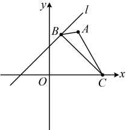
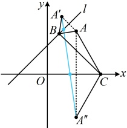
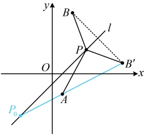

由直线 $l$ 的方程 $x - y + 2 = 0$ 可得 $\begin{cases} x = y - 2 \\ y = x + 2 \end{cases}$，将点 $A(2,3)$ 代入此二式的右侧得 $\begin{cases} x = 3 - 2 = 1 \\ y = 2 + 2 = 4 \end{cases} \Rightarrow A'(1,4)$，因为 $A''$ 与 $A(2,3)$ 关于 $x$ 轴对称，所以 $A''(2,-3)$，从而 $|A'A'| = \sqrt{(2-1)^2 + (-3-4)^2} = 5\sqrt{2}$，故 $L_{\min} = 5\sqrt{2}$。

图1

图2

答案： $ 5\sqrt{2} $

【反思】涉及与直线上的动点有关的距离之和的最小值问题，都可以考虑用对称思想处理，那如果将距离之和改为距离之差，又怎么处理呢？我们来看下面的变式2.

【变式2】已知点 P 在直线  $ l: x - y - 1 = 0 $ 上， $ A(1, -2) $， $ B(2, 6) $，则  $ |PB| - |PA| $ 的最大值为 ___.

解析：如图， $ A $， $ B $ 在  $ l $ 的两侧，不易看出何时  $ \left|PB\right| - \left|PA\right $ 最大，怎么办呢？既然点在直线两侧不好处理，我们试试通过对称将其转化为同侧两点的情况，再作观察，

设 $B$ 关于 $l$ 的对称点为 $B'$，则 $|PB|=|PB|$，所以 $|PB|-|PA|=|PB'|-|PA|$ ①，

故只需求 $ |PB^{\prime}|-|PA| $的最大值，涉及两边之差，想到三角形两边之差小于第三边，这里第三边是 $ AB^{\prime} $

当 $P$，$A$，$B'$ 三点不共线时，由三角形两边之差小于第三边可得 $|PB'| - |PA| < |AB'|$；

当 $P$，$A$，$B'$ 三点共线，即 $P$ 与图中 $P_0$ 重合时，$|PB'| - |PA| = |AB'|$；

所以 $ |PB'| - |PA| $的最大值为 $ |AB| $，下面求 $ |AB| $，还差 $ B' $的坐标，注意到 $ l $的斜率为1，故可用点关于直线对称的特殊方法来求 $ B' $的坐标，

由直线 $ l $的方程 $ x - y - 1 = 0 $可得 $ \begin{cases}x = y + 1\\y = x - 1\end{cases} $，

将 $ B(2,6) $代入上述二式的右侧得 $ \begin{cases}x = 7\\y = 1\end{cases} $，所以 $ B'(7,1) $，

从而 $ |AB'| = \sqrt{(7-1)^2 + [1-(-2)]^2} = 3\sqrt{5} $，故 $ |PB'| - |PA| $的最大值为 $ 3\sqrt{5} $，

结合①得 $ |PB|-|PA| $的最大值为 $ 3\sqrt{5} $

答案： $ 3\sqrt{5} $

【反思】涉及与直线上的动点和该直线异侧两个定点有关的距离之差的最值问题，常考虑将其中一个点对称到直线的另一侧去，利用三角形两边之差小于第三边来处理.

## 强化训练

## A 组 夯实基础

1. (2024 · 全国模拟)

已知直线 $l$ 与直线 $l': 2x - 3y + 4 = 0$ 关于直线 $x = 1$ 对称，则直线 $l$ 的方程为___。