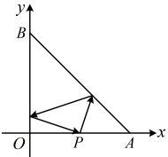

## C组 拓展提升

### 12. （2025·上海奉贤期中）

已知点  $ A(-2,-3) $，在 y 轴和直线 y=x 上各取一点 B，C，则 $ \triangle ABC $的周长的最小值为 ___.

### 13. （2025·海南期中）

在平面直角坐标系中，动点  $ P $， $ Q $ 关于直线  $ l: y = -x $ 对称（ $ P $ 在  $ Q $ 上方），且  $ |PQ| = \sqrt{2} $， $ M(0,2) $， $ N(0,-2) $，则  $ |PM| + |QN| $ 的最小值为___。

## 一 数·高中数学一本通

### 14. （2025 · 江苏无锡模拟）

如图，已知  $ A(4,0) $， $ B(0,4) $， $ O(0,0) $，若光线  $ l $ 从  $ P(2,0) $ 射出，被直线  $ AB $ 反射后到直线  $ OB $ 上，再经直线  $ OB $ 反射回到点  $ P $，则光线  $ l $ 所在直线的方程为（ ）

A.  $ y = 2x - 4 $  

B.  $ y = \frac{5}{2}x - 5 $  

C.  $ y = 3x - 6 $  

D.  $ y = 4x - 8 $

