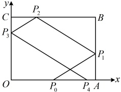

15.（2025 · 江苏模拟）

平面直角坐标系中，矩形的四个顶点为 $ O(0,0) $， $ A(8,0) $， $ B(8,6) $， $ C(0,6) $，光线从 $ OA $边上一点 $ P_0(4,0) $沿与 $ x $轴正向成 $ \theta $角的方向发射到 $ AB $边上的点 $ P_1 $，被 $ AB $反射到 $ BC $上的点 $ P_2 $，再被 $ BC $反射到 $ OC $上的点 $ P_3 $，最后被 $ OC $反射到 $ x $轴上的点 $ P_4(t,0) $，若 $ t\in(4,8) $，则 $ \tan\theta $的取值范围是___。

一数·高中数学一本通