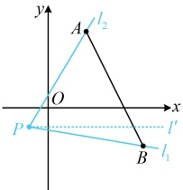
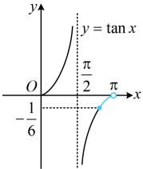
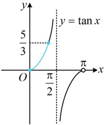
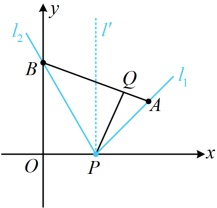
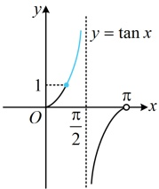
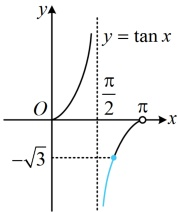

图1

答案： $ \left[-\frac{1}{6},\frac{5}{3}\right] $

图2

图3

【变式】设  $ A(2,1) $， $ B(0,\sqrt{3}) $，若点  $ Q(x,y) $ 在线段 AB 上运动，则  $ \frac{y}{x-1}(x\neq1) $ 的取值范围是 ___.

解析：由 $ \frac{y}{x-1} $联想到什么？可将其看成 $ \frac{y-0}{x-1} $，它表示 $ Q(x,y) $与定点 $ P(1,0) $的连线斜率，故问题即为求当Q在线段AB上运动时，直线PQ斜率的取值范围，这就和上面的例13类似了，记 $ P(1,0) $，则 $ \frac{y}{x-1} $表示直线PQ的斜率，

如图1，当Q沿线段AB从点A运动到点B时，直线PQ则绕点P从l_1旋转至l_2，直线l_1的斜率k_1=\frac{1-0}{2-1}=1，直线l_2的斜率k_2=\frac{\sqrt{3}-0}{0-1}=-\sqrt{3}，那么 $ \frac{y}{x-1} $的取值范围是[\-\sqrt{3},1]吗？我们仍然以倾斜角 $ \frac{\pi}{2} $为界来分段考虑，

当直线  $ PQ $ 从  $ l_1 $ 旋转至竖直线  $ l' $（不含）时， $ PQ $ 的倾斜角始终为锐角，且不断增大到  $ \frac{\pi}{2} $

如图2，直线  $ PQ $ 的斜率  $ \frac{y}{x-1} $ 的取值范围是  $ [1,+\infty) $；

当直线  $ PQ $ 从直线  $ l' $（不含）旋转至  $ l_2 $ 时， $ PQ $ 的倾斜角始终为钝角，且不断增大，如图 3，直线  $ PQ $ 的斜率  $ \frac{y}{x-1} $ 的取值范围是  $ (-\infty, -\sqrt{3}] $；

综上所述， $ \frac{y}{x-1} $ 的取值范围是  $ (-\infty,-\sqrt{3}]\cup[1,+\infty) $

图1

图2

图3

答案： $ (-\infty,-\sqrt{3}]\cup[1,+\infty) $

【反思】从上面两道题可以看出，当直线 $l$ 绕定点 $P$ 旋转，且与某线段 $AB$ 有交点时，记临界状态下 $PA$，$PB$ 的斜率分别为 $k_1$，$k_2$ ($k_1 < k_2$)，则当旋转过程中不经过竖直线（如上面的例 13）时，$l$ 斜率的变化范围是 $[k_1, k_2]$；当旋转过程中经过竖直线（如上面的变式）时，$l$ 斜率的变化范围是 $(-\infty, k_1] \cup [k_2, +\infty)$。