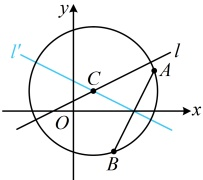

因为圆 C 经过 A，B 两点，所以  $ \left\{\begin{aligned}&(4-a)^{2}+(2-b)^{2}=r^{2}\\ &(2-a)^{2}+(-2-b)^{2}=r^{2}\end{aligned}\right. $ ①，

又圆心 C 在直线 l 上，所以  $ a - 2b + 1 = 0 $ ③，

（观察发现方程③不含 $r$，而由方程①②又容易消去 $r$，故考虑按此处理，先求解 $a$，$b$）

由①②可得 $(4-a)^2 + (2-b)^2 = (2-a)^2 + (-2-b)^2$，化简得：$a + 2b - 3 = 0$，结合③可解得：$a = b = 1$，代入①可得 $r = \sqrt{10}$，所以圆 $C$ 的标准方程为 $(x-1)^2 + (y-1)^2 = 10$。

解法2：（求圆的标准方程，核心是找圆心，求半径，已有圆心在/上，若能再找到过圆心C的另一条直线，就

能与 $l$ 联立求交点坐标，得到圆心，怎么找？第（1）问已求得 $AB$ 垂直平分线 $l'$ 的方程，如图，由垂径定理，$l'$ 过圆心 $C$，另一条直线就找到了）

联立 $\begin{cases} x + 2y - 3 = 0 \\ x - 2y + 1 = 0 \end{cases}$ 解得：$x = y = 1$，所以圆心 $C$ 的坐标为 $(1,1)$，

（半径 $r$ 怎么求？圆心到圆上任意一点的距离都等于半径，故计算 $|CA|$ 或 $|CB|$ 均可）

半径 $r = |CA| = \sqrt{(4-1)^2 + (2-1)^2} = \sqrt{10}$，故圆 $C$ 的标准方程为 $(x-1)^2 + (y-1)^2 = 10$。

【反思】求圆的标准方程，核心是找圆心，求半径，常用思路有两个：①用待定系数法，即直接设圆的标准方程，翻译已知条件，建立关于a，b，r的方程组并求解，例如解法1；②结合几何性质分析.例如给出圆上两点，则可用垂径定理找到过圆心的一条直线，由两条过圆心的直线就能求出圆心，解法2就是这样处理的.

【变式1】过三个点 $ O(0,0) $， $ A(6,8) $， $ B(8,-6) $的圆C的方程为___。

解法1：已有圆C上的三点，可以得到圆C的三条弦，任选其中两条，求出其垂直平分线的方程，都能得到两条过圆心的直线，找到圆心，由题意， $ k_{OA}=\frac{8-0}{6-0}=\frac{4}{3} $，所以线段OA的垂直平分线 $ l_{1} $的斜率为 $ -\frac{3}{4} $，又OA的中点为(3,4)，所以 $ l $的方程为 $ v-4=-\frac{3}{4}(x-3) $，整理得： $ 3x+4v-25=0 $，

同理可得线段 OB 的垂直平分线的方程为  $ 4x - 3y - 25 = 0 $，联立  $ \left\{\begin{aligned}3x + 4y - 25 &= 0\\4x - 3y - 25 &= 0\end{aligned}\right. $ 解得：x = 7，y = 1，

所以圆 C 的圆心为  $ C(7,1) $，半径  $ r = |OC| = \sqrt{7^2 + 1^2} = 5\sqrt{2} $，故圆 C 的方程为  $ (x-7)^2 + (y-1)^2 = 50 $。

解法2：给出圆上三点，也可设圆的一般方程，将所给三点代入，建立关于D，E，F的方程组并求解，

设圆 C 的一般方程为  $ x^2 + y^2 + Dx + Ey + F = 0 $，则由题意， $ \begin{cases}0^2 + 0^2 + D \cdot 0 + E \cdot 0 + F = 0\\6^2 + 8^2 + D \cdot 6 + E \cdot 8 + F = 0\\8^2 + (-6)^2 + D \cdot 8 + E \cdot (-6) + F = 0\end{cases} $，

化简得： $ \begin{cases}F=0\\6D+8E+F+100=0,\\8D-6E+F+100=0\end{cases} $，解得： $ D=-14 $，E=-2，F=0，所以圆 C 的方程为  $ x^{2}+y^{2}-14x-2y=0 $。

答案： $ (x-7)^{2}+(y-1)^{2}=50 $ （或  $ x^{2}+y^{2}-14x-2y=0 $）

【反思】已知圆上三点，可以通过求两条弦的垂直平分线来找到圆心，再求半径，也可设圆的一般方程，将所给三点代入，建立关于所设系数的方程组并求解。但可发现，解法2的待定系数法计算量更小一点，故后续这类问题中，我们主要采用解法2处理。

【变式2】已知圆 C 经过  $ P(-2,4) $， $ Q(3,-1) $ 两点，且在 x 轴上截得的弦长等于 6，则圆 C 的方程为 ___.

解析：圆过  $ P $， $ Q $ 两点容易翻译，那圆  $ C $ 在  $ x $ 轴上截得的弦长为 6 呢？由于是圆  $ C $ 在  $ x $ 轴上截得的弦长，故可按  $ |x_1 - x_2| $ 来计算，其中  $ x_1 $， $ x_2 $ 分别为圆与  $ x $ 轴的两个交点的横坐标，故考虑设圆的一般方程，并令  $ y = 0 $，