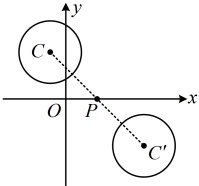
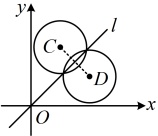

设圆的一般方程为  $ x^2 + y^2 + Dx + Ey + F = 0 $，令  $ y = 0 $ 得  $ x^2 + Dx + F = 0 $，判别式  $ \Delta = D^2 - 4F $，

由韦达定理推论， $ \left|x_1 - x_2\right| = \frac{\sqrt{D^2 - 4F}}{|1|} = \sqrt{D^2 - 4F} $，由题意， $ \left|x_1 - x_2\right| = 6 $，所以  $ \sqrt{D^2 - 4F} = 6 $ ①，

已有一个方程，再将  $ P $， $ Q $ 两点代入圆  $ C $ 的一般方程又能得到两个方程，三个方程联立可求出  $ D $， $ E $， $ F $，将  $ P $， $ Q $ 两点代入所设圆  $ C $ 的方程得  $ \begin{cases}(-2)^2 + 4^2 + D \cdot (-2) + E \cdot 4 + F = 0 \\ 3^2 + (-1)^2 + D \cdot 3 + E \cdot (-1) + F = 0\end{cases} $，所以  $ \begin{cases}-2D + 4E + F + 20 = 0 \\ 3D - E + F + 10 = 0\end{cases} $，观察发现式①不含  $ E $，故考虑由②③消去  $ E $，由② + 4 × ③ 化简得： $ 2D + F + 12 = 0 $，所以  $ F = -2D - 12 $，代入①得  $ \sqrt{D^2 - 4(-2D - 12)} = 6 $，解得： $ D = -6 $ 或 -2，

当  $ D = -6 $ 时， $ F = -2D - 12 = 0 $，代入③得  $ E = -8 $，此时圆  $ C $ 的方程为  $ x^2 + y^2 - 6x - 8y = 0 $；当  $ D = -2 $ 时， $ F = -2D - 12 = -8 $，代入③得  $ E = -4 $，此时圆  $ C $ 的方程为  $ x^2 + y^2 - 2x - 4y - 8 = 0 $；综上所述，圆  $ C $ 的方程为  $ x^2 + y^2 - 6x - 8y = 0 $ 或  $ x^2 + y^2 - 2x - 4y - 8 = 0 $。

答案： $ x^2 + y^2 - 6x - 8y = 0 $ 或  $ x^2 + y^2 - 2x - 4y - 8 = 0 $

## 类型IV：圆相关的对称问题

【例8】已知圆  $ C: x^{2} + y^{2} + 2x - 8y = 0 $ 关于直线  $ l: mx + y + 2 = 0 $ 对称，则实数 m = （ ）

A. 4       B. 5       C. 6       D. 8

解析：圆关于直线对称意味着该直线过圆心，故直接将圆心坐标代入直线方程，即可求出参数  $ m $， $ x^2 + y^2 + 2x - 8y = 0 \Leftrightarrow (x+1)^2 + (y-4)^2 = 17 $，所以圆  $ C $ 的圆心为  $ C(-1,4) $，

代入直线  $ l $ 的方程得  $ m \cdot (-1) + 4 + 2 = 0 $，解得： $ m = 6 $。

答案：C

【反思】圆本身关于某直线对称，则圆心在该直线上，此类问题只涉及一个圆，容易翻译，那如果是两个圆的对称问题呢？我们来看下面的变式1和变式2。

【变式1】已知圆 $ C:x^2+y^2+2x-6y+6=0 $，则圆C关于点 $ P(2,0) $对称的圆 $ C' $的方程为___。

解析： $ x^2+y^2+2x-6y+6=0\Leftrightarrow(x+1)^2+(y-3)^2=4 $，所以圆C的圆心为 $ C(-1,3) $，半径 $ r=2 $，

如图，圆 $ C $与圆 $ C' $关于点 $ P $对称，则两圆圆心关于点 $ P $对称，半径相等，故只需求点 $ C $关于点 $ P $的对称点 $ C' $

设 $ C'(a,b) $，则 $ CC' $的中点为 $ \left(\frac{a-1}{2},\frac{b+3}{2}\right) $，

设 $ C'(a,b) $，则 $ CC' $的中点为 $ \left(\frac{a-1}{2},\frac{b+3}{2}\right) $，

由题意，该中点为  $ P(2,0) $，所以  $ \left\{\begin{aligned}\frac{a-1}{2}&=2,\\ \frac{b+3}{2}&=0.\end{aligned}\right. $，解得： $ \left\{\begin{aligned}a&=5,\\ b&=-3.\end{aligned}\right. $

所以圆  $ C^{\prime} $ 的方程为  $ (x-5)^{2}+(y+3)^{2}=4 $.

答案： $ (x-5)^{2}+(y+3)^{2}=4 $

【反思】涉及两圆关于某点的对称，核心是抓住两圆的圆心关于该点对称，半径相等，其实两圆关于某直线对称，也是类似的处理方法，我们来看下面的变式2.

【变式2】已知圆 C 与圆  $ D:(x-2)^{2}+(y-1)^{2}=1 $ 关于直线  $ l:y=x $ 对称，则圆 C 的方程为 ___.

解析：如图，圆 C 与圆 D 关于直线 l 对称，则它们的圆心 C 和 D 关于直线 l 对称，且半径相等，故核心是求点 D 关于直线 l 的对称点 C，找到所求圆的圆心，由题意，圆 D 的圆心为  $ D(2,1) $，它关于直线 l 的对称点为  $ C(1,2) $，

