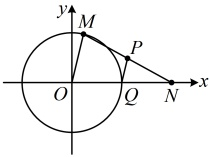

所以圆 C 的方程为  $  (x-1)^{2} + (y-2)^{2} = 1  $.

答案： $ (x-1)^{2}+(y-2)^{2}=1 $

## 类型V：与圆有关的求轨迹方程问题

【例 9】已知点 $M$ 是圆 $O: x^2 + y^2 = 1$ 上的动点，点 $N(2,0)$，则 $MN$ 的中点 $P$ 的轨迹方程是（ ）

A. $(x-1)^2 + y^2 = \frac{1}{4}$  

B. $(x-1)^2 + y^2 = \frac{1}{2}$  

C. $(x+1)^2 + y^2 = \frac{1}{2}$  

D. $(x+1)^2 + y^2 = \frac{1}{4}$

解法1：如图，M在圆上运动，带动P一起动，二者的坐标关系又容易获得，故可考虑用相关点法求P的轨迹，设 $ P(x,y) $， $ M(x_{0},y_{0}) $，则由M在圆O上可得 $ x_{0}^{2}+y_{0}^{2}=1 $ ①，

因为P为MN的中点，所以 $ \left\{\begin{aligned}\frac{x_{0}+2}{2}&=x\textcircled{2}\\ \frac{y_{0}}{2}&=y\textcircled{3}\end{aligned}\right. $，已有关于 $ x_{0} $， $ y_{0} $的方程①，故考虑

由②③反解出  $ x_{0} $， $ y_{0} $，代入①，得到关于 x，y 的方程，

由②③可得  $ \left\{\begin{aligned}x_{0}&=2x-2\\ y_{0}&=2y\end{aligned}\right. $，代入①得  $ (2x-2)^{2}+(2y)^{2}=1 $，化简得： $ (x-1)^{2}+y^{2}=\frac{1}{4} $.

所以点 P 的轨迹方程是  $ (x-1)^{2}+y^{2}=\frac{1}{4} $.

解法2：涉及中点，常联想到中位线，故也可尝试分析几何关系，但注意需单独考虑M，O，N共线的情况，当M不在x轴上时，如图，设ON的中点为Q，则 $ Q(1,0) $，又因为P为MN的中点，所以 $ \left|PQ\right|=\frac{1}{2}\left|OM\right|=\frac{1}{2} $，故点P在以Q为圆心， $ \frac{1}{2} $为半径的圆上，其方程为 $ (x-1)^{2}+y^{2}=\frac{1}{4} $；

当M在x轴上时，M的坐标为 $ (-1,0) $或 $ (1,0) $，此时对应的点P分别为 $ \left(\frac{1}{2},0\right) $， $ \left(\frac{3}{2},0\right) $，

经检验，它们都在圆 $ (x-1)^{2}+y^{2}=\frac{1}{4} $上；综上所述，点P的轨迹方程是 $ (x-1)^{2}+y^{2}=\frac{1}{4} $.

答案：A

【反思】①何时用相关点法求轨迹方程？满足三个特征即可：首先，求轨迹方程的点P是随着另一个点M的运动而运动的；其次，点M的运动轨迹是已知的；最后，P和M的坐标关系容易找到。具体操作步骤为：设求轨迹方程的点P的坐标为 $ (x,y) $（求谁的轨迹就设谁的坐标为 $ (x,y) $），设相关点M的坐标为 $ (x_{0},y_{0}) $，将 $ x_{0} $， $ y_{0} $用x，y表示，代入已知的点M的轨迹方程，即可建立关于x，y的方程，得到点P的轨迹方程。

②圆具有丰富的几何性质，所以与圆有关的求轨迹方程问题，除了代数的方法外，常还可考虑用几何的方法处理，我们再来看几个变式.

【变式1】已知过点  $ P(-1,1) $ 的直线  $ l $ 与圆  $ C:(x+3)^2 + y^2 = 9 $ 交于  $ M $， $ N $ 两点，则弦  $ MN $ 的中点  $ Q $ 的轨迹方程为___。

解析：如图，Q随M和N一起运动，但这里Q的坐标必须由M,N的坐标共同表示，所以不方便像上面例9解法1那样简单地用相关点法求Q的轨迹方程，于是考虑分析几何特征，

当 Q 不与 P，C 重合时，因为 Q 为弦 MN 的中点，所以  $ CQ \perp MN $，从而  $ CQ \perp PQ $。

故点 Q 的轨迹是以 PC 为直径的圆，设该圆的圆心为 T，则 T 为 PC 的中点，