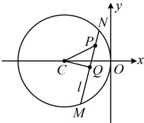
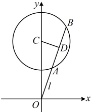
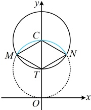

因为$C(-3,0)$，所以$T\left(-2,\frac{1}{2}\right)$，圆$T$的半径$r=\frac{1}{2}\left|PC\right|=\frac{1}{2}\sqrt{[-3-(-1)]^2+(0-1)^2}=\frac{\sqrt{5}}{2}$，所以圆$T$的方程为$(x+2)^2+\left(y-\frac{1}{2}\right)^2=\frac{5}{4}$；

当$Q$与$P$或$C$重合时，经检验，$P$，$C$两点的坐标也满足此方程，

故点$Q$的轨迹方程为$(x+2)^2+\left(y-\frac{1}{2}\right)^2=\frac{5}{4}$。

答案： $ (x+2)^2+\left(y-\frac{1}{2}\right)^2=\frac{5}{4} $

【变式 2】已知过原点  $ O $ 的直线  $ l $ 与圆  $ C: x^2 + y^2 - 8y + 12 = 0 $ 交于  $ A $,  $ B $ 两点， $ D $ 为  $ AB $ 的中点，则点  $ D $ 的轨迹的长度为（ ）

A.  $ \frac{8\pi}{3} $ B.  $ 2\pi $ C.  $ \frac{4\pi}{3} $ D.  $ \frac{2\pi}{3} $

解析： $ x^{2}+y^{2}-8y+12=0\Leftrightarrow x^{2}+(y-4)^{2}=4 $，所以圆C的圆心为 $ C(0,4) $，半径 $ r=2 $，

可以看到，情况与上面变式1类似，仍不方便用相关点法求$D$的轨迹方程，考虑分析几何特征，

当$D$不与$C$重合时，如图1，因为$D$为$AB$的中点，所以$CD \perp AB$，从而$CD \perp OD$，故点$D$在以$OC$为直径的圆$T$上，因为$C(0,4)$，所以$OC$的中点为$T(0,2)$，$|OC|=4$，故圆$T$的方程为$x^2+(y-2)^2=4$ ①；

当$D$与$C$重合时，经检验，点$C$的坐标也满足方程①；

点 $D$ 的轨迹是整个圆 $T$ 吗？与变式 1 不同，本题 $l$ 所过的定点 $O$ 在圆 $C$ 外，这导致以 $OC$ 为直径的圆 $T$ 有一部分在圆 $C$ 外，而弦 $AB$ 的中点只能在圆 $C$ 内，故点 $D$ 不能取整个圆 $T$，只能取圆 $C$ 内的那部分，下面我们来分析这部分。如图 2，已有圆 $T$ 的半径，求 $\widehat{MN}$ 的长还差 $\angle MTN$，由对称性，可先到 $\triangle MTC$ 中求 $\angle MTC$，在图 2 中，$|CM|=|CT|=|TM|=2$，所以 $\triangle MCT$ 是正三角形，从而 $\angle MTC=\frac{\pi}{3}$，故 $\angle MTN=\frac{2\pi}{3}$，所以由弧长公式，$\widehat{MN}$ 的长 $L=\frac{2\pi}{3}\times2=\frac{4\pi}{3}$，即点 $D$ 的轨迹的长为 $\frac{4\pi}{3}$。

图1

图2

答案：C

【反思】圆的弦中点必在圆内，故求出弦中点的轨迹方程后，一定要看看该方程表示的轨迹是否都在圆内. 若不是，则需分析该轨迹在圆内的是哪一部分.

## 类型VI：定点与圆上动点之间距离的最值问题

【例 10】设  $ A(-1,0) $， $ P $ 为圆  $ C: (x-3)^2 + (y+2)^2 = 4 $ 上的动点，则  $ |PA| $ 的最大值为___。

解析：分析圆上动点与定点距离的最值，可尝试画图，看能否直接找到何时$|PA|$最大，如图，点$A$在圆$C$外，由图可知当$P$与$AC$的延长线与圆$C$的交点$P_0$重合时，