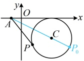
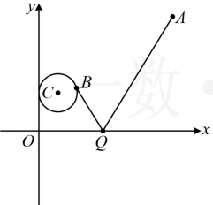
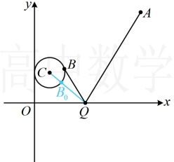
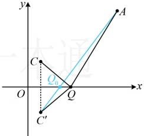
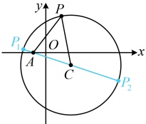

|PA|最大，且最大值为 $ |AC|+|CP_0|=|AC|+2=\sqrt{[3-(-1)]^2+(-2-0)^2}+2=2\sqrt{5}+2 $。

答案： $ 2\sqrt{5}+2 $

【反思】当点 $P$ 在圆 $C$ 上运动时，对圆 $C$ 外的定点 $A$，$|PA|$ 的最大值为 $|AC| + r$，最小值为 $|AC|-r$。这是一个基础最值模型，它还能与其它知识结合，演变出稍复杂的问题，比如下面的变式1；另外，如果点 $A$ 在圆内，$|PA|$ 的最大值与最小值又在何处取得呢？后面的变式2会涉及。

【变式1】已知圆 $ C:(x-1)^2+(y-2)^2=1 $，点 $ A(7,6) $， $ B $为圆 $ C $上的动点， $ Q $为 $ x $轴上的动点，则 $ |QA|+|QB| $的最小值为___。

解析：如图1，B，Q都是动点，不易看出何时 $ |QA|+|QB| $最小，可考虑先取定一个点，取定谁？由于圆外定点到圆上动点的距离最值更容易分析，故考虑先取定O，考虑B在圆上运动的情形，

对 x 轴上任意的点 Q，当 B 在圆 C 上运动时，都有  $ |QB| \geq |QC| - 1 $，所以  $ |QA| + |QB| \geq |QA| + |QC| - 1 $ ①，

取等条件是 $B$ 为线段 $CQ$ 与圆 $C$ 的交点 $B_0$，如图2，再求 $|QA| + |QC|$ 的最小值，此时只有 $Q$ 为动点了，注意到 $A$，$C$ 都在 $x$ 轴的上方，这是典型的“将军饮马”模型，可将 $C$ 对称到 $x$ 轴下方，再作观察，如图3，设 $C'$ 是 $C$ 关于 $x$ 轴的对称点，则 $C'(1,-2)$，且 $|OC| = |OC'|$。

如图3，设 $ C' $是C关于x轴的对称点，则 $ C'(1,-2) $，且 $ \left|QC\right|=\left|QC'\right| $。

所以 $ |QA|+|QC|=|QA|+|QC'|\geq|AC'|=\sqrt{(1-7)^2+(-2-6)^2}=10 $，

取等条件是 Q 为线段  $ AC' $ 与 x 轴的交点  $ Q_{0} $，结合①得  $ |QA| + |QB| \geq |QA| + |QC| - 1 \geq 10 - 1 = 9 $，

当 $Q$ 为线段 $AC'$ 与 $x$ 轴的交点，且 $B$ 为线段 $CQ$ 与圆 $C$ 的交点时，$|QA| + |QB| = 9$，所以 $(|QA| + |QB|)_{\min} = 9$。

图1

图2

图3

答案：9

【变式 2】已知实数  $ x $， $ y $ 满足  $ x^2 + y^2 - 4x + 2y - 11 = 0 $，则  $ \sqrt{(x+1)^2 + y^2} $ 的最小值为___。

解析：观察发现所给方程表示圆， $ \sqrt{(x+1)^2+y^2} $ 可看成点  $ (x,y) $ 与点  $ (-1,0) $ 的距离，故问题即为分析圆上动点到定点  $ (-1,0) $ 距离的最小值，我们先把所给方程化为标准方程，找到圆心和半径，再画图分析，

 $ x^{2}+y^{2}-4x+2y-11=0\Leftrightarrow(x-2)^{2}+(y+1)^{2}=16 $，所以圆心为 $ C(2,-1) $，半径

已 $ P(x,y) $， $ A(-1,0) $，则P是圆C上的动点，且 $ \sqrt{(x+1)^{2}+y^{2}}=\left|PA\right| $，

如图，直观感觉，当 $P$ 为 $CA$ 的延长线与圆 $C$ 交点 $P_1$ 时，$|PA|$ 最小，如何严格证明？

可借助三角形两边之差小于第三边来论证，

当 $P$，$A$，$C$ 不共线时，$|PA| > |PC| - |AC| = |P_1C| - |AC| = |P_1A|$，

当 $P$，$A$，$C$ 共线时，点 $P$ 为图中的 $P_1$ 或 $P_2$，显然 $|P_2A| > |P_1A|$，

所以当且仅当点 P 与  $ P_{1} $ 重合时， $ \left|PA\right| $ 最小，

 $$ \left(\sqrt{(x+1)^{2}+y^{2}}\right)_{\min}=\left|P_{1}A\right|=\left|P_{1}C\right|-\left|A C\right|=4-\sqrt{\left[2-(-1)\right]^{2}+\left(-1-0\right)^{2}}=4-\sqrt{10} $$ 

答案： $ 4-\sqrt{10} $

【反思】当点  $ P $ 在圆  $ C $ 上运动时，对圆  $ C $ 内的定点  $ A $， $ |PA| $ 的最小值为  $ r - |AC| $，最大值为  $ r + |AC| $。