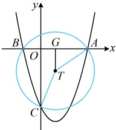

由韦达定理及其推论， $ x_1 + x_2 = m = -\frac{1}{2} $， $ |x_1 - x_2| = \frac{\sqrt{m^2 - 8m}}{|1|} = \frac{\sqrt{17}}{2} $，

所以以  $ AB $ 为直径的圆的圆心为  $ \left(-\frac{1}{4}, 0\right) $，半径  $ r = \frac{1}{2}|AB| = \frac{1}{2}|x_1 - x_2| = \frac{\sqrt{17}}{4} $，

故存在以  $ AB $ 为直径的圆过点  $ C $，其方程为  $ \left(x + \frac{1}{4}\right)^2 + y^2 = \frac{17}{16} $。

解法 2：（对于以 $AB$ 为直径的圆经过点 $C$，我们再来试试按 $|CG| = \frac{1}{2}|AB|$ 翻译）

求得 $C(0,2m)$，$x_1 + x_2 = m$，$x_1x_2 = 2m$，$|x_1 - x_2| = \sqrt{m^2 - 8m}$ 的过程同解法 1，此处不再赘述，

设 $AB$ 中点为 $G$，则 $G\left(\frac{m}{2},0\right)$，所以 $|CG| = \sqrt{\left(\frac{m}{2}-0\right)^2 + (0 - 2m)^2} = \frac{\sqrt{17}}{2}|m|$，

又 $|AB| = |x_1 - x_2| = \sqrt{m^2 - 8m}$，所以当以 $AB$ 为直径的圆过点 $C$ 时，$|CG| = \frac{1}{2}|AB|$，即 $\frac{\sqrt{17}}{2}|m| = \frac{\sqrt{m^2 - 8m}}{2}$

解得：$m = -\frac{1}{2}$ 或 0（舍去），接下来同解法 1.

（2）（过  $ A, B, C $ 三点的圆， $ AB $ 不一定是直径了，所以需要重新求圆的方程，怎么求？由于  $ A, B $ 的坐标不好求，所以不方便设一般方程，用待定系数法处理，考虑先结合垂径定理找圆心、求半径）

设过  $ A, B, C $ 三点的圆的圆心为  $ T(a, b) $，半径为  $ r $，由（1）得  $ x_1 + x_2 = m $，所以线段  $ AB $ 的中垂线为  $ x = \frac{m}{2} $，圆心在该直线上，所以  $ a = \frac{m}{2} $，故  $ T\left(\frac{m}{2}, b\right) $，（怎样求  $ b $？只需建立一个方程，如图，可由  $ |TA| = |TC| $ 建立方程，其中  $ |TC| $ 可由  $ T, C $ 的坐标来算，那  $ |TA| $ 呢？由于设求  $ A $ 的坐标，故不方便像  $ |TC| $ 那样算，观察发现  $ |AB| $ 已求出点  $ T $ 到  $ x $ 轴的距离也容易用  $ b $ 表示，故可到  $ \triangle TGA $ 中用勾股定理计算  $ |TA| $。

连接  $ TG $（ $ G $ 为  $ AB $ 中点），则  $ TG \perp x $ 轴，所以  $ |TG| = |b| $，由（1）知  $ |AG| = \frac{1}{2}|AB| = \frac{1}{2}|x_1 - x_2| = \frac{\sqrt{m^2 - 8m}}{2} $，在  $ \triangle TGA $ 中， $ |TA| = \sqrt{|TG|^2 + |AG|^2} = \sqrt{b^2 + \frac{m^2 - 8m}{4}} $，又  $ |TC| = \sqrt{\left(0 - \frac{m}{2}\right)^2 + (2m - b)^2} = \sqrt{\frac{m^2}{4} + (2m - b)^2} $，且  $ |TA| - |TC| $ 近似为  $ \sqrt{b^2 + m^2 - 8m} = \sqrt{\frac{m^2}{4} + (2m - b)^2} $，化简得： $ 2m + 1 = 2b - 0 $。

且 $ \left|TA\right|=\left|TC\right| $，所以 $ \sqrt{b^{2}+\frac{m^{2}-8m}{4}}=\sqrt{\frac{m^{2}}{4}}+(2m-b)^{2} $，化简得： $ 2m+1-2b=0 $，

所以  $ b = \frac{2m+1}{2} $，从而  $ T\left(\frac{m}{2}, \frac{2m+1}{2}\right) $， $ r = |TA| = \sqrt{b^2 + \frac{m^2 - 8m}{4}} = \sqrt{\left(\frac{2m+1}{2}\right)^2 + \frac{m^2 - 8m}{4}} $

 $ \frac{\sqrt{5m^2 - 4m+1}}{2} $，故圆  $ T $ 的方程为  $ \left(x - \frac{m}{2}\right)^2 + \left(y - \frac{2m+1}{2}\right)^2 = \frac{5m^2 - 4m+1}{4} $ ③，

万程③可化为  $ x^2 + y^2 - mx - (2m+1)y + 2m = 0 $，即  $ x^2 + y^2 - y - m(x + 2y - 2) = 0 $，

令  $ \begin{cases} x^2 + y^2 - y = 0 \\ x + 2y - 2 = 0 \end{cases} $ 解得： $ \begin{cases} x = 0 \\ y = 1 \end{cases} $ 或  $ \begin{cases} x = \frac{2}{5} \\ y = \frac{4}{5} \end{cases} $，所以经过  $ A $， $ B $， $ C $ 三点的圆过定点  $ (0,1) $ 和  $ \left(\frac{2}{5}, \frac{4}{5}\right) $。

【反思】①翻译以  $ AB $ 为直径的圆过点  $ C $，常有三种方法：(i)  $ \overrightarrow{AC} \cdot \overrightarrow{BC} = 0 $；(ii)  $ \left|CG\right| = \frac{1}{2} \left|AB\right| $，其中  $ G $ 为  $ AB $ 中点；(iii)  $ k_{AC} k_{BC} = -1 $，用此法需考虑  $ AC $ 或  $ BC $ 斜率不存在的情况，以及  $ C $ 与  $ A $ 或  $ B $ 重合的情况；②在本题中，我们设出了  $ A $， $ B $ 的坐标，但却没有具体求出这两个坐标，而是结合韦达定理整体处理，这种设而不求的思想在后续内容中会反复用到。

