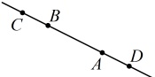

类型III：判定两条直线平行

【例 14】分别根据下列各点的坐标，判断各组中直线 AB 与 CD 是否平行：

(1)  $ A(3,-1) $,  $ B(-1,1) $,  $ C(-3,5) $,  $ D(5,1) $;

(2)  $ A(2,-4) $,  $ B(-\sqrt{3},-4) $,  $ C(0,2) $,  $ D(4,1) $;

(3)  $ A(2,3) $,  $ B(-1,-3) $,  $ C(0,-1) $,  $ D(3,5) $.

解：（1）（观察发现直线 AB 与 CD 的斜率都存在，故要判断它们是否平行，可先看看它们的斜率是否相等）

由题意，直线 AB 的斜率  $ k_{AB} = \frac{1 - (-1)}{-1 - 3} = -\frac{1}{2} $，直线 CD 的斜率  $ k_{CD} = \frac{1 - 5}{5 - (-3)} = -\frac{1}{2} $，所以  $ k_{AB} = k_{CD} $ ①，

（由  $ k_{AB}=k_{CD} $ 一定能得出 AB//CD 吗？不一定，它们也可能重合，如图，当直线 AB 与 CD 重合时，A，B，C，D 四点共线，有  $ k_{AB}=k_{BC} $，故可通过验证  $ k_{AB}=k_{BC} $ 是否成立来判断 AB 与 CD 是否重合）

又因为直线 BC 的斜率  $ k_{BC}=\frac{5-1}{-3-(-1)}=-2 \neq k_{AB} $，所以直线 AB 与 CD 不重合，结合①可得  $ AB \parallel CD $。

（2）由题意，直线  $ AB $ 的斜率  $ k_{AB} = \frac{-4 - (-4)}{-\sqrt{3} - 2} = 0 $，直线  $ CD $ 的斜率  $ k_{CD} = \frac{1 - 2}{4 - 0} = -\frac{1}{4} $，所以  $ k_{AB} \neq k_{CD} $，故直线  $ AB $ 与  $ CD $ 不平行。

（3）由题意，直线  $ AB $ 的斜率  $ k_{AB} = \frac{-3 - 3}{-1 - 2} = 2 $，直线  $ CD $ 的斜率  $ k_{CD} = \frac{5 - (-1)}{3 - 0} = 2 $，所以  $ k_{AB} = k_{CD} $ ②，又因为直线  $ BC $ 的斜率  $ k_{BC} = \frac{-1 - (-3)}{0 - (-1)} = 2 = k_{AB} $，所以结合②得直线  $ AB $ 与  $ CD $ 重合，它们不平行。

【反思】判断斜率存在的直线 AB 与 CD 是否平行，常先算  $ k_{AB} $ 和  $ k_{CD} $，看它们是否相等。若不等，则两直线相交；若相等，则又通过判断  $ k_{AB} = k_{BC} $ 是否成立来检验它们是否重合，若成立，则两直线重合；否则两直线平行。

【变式】若过点  $ P(3,2m) $ 和点  $ Q(-m,2) $ 的直线与过点  $ M(2,-2) $ 和点  $ N(-3,-7) $ 的直线平行，则 m 的值为（）

A. -1 B. 1 C. -5 D. 5

解析：条件给出两直线平行，可考虑由所给坐标，计算斜率，由斜率相等建立方程求 m，

由题意，直线 MN 的斜率  $ k_{MN} = \frac{-7 - (-2)}{-3 - 2} = 1 $，又  $ PQ \parallel MN $，所以直线 PQ 的斜率存在，且  $ k_{PQ} = k_{MN} $，

由所给坐标， $ k_{PQ} = \frac{2 - 2m}{-m - 3} = \frac{2m - 2}{m + 3} $，所以  $ \frac{2m - 2}{m + 3} = 1 $，解得：m = 5。

答案：D

类型IV：判定两条直线垂直

【例 15】已知直线  $ l_{1} $ 经过  $ A(-3,4) $， $ B(-8,-1) $ 两点，直线  $ l_{2} $ 的倾斜角为  $ 135^{\circ} $，则  $ l_{1} $ 与  $ l_{2} $（）

A. 垂直 B. 平行 C. 重合 D. 相交但不垂直

解析：判断斜率存在的两直线是否垂直，可看它们的斜率之积是否等于 -1，下面先计算两直线的斜率，因为直线  $ l_1 $ 过  $ A(-3,4) $， $ B(-8,-1) $ 两点，所以其斜率  $ k_1 = \frac{4 - (-1)}{-3 - (-8)} = 1 $，