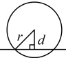
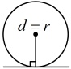
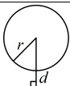
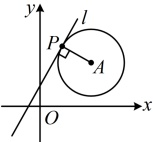
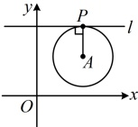
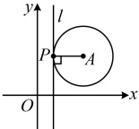

# 2.5.1 直线与圆的位置关系

习题：P1

## 知识梳理

## 知识点 1：直线与圆的位置关系

直线与圆有三种位置关系：相交、相切、相离。判断方法用表格表示如下：

<table border=1 style='margin: auto; word-wrap: break-word;'><tr><td colspan="2">位置关系</td><td style='text-align: center; word-wrap: break-word;'>相交</td><td style='text-align: center; word-wrap: break-word;'>相切</td><td style='text-align: center; word-wrap: break-word;'>相离</td></tr><tr><td colspan="2">图示</td><td style='text-align: center; word-wrap: break-word;'></td><td style='text-align: center; word-wrap: break-word;'></td><td style='text-align: center; word-wrap: break-word;'></td></tr><tr><td colspan="2">公共点个数</td><td style='text-align: center; word-wrap: break-word;'>2</td><td style='text-align: center; word-wrap: break-word;'>1</td><td style='text-align: center; word-wrap: break-word;'>0</td></tr><tr><td rowspan="2">判定方法</td><td style='text-align: center; word-wrap: break-word;'>几何法</td><td style='text-align: center; word-wrap: break-word;'>d &lt; r</td><td style='text-align: center; word-wrap: break-word;'>d = r</td><td style='text-align: center; word-wrap: break-word;'>d &gt; r</td></tr><tr><td style='text-align: center; word-wrap: break-word;'>代数法</td><td style='text-align: center; word-wrap: break-word;'>$ \Delta &gt; 0 $</td><td style='text-align: center; word-wrap: break-word;'>$ \Delta = 0 $</td><td style='text-align: center; word-wrap: break-word;'>$ \Delta &lt; 0 $</td></tr></table>

注：①几何法中的 d 指的是圆心到直线的距离，r 指的是圆的半径.

②代数法指的是联立直线和圆的方程，消去y（或x）后，得到关于x（或y）的一元二次方程，根据该方程的判别式 $ \Delta $的正负情况判断直线与圆的交点个数.

## 知识点2：直线与圆相切

1. 过圆上一点的切线

过圆上一点 $ P(x_{0},y_{0}) $的切线只有一条，切线有斜率存在和不存在两种情况.

若切线 $l$ 的斜率存在，设为 $k$。当 $PA$ 斜率存在时，如图 1，先由 $P$，$A$ 的坐标求 $k_{PA}$，再由 $l \perp PA$ 求 $k$，再用点斜式写出切线 $l$ 的方程；当 $PA$ 的斜率不存在时，如图 2，$k=0$，可直接得到切线 $l$ 的方程为 $y=y_0$。

如图3，若切线$l$的斜率不存在，则可直接得到切线$l$的方程为$x=x_0$。

图1

图2

图3

## 知识点1

【例 1】直线  $ l: 2x - y + 1 = 0 $ 与圆 C:  $ (x+1)^{2} + y^{2} = 4 $ 的位置关系是（）

A. 相离 B. 相切

C. 相交 D. 无法确定

解法1：判断直线与圆的位置关系，先计算圆心到直线的距离，再与半径比较，由题意，圆心  $ C(-1,0) $，半径  $ r=2 $，所以 C 到 l 的距离  $ d=\frac{|2\times(-1)-0+1|}{\sqrt{2^2+(-1)^2}} $  $ =\frac{\sqrt{5}}{5}<r $，故直线 l 与圆 C 相交。

解法2：判断直线与圆的位置关系，也可用代数法处理，

直线 l 的方程可化为  $ y=2x+1 $，代入圆 C 的方程整理得： $ 5x^2+6x-2=0 $，

判别式  $ \Delta=6^2-4\times5\times(-2)=76>0 $，

所以直线 l 与圆 C 相交。

答案：C

【反思】判断直线与圆的位置关系，常有几何、代数两种方法，但几何法往往计算量更小，所以后续问题我们以几何法为主。

## 知识点2

【例2】“k=0”是“直线l:y=kx+2

与圆 $ C:x^{2}+y^{2}-2y=0 $相切”的（）

A. 必要不充分条件

B．充分不必要条件

C．充要条件

D．既不充分也不必要条件

解析： $ x^2 + y^2 - 2y = 0 \Leftrightarrow x^2 + (y - 1)^2 = 1 $，

所以圆  $ C $ 的圆心为  $ C(0,1) $，半径  $ r = 1 $，

 $ y = kx + 2 \Leftrightarrow kx - y + 2 = 0 $，

 $ l $ 与圆  $ C $ 相切  $ \Leftrightarrow $ 圆心  $ C $ 到  $ l $ 的距离与  $ r $ 相等