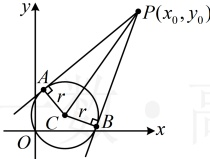
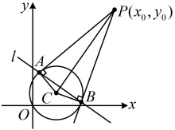
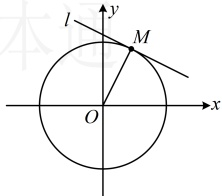

<table border=1 style='margin: auto; word-wrap: break-word;'><tr><td colspan="2">圆上一点 $ P(x_0,y_0) $的切线 $ l $的方程结论如下表：</td></tr><tr><td style='text-align: center; word-wrap: break-word;'>圆的方程</td><td style='text-align: center; word-wrap: break-word;'>切线方程</td></tr><tr><td style='text-align: center; word-wrap: break-word;'>$ (x-a)^2+(y-b)^2=r^2 $</td><td style='text-align: center; word-wrap: break-word;'>$ (x_0-a)(x-a)+(y_0-b)(y-b)=r^2 $</td></tr><tr><td style='text-align: center; word-wrap: break-word;'>$ x^2+y^2+Dx+Ey+F=0 $</td><td style='text-align: center; word-wrap: break-word;'>$ x_0x+y_0y+D\cdot\frac{x_0+x}{2}+E\cdot\frac{y_0+y}{2}+F=0 $</td></tr></table>

注：上述公式可用于选择、填空题的快速求解，在解答题中，则建议用前面叙述的常规方法。

### 2. 切线长

如图，过圆 C 外一点  $ P(x_0, y_0) $ 的圆的切线有两条， $ A $， $ B $ 为切点，我们把  $ |PA| $ 和  $ |PB| $ 称为切线长。两切线的切线长相等，且常利用勾股定理来计算， $ |PA| = |PB| = \sqrt{|PC|^2 - r^2} $。

### 3. 切点弦

如图，过圆外一点  $ P(x_0, y_0) $ 引圆的两条切线，切点分别为  $ A $,  $ B $，弦  $ AB $ 称为该圆的切点弦。下面给出过圆外一点  $ P(x_0, y_0) $ 引圆的切线所得切点弦所在直线  $ l $ 的方程：

 $ \Leftrightarrow \frac{|k \cdot 0 - 1 + 2|}{\sqrt{k^2 + (-1)^2}} = 1 \Leftrightarrow k^2 + 1 = 1 \Leftrightarrow k = 0 $，

所以“ $ k = 0 $”是“直线  $ l: y = kx + 2 $ 与圆  $ C: x^2 + y^2 - 2y = 0 $ 相切”的充要条件。

答案：C

<table border=1 style='margin: auto; word-wrap: break-word;'><tr><td style='text-align: center; word-wrap: break-word;'>圆的方程</td><td style='text-align: center; word-wrap: break-word;'>切点弦方程</td></tr><tr><td style='text-align: center; word-wrap: break-word;'>$ (x-a)^{2}+(y-b)^{2}=r^{2} $</td><td style='text-align: center; word-wrap: break-word;'>$ (x_{0}-a)(x-a)+(y_{0}-b)(y-b)=r^{2} $</td></tr><tr><td style='text-align: center; word-wrap: break-word;'>$ x^{2}+y^{2}+Dx+Ey+F=0 $</td><td style='text-align: center; word-wrap: break-word;'>$ x_{0}x+y_{0}y+D\cdot\frac{x_{0}+x}{2}+E\cdot\frac{y_{0}+y}{2}+F=0 $</td></tr></table>

【例 3】已知点  $ M(1,2) $ 在圆  $ O: x^2 + y^2 = r^2 $ 上，则过点  $ M $ 的圆  $ O $ 的切线  $ l $ 的方程为 ___.

解法1：$r$ 未知，先将点代入圆的方程求 $r$，

把点 $M$ 代入圆 $O$ 的方程中，有 $1^2 + 2^2 = r^2$，

结合 $r > 0$ 可解得：$r = \sqrt{5}$，

所以圆 $O$ 的方程为 $x^2 + y^2 = 5$，

如图，$l \perp OM$，且 $k_{OM} = \frac{2 - 0}{1 - 0} = 2$，

所以切线 $l$ 的斜率 $k = -\frac{1}{k_{OM}} = -\frac{1}{2}$，

故切线 $l$ 的方程为 $y - 2 = -\frac{1}{2}(x - 1)$，

整理得：$x + 2y - 5 = 0$。

解法2：同解法1 求出圆 O 的方程后，也可利用知识点2第1点中的结论快速写出切线 l 的方程，

圆  $ O: x^{2} + y^{2} = 5 $ 在点  $ M(1,2) $ 处的切线 l 的方程为  $ 1 \cdot x + 2 \cdot y = 5 $，即  $ x + 2y - 5 = 0 $。

答案： $ x + 2y - 5 = 0 $

【例4】过圆 $ O:x^2+y^2=1 $外的一点 $ P(3,2) $作圆 $ O $的两条切线，切点分别为 $ M $， $ N $，则 $ |MP|= $___，直线 $ MN $的方程为___。

解析：由题意，圆 $O$ 的圆心为 $O(0,0)$，

半径 $r=1$，所以 $|OM|=1$，

如图，$|OP|=\sqrt{(3-0)^2+(2-0)^2}=\sqrt{13}$，