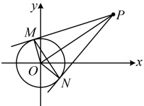

注：①切点弦方程与前述过圆上一点 $ P(x_{0},y_{0}) $的切线方程的形式相同，但含义不同.

当 P 在圆上时，方程  $ (x_0 - a)(x - a) + (y_0 - b)(y - b) = r^2 $ 或  $ x_0x + y_0y + D \cdot \frac{x_0 + x}{2} + E \cdot \frac{y_0 + y}{2} + F = 0 $ 表示圆在点 P 处的切线方程；

当 P 在圆外时，方程  $ (x_{0}-a)(x-a)+(y_{0}-b)(y-b)=r^{2} $ 或  $ x_{0}x+y_{0}y+D\cdot\frac{x_{0}+x}{2}+E\cdot\frac{y_{0}+y}{2}+F=0 $ 表示过点 P 作圆的两条切线，切点弦所在直线的方程.

②上述公式建议用于选择、填空题的快速求解.

由 MP 是圆 O 的一条切线得  $ MP \perp OM $，

所以  $ \left|MP\right| = \sqrt{\left|OP\right|^{2} - \left|OM\right|^{2}} $

 $ =\sqrt{(\sqrt{13})^{2}-1^{2}}=2\sqrt{3} $

由知识点2第3点的结论，切点弦MN所在

直线的方程为 $ 3\cdot x+2\cdot y=1 $，

即 $ 3x+2y-1=0 $。

答案： $ 2\sqrt{3} $， $ 3x+2y-1=0 $

## 本节核心题型

本节核心内容基于直线与圆的相离、相交、相切三种位置关系而设计，首先类型Ⅰ针对的是判断直线与圆的位置关系和根据直线与圆的位置关系求参这两类问题，其目的是让同学们熟悉直线与圆位置关系的判断方法；类型Ⅱ、Ⅲ这两组题是在直线与圆相交的基础上设计的题型，包括弦长计算和中点弦问题；类型Ⅳ则涉及圆的切线有关的计算；最后的类型V，我们归纳基于直线与圆的位置关系演变出的一系列最值问题。请大家跟着例题、解析和反思去学习、归纳这些题型的处理方法吧。

## 类型 I：直线与圆的位置关系的判断与应用

【例 5】已知圆  $ C:(x-1)^{2}+(y-1)^{2}=4 $，直线  $ l:mx-y-2m=0 $，则直线  $ l $ 与圆  $ C $ 的公共点个数为（ ）

A. 0 个          B. 1 个          C. 2 个          D. 与  $ m $ 有关，不能确定

解法1：判断直线与圆的位置关系，可计算圆心到直线的距离，与半径比较，

由题意，圆 $C$ 的圆心为 $C(1,1)$，半径 $r=2$，所以圆心到直线 $l$ 的距离 $d=\frac{|m-1-2m|}{\sqrt{m^2+(-1)^2}}=\frac{|m+1|}{\sqrt{m^2+1}}=\sqrt{\frac{(m+1)^2}{m^2+1}}$

$=\sqrt{\frac{m^2+2m+1}{m^2+1}}=\sqrt{1+\frac{2m}{m^2+1}}$，对于 $\frac{2m}{m^2+1}$ 这部分，常上下同除以 $m$，再用基本不等式分析，但需讨论 $m$ 的正负，

当 $m\leq0$ 时，因为 $m^2+1\geq1>0$，所以 $\frac{2m}{m^2+1}\leq0$，故 $d=\sqrt{1+\frac{2m}{m^2+1}}\leq1$；

当 $m>0$ 时，$\frac{2m}{m^2+1}=\frac{2}{m+\frac{1}{m}}\leq\frac{2}{2\sqrt{m\cdot\frac{1}{m}}}=1$，所以 $d=\sqrt{1+\frac{2m}{m^2+1}}\leq\sqrt{1+1}=\sqrt{2}$，取等条件是 $m=\frac{1}{m}$，即 $m=1$；

综上所述，$d\leq\sqrt{2}<r$ 对任意的实数 $m$ 恒成立，所以直线 $l$ 与圆 $C$ 相交，它们有 2 个交点。