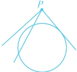

解法2：观察发现直线 $l$ 过定点，故先找到该定点，再通过判断该定点与圆的位置关系来判断直线 $l$ 与圆 $C$ 的公共点个数，$mx - y - 2m = 0 \Rightarrow m(x - 2) - y = 0$，令 $\begin{cases} x - 2 = 0 \\ y = 0 \end{cases}$ 得 $\begin{cases} x = 2 \\ y = 0 \end{cases}$，所以直线 $l$ 过定点 $P(2,0)$，因为 $(2 - 1)^2 + (0 - 1)^2 = 2 < 4$，所以点 $P$ 在圆 $C$ 内部，故直线 $l$ 与圆 $C$ 相交，它们有 2 个公共点。

答案：C

【反思】①判断直线与圆的位置关系，常规方法是计算圆心到直线的距离 d，再与半径 r 比较。

(i)若  $ d > r $，则直线与圆相离；(ii)若  $ d = r $，则直线与圆相切；(iii)若  $ d < r $，则直线与圆相交。不仅判断直线与圆的位置关系可以这么处理，已知直线与圆的位置关系求参时，也能这样翻译，比如下面的变式1，2，3。

②若直线是过定点P的动直线，则也可通过判断点P与圆的位置关系来判断直线与圆的位置关系。

(i) 若 P 在圆外，则如图 1，直线与圆可能相离、相交或相切；(ii) 若 P 在圆上，则如图 2，直线与圆可能相切或相交；(iii) 若 P 在圆内，则如图 3，直线与圆只能相交.

图1

图2

图3

【变式1】（多选）已知圆  $ M: x^2 + y^2 = 1 $，直线  $ l: y = k(x + \sqrt{3}) - 1 $，则（ ）

A.  $ l $ 恒过定点  $ (\sqrt{3}, -1) $  

B. 若  $ l $ 平分圆周  $ M $，则  $ k = \frac{\sqrt{3}}{3} $  

C. 当  $ k = \sqrt{3} $ 时， $ l $ 与圆  $ M $ 相切  

D. 当  $ -\sqrt{3} < k < \sqrt{3} $ 时， $ l $ 与圆  $ M $ 相交

解析：A 项，令  $ x + \sqrt{3} = 0 $ 可得  $ x = -\sqrt{3} $，此时  $ y = -1 $，所以直线  $ l $ 恒过定点  $ (-\sqrt{3}, -1) $，故 A 项错误；B 项，平分圆周意味着过圆心，故可直接将圆心的坐标代入直线  $ l $ 的方程求  $ k $，

由题意， $ l $ 过圆心  $ M(0, 0) $，代入  $ l $ 的方程得  $ 0 = k \cdot (0 + \sqrt{3}) - 1 $，解得： $ k = \frac{\sqrt{3}}{3} $，故 B 项正确；

当  $ k = \sqrt{3} $ 时， $ l $ 的方程为  $ y = \sqrt{3}(x + \sqrt{3}) - 1 $，即  $ \sqrt{3}x - y + 2 = 0 \Rightarrow $ 圆心  $ M $ 到  $ l $ 的距离  $ d = \frac{|2|}{\sqrt{(\sqrt{3})^2 + (-1)^2}} = 1 $；又圆  $ M $ 的半径  $ r = 1 $，所以  $ d = r $，从而直线  $ l $ 与圆  $ M $ 相切，故 C 项正确；

D 项，直线与圆相交 ⇔ 圆心到直线的距离  $ d < r $，由此求出  $ k $ 的范围，与此项的结论比较，

直线  $ l $ 的方程可化为  $ kx - y + \sqrt{3}k - 1 = 0 $，所以直线  $ l $ 与圆  $ M $ 相交 ⇔  $ d = \frac{\left|\sqrt{3}k - 1\right|}{\sqrt{k^2 + (-1)^2}} < 1 $，解得： $ 0 < k < \sqrt{3} $，

从而当  $ -\sqrt{3} < k < \sqrt{3} $ 时， $ l $ 与圆  $ M $ 不一定相交，故 D 项错误。

答案：BC

【变式 2】已知圆  $ O: x^2 + y^2 = r^2 (r > 0) $，设直线  $ x + \sqrt{3}y - \sqrt{3} = 0 $ 与两坐标轴的交点分别为  $ A $， $ B $，若圆  $ O $ 上有且只有一个点  $ P $ 满足  $ |AP| = |BP| $，则  $ r $ 的值为___。

解析：所给直线与坐标轴的交点 A，B 的坐标可求，先把它们求出来，