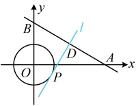
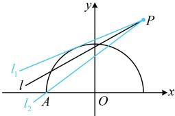

联立 $ \begin{cases}y=0\\x+\sqrt{3}y-\sqrt{3}=0\end{cases} $解得： $ x=\sqrt{3} $，所以 $ A(\sqrt{3},0) $，联立 $ \begin{cases}x=0\\x+\sqrt{3}y-\sqrt{3}=0\end{cases} $解得： $ y=1 $，所以 $ B(0,1) $，

怎样翻译圆 $ O $上只有1个点 $ P $满足 $ |AP|=|BP| $？由于满足 $ |AP|=|BP| $的点 $ P $在线段 $ AB $的中垂线上，所以问题等

价于 $ AB $的中垂线与圆 $ O $只有1个交点，

如图， $ AB $中点为 $ D\left(\frac{\sqrt{3}}{2},\frac{1}{2}\right) $，直线 $ AB $的斜率为 $ -\frac{\sqrt{3}}{3}\Rightarrow AB $中垂线 $ l $的斜率为 $ \sqrt{3} $，

所以 $ AB $中垂线 $ l $的方程为 $ y-\frac{1}{2}=\sqrt{3}\left(x-\frac{\sqrt{3}}{2}\right) $，整理得： $ \sqrt{3}x-y-1=0 $，

由题意，圆 $ O $与直线 $ l $相切，所以 $ d=\frac{|-1|}{\sqrt{(\sqrt{3})^2+(-1)^2}}=r $，故 $ r=\frac{1}{2} $。

答案： $ \frac{1}{2} $

【变式 3】已知圆  $ C $ 的圆心在  $ x $ 轴正半轴上，且与直线  $ x - \sqrt{3}y + 1 = 0 $ 和  $ y $ 轴都相切，则圆  $ C $ 的方程为___。

解析：条件给出圆心在 x 轴正半轴上，则写出圆的方程只差圆心的横坐标和半径，故可考虑设出它们，并翻译圆 C 与所给两直线相切，建立方程组求解所设未知量，

由题意，可设圆 C 的圆心为  $ C(a,0) $， $ a>0 $，半径为 r，因为圆 C 与直线  $ x-\sqrt{3}y+1=0 $ 和 y 轴都相切，

所以  $ \frac{|a+1|}{\sqrt{1^2+(\sqrt{3})^2}}=r $ 且  $ |a|=r $，从而  $ \frac{|a+1|}{\sqrt{1^2+(\sqrt{3})^2}}=|a| $，解得： $ a=1 $ 或  $ -\frac{1}{3} $（舍去），故  $ r=|a|=1 $，

 $$ (x-1)^{2}+y^{2}=1 $$ 

答案： $ (x-1)^{2}+y^{2}=1 $

【变式 4】若关于  $ x $ 的方程  $ kx - 2k + 3 - \sqrt{4 - x^2} = 0 $ 有且仅有 2 个不同的实数根，则实数  $ k $ 的取值范围是___.

解析：直接研究所给方程的解不易，而方程解的个数问题可转化为图象的交点个数问题来分析，故考虑按此处理。观察发现将  $ kx - 2k + 3 $ 和  $ \sqrt{4 - x^2} $ 分开，就能画图了， $ kx - 2k + 3 - \sqrt{4 - x^2} = 0 \Leftrightarrow kx - 2k + 3 = \sqrt{4 - x^2} $，所以题设条件等价于直线  $ l: y = kx - 2k + 3 $ 与曲线  $ C: y = \sqrt{4 - x^2} $ 有且仅有 2 个交点，容易看出直线  $ l $ 是过定点的直线，那曲线  $ C $ 呢？曲线  $ C $ 的方程带根号，可通过平方去根号，再作观察，直线  $ l $ 的方程可化为  $ y = k(x - 2) + 3 $，令  $ x - 2 = 0 $ 得  $ x = 2 $，此时  $ y = 3 $，所以直线  $ l $ 过定点  $ P(2, 3) $，由  $ y = \sqrt{4 - x^2} $ 可得  $ y^2 = 4 - x^2 (y \geq 0) $，即  $ x^2 + y^2 = 4 (y \geq 0) $，所以曲线  $ C $ 是圆心为原点，半径为 2 的上半圆，如图，要使直线  $ l $ 与曲线  $ C $ 恰有 2 个交点，则  $ l $ 可从  $ l_1 $（不可取）绕点  $ P $ 逆时针旋转至  $ l_2 $（可取），其中直线  $ l $ 与圆  $ \varOmega $ 相切，所以圆心  $ \varOmega $ 到  $ l: kx - v - 2k + 3 = 0 $ 的距离  $ d = \frac{|-2k + 3|}{\sqrt{k^2 + (-1)^2}} = 2 $，解得： $ k = \frac{5}{12} $，直线  $ l_2 $ 过  $ P(2, 3) $ 和  $ A(-2, 0) $，其斜率  $ k = \frac{0 - 3}{-2 - 2} = \frac{3}{4} $，所以实数  $ k $ 的取值范围是  $ \left( \frac{5}{12}, \frac{3}{4} \right] $。

答案： $ \left( \frac{5}{12}, \frac{3}{4} \right] $

【反思】可以看到，本题虽仍是根据直线与圆的位置关系求参，但设问的方式与前几题不同，且由于本题只取了上半圆，所以不能将直线与圆有 2 个交点简单地翻译成  $ d < r $，需要具体问题具体分析。

