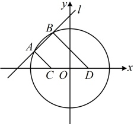
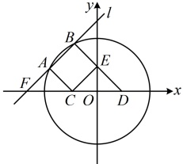

类型Ⅱ：弦长计算

【例 6】已知圆  $ C: x^{2} + y^{2} - 2x - 2y - 2 = 0 $，直线  $ l: x - y + 2 = 0 $.

（1）求圆 C 的圆心及半径；

（2）求直线 l 被圆 C 截得的弦 AB 的长.

解：（1）由 $ x^{2}+y^{2}-2x-2y-2=0 $可得 $ (x-1)^{2}+(y-1)^{2}=4 $，所以圆C的圆心为 $ C(1,1) $，半径 $ r=2 $。

（2）（涉及直线被圆截得的弦长，考虑用公式  $ L=2\sqrt{r^2-d^2} $ 计算，已有  $ r $，下面先算圆心到直线的距离  $ d $）

圆心  $ C $ 到直线  $ l $ 的距离  $ d=\frac{|1-1+2|}{\sqrt{1^2+(-1)^2}}=\sqrt{2} $，所以直线  $ l $ 被圆  $ C $ 截得的弦长  $ L=2\sqrt{r^2-d^2}=2\sqrt{2} $。

【反思】直线被圆截得的弦长常用公式  $ L=2\sqrt{r^{2}-d^{2}} $ 计算。本题是让求弦长，若是已知弦长求参，我们也常用此公式建立方程，比如下面的变式1。另外，弦长还可能结合平面几何知识考查，在变式2，3中会涉及。甚至有的题条件并不涉及弦长，但其本质仍是弦长问题，比如后面的变式4。

【变式1】（2025·天津卷）直线 $ l:x-y+6=0 $与x轴交于点 $ A $，与y轴交于点 $ B $，与圆 $ (x+1)^2+(y-3)^2=r^2(r>0) $交于 $ C $， $ D $两点，若 $ |AB|=3|CD| $，则 $ r= $___。

解析：条件给出  $ |AB|=3|CD| $，且分析发现  $ |AB| $ 和  $ |CD| $ 都好求，故先求出它们，再由此建立方程求  $ r $，联立  $ \begin{cases} y=0 \\ x-y+6=0 \end{cases} $ 解得： $ \begin{cases} x=-6 \\ y=0 \end{cases} $，所以  $ A(-6,0) $，联立  $ \begin{cases} x=0 \\ x-y+6=0 \end{cases} $ 解得： $ \begin{cases} x=0 \\ y=6 \end{cases} $，所以  $ B(0,6) $，故  $ |AB|=\sqrt{(-6-0)^2+(0-6)^2}=6\sqrt{2} $，

再求 |CD|，这是直线被圆截得的弦长，可用弦长公式  $ L = 2\sqrt{r^2 - d^2} $ 计算，下面先求  $ d $，圆心  $ (-1,3) $ 到直线  $ l $ 的距离  $ d = \frac{|-1 - 3 + 6|}{\sqrt{1^2 + (-1)^2}} = \sqrt{2} $，所以  $ |CD| = 2\sqrt{r^2 - d^2} = 2\sqrt{r^2 - 2} $，由题意， $ |AB| = 3|CD| $，所以  $ 6\sqrt{2} = 3 \times 2\sqrt{r^2 - 2} $，结合  $ r > 0 $ 可得  $ r = 2 $。

答案：2

【变式 2】已知直线  $ l: x - y + 4 = 0 $ 与圆  $ O: x^2 + y^2 = 9 $ 交于  $ A $,  $ B $ 两点，过  $ A $,  $ B $ 分别作  $ l $ 的垂线交  $ x $ 轴于  $ C $,  $ D $ 两点，则  $ |CD| = $（ ）

A.  $ \sqrt{2} $ B. 2 C.  $ 2\sqrt{2} $ D. 4

解析：如图1，这里所求不是弦长 $ |AB| $，而是让求 $ |CD| $，怎么办呢？CD是直角梯形ABDC的斜腰，计算斜腰，常考虑过C向BD作垂线，构造直角三角形来分析，

图1

图2

如图2，作 $ CE\perp BD $于点E，由题意， $ l\perp BD $， $ l\perp AC $，所以 $ AC\parallel BE $， $ AB\parallel CE $，故四边形ABEC是矩形，