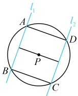
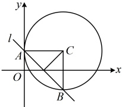

由 $AB \parallel CE$ 可得 $\angle ECD = \angle AFC$，而 $\angle AFC$ 即为直线 $l$ 的倾斜角，

由 $AB \parallel CE$ 可得 $\angle ECD = \angle AFC$，而 $\angle AFC$ 即为直线 $l$ 的倾斜角，

$x - y + 4 = 0 \Rightarrow y = x + 4 \Rightarrow l$ 的斜率为 $1 \Rightarrow l$ 的倾斜角为 $45^\circ$，所以 $\angle ECD = 45^\circ$，

观察图 2 可发现，有了 $\angle ECD$，只要再求出 $\triangle CDE$ 的一边，就能得到 $|CD|$，观察发现 $|CE| = |AB|$，而 $|AB|$ 是直线 $l$ 被圆 $O$ 截得的弦长，可按公式 $L = 2\sqrt{r^2 - d^2}$ 计算，

圆心 $O$ 到直线 $l$ 的距离 $d = \frac{|4|}{\sqrt{1^2 + (-1)^2}} = 2\sqrt{2}$，所以 $|AB| = 2\sqrt{r^2 - d^2} = 2\sqrt{9 - (2\sqrt{2})^2} = 2$，

从而 $|CE| = |AB| = 2$，故在 $\triangle CDE$ 中，$|CD| = \frac{|CE|}{\cos \angle ECD} = \frac{2}{\cos 45^\circ} = 2\sqrt{2}$。

答案：C

【变式 3】若两条直线  $ l_1: y = 3x + m $， $ l_2: y = 3x + n $ 与圆  $ x^2 + y^2 + 3x + y + k = 0 $ 的四个交点能构成矩形，则  $ m + n =  $___。

解析：如图，四个交点  $ A $， $ B $， $ C $， $ D $ 能构成矩形等价于  $ l_1 \parallel l_2 $ 且  $ |AB| = |CD| $，

由题意， $ l_{1} $ 和  $ l_{2} $ 的斜率都为 3，所以要使  $ l_{1} \parallel l_{2} $，只需  $ m \neq n $，

再翻译  $ |AB|=|CD| $，涉及圆的弦长，可用  $ L=2\sqrt{r^{2}-d^{2}} $ 处理，不难发现只需圆心到两直线的距离相等，

由  $ x^{2}+y^{2}+3x+y+k=0 $ 可得  $ \left(x+\frac{3}{2}\right)^{2}+\left(y+\frac{1}{2}\right)^{2}=\frac{5}{2}-k $，所以圆心为  $ P\left(-\frac{3}{2},-\frac{1}{2}\right) $

 $ l_{2} $ 的方程可分别化为  $ 3x - y + m = 0 $，  $ 3x - y + n = 0 $，

所以 $ \frac{\left|3\times\left(-\frac{3}{2}\right)-\left(-\frac{1}{2}\right)+m\right|}{\sqrt{3^{2}+(-1)^{2}}}=\frac{\left|3\times\left(-\frac{3}{2}\right)-\left(-\frac{1}{2}\right)+n\right|}{\sqrt{3^{2}+(-1)^{2}}}\Rightarrow|m-4|=|n-4| $，故 $ m-4=\pm(n-4) $，又 $ m\neq n $，所以 $ m-4\neq n-4 $，从而 $ m-4=-(n-4) $，故 $ m+n=8 $。

答案：8

【变式 4】已知直线  $ l: x + y = 1 $ 与圆  $ C: (x - a)^2 + (y - 1)^2 = 4 $ 交于  $ A, B $ 两点，若  $ \triangle ABC $ 的面积为 2，则  $ a $ 的值是（ ）

A.  $ \pm1 $ B.  $ \pm\sqrt{2} $ C.  $ \pm2 $ D.  $ \pm\sqrt{5} $

解析：条件给出$\triangle ABC$的面积为2，如何翻译？需先表示该面积。如图，可以$AB$为底边，则底边可用弦长公式$L=2\sqrt{r^2-d^2}$计算，高即为点$C$到直线$l$的距离$d$，两者都与$d$有关，故先用$d$表示$S_{\triangle ABC}$，由弦长公式，$|AB|=2\sqrt{r^2-d^2}=2\sqrt{4-d^2}$，所以$S_{\triangle ABC}=\frac{1}{2}|AB|\cdot d=\frac{1}{2}\times2\sqrt{4-d^2}\cdot d=\sqrt{4-d^2}\cdot d$，又由题意，$S_{\triangle ABC}=2$，所以$\sqrt{4-d^2}\cdot d=2$，解得：$d=\sqrt{2}$，

根据点到直线的距离公式， $ d $ 又可用  $ a $ 表示，于是可建立方程求  $ a $，圆  $ C $ 的圆心为  $ C(a,1) $，直线  $ l $ 的方程可化为  $ x + y - 1 = 0 $，所以  $ d = \frac{|a + 1 - 1|}{\sqrt{1^2 + 1^2}} = \frac{|a|}{\sqrt{2}} $，从而  $ \frac{|a|}{\sqrt{2}} = \sqrt{2} $，故  $ a = \pm 2 $。

答案：C

类型Ⅲ：中点弦问题

【例 7】已知圆  $ C:(x-1)^{2}+y^{2}=10 $，直线 l 过点  $ P(3,1) $ 且与圆 C 交于 A, B 两点，若 P 为线段 AB