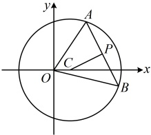
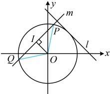
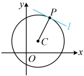

的中点，O为坐标原点，则 $ \triangle AOB $的面积为___.

解析：条件涉及 $P$ 为弦 $AB$ 的中点，想到垂径定理，如图，因为 $P$ 为 $AB$ 的中点，所以 $PC \perp AB$，

怎样计算 $S_{\triangle AOB}$？可以 $AB$ 为底边，$|AB|$ 可按弦长公式 $L=2\sqrt{r^2-d^2}$ 计算，要圆心 $C$ 到直线 $AB$ 的距离 $d$，下面

先由 $PC \perp AB$ 求直线 $AB$ 的方程，圆心 $C$ 的坐标为 $(1,0)$，又 $P(3,1)$，所以 $k_{PC}=\frac{0-1}{1-3}=\frac{1}{2}$，

从而 $k_{AB}=-\frac{1}{k_{PC}}=-2$，故直线 $AB$ 的方程为 $y-1=-2(x-3)$，即 $2x+y-7=0$，

所以圆心 $C$ 到直线 $AB$ 的距离 $d = \frac{|2 \times 1 + 0 - 7|}{\sqrt{2^2 + 1^2}} = \sqrt{5}$，故 $|AB| = 2\sqrt{r^2 - d^2}$

$=2\sqrt{10 - (\sqrt{5})^2} = 2\sqrt{5}$，又原点到直线 $AB$ 的距离 $h = \frac{|-7|}{\sqrt{2^2 + 1^2}} = \frac{7}{\sqrt{5}}$，

所以 $S_{\triangle AOB} = \frac{1}{2}|AB| \cdot h = \frac{1}{2} \times 2\sqrt{5} \times \frac{7}{\sqrt{5}} = 7$。

答案：7

【反思】涉及圆的弦中点，常抓住弦中点与圆心的连线垂直于弦来分析。本题是直接给出了弦中点，其实在诸多问题中，即使题干没有提及弦中点，我们也可以取出弦中点来分析，比如下面的变式。

【变式】设 $O$ 为坐标原点，圆 $O$ 与直线 $l: x + y = 2$ 相切，与直线 $l$ 垂直的直线 $m$ 与圆 $O$ 交于不同的两点 $P$，$\overrightarrow{Q}$，若 $\overrightarrow{OP} \cdot \overrightarrow{OQ} < 0$，则直线 $m$ 的纵截距的取值范围是___。

解析：题干没给圆 $O$ 的半径，先用直线 $l$ 与圆 $O$ 相切求半径，

设圆 $O$ 的半径为 $r$，则由题意，圆心 $O$ 到直线 $l$ 的距离 $d = \frac{|-2|}{\sqrt{1^2 + 1^2}} = \sqrt{2} = r$，

怎样翻译 $\overrightarrow{OP} \cdot \overrightarrow{OQ} < 0$？要设 $P$，$Q$ 的坐标，用坐标算 $\overrightarrow{OP} \cdot \overrightarrow{OQ}$ 吗？这样做需联立直线 $m$ 和圆 $O$ 的方程，比较麻烦，不妨先画图看看。如图，设 $PQ$ 的中点为 $I$，则 $\overrightarrow{OP} \cdot \overrightarrow{OQ} < 0 \Leftrightarrow \angle POQ$ 为钝角或平角 $\Leftrightarrow 45^\circ < \angle POI < 90^\circ$ 或 $O$ 与 $I$ 重合 $\Leftrightarrow |OI| < |PI|$，$|OI|$ 和 $|PI|$ 好算，故按此翻译较简单，

因为 $m \perp l$，所以可设直线 $m$ 的方程为 $y = x + b$，即 $x - y + b = 0$，

圆心到直线 $m$ 的距离 $|OI| = \frac{|b|}{\sqrt{1^2 + (-1)^2}} = \frac{|b|}{\sqrt{2}}$，所以 $|PI| = \sqrt{|OP|^2 - |OI|^2} = \sqrt{2 - \frac{b^2}{2}}$，因为 $\overrightarrow{OP} \cdot \overrightarrow{OQ} < 0$，所以 $|OI| < |PI|$，即 $\frac{|b|}{\sqrt{2}} < \sqrt{2 - \frac{b^2}{2}}$，解得：$-\sqrt{2} < b < \sqrt{2}$，故直线 $m$ 的纵截距的取值范围是 $(-\sqrt{2}, \sqrt{2})$。

答案： $ (-\sqrt{2}, \sqrt{2}) $

## 类型IV：切线有关的计算

【例 8】已知点  $ P(2,3) $ 和圆  $ C:(x-1)^2+(y-1)^2=5 $，则圆  $ C $ 的过点  $ P $ 的切线  $ l $ 的方程为___.

解法1：求圆的过某点的切线，先判断该点与圆的位置关系，以便于知道有几条切线，

将点 $P$ 的坐标代入圆 $C$ 的方程得 $(2-1)^2 + (3-1)^2 = 5$，所以点 $P$ 在圆 $C$ 上，

如图，圆 $C$ 的过 $P$ 的切线 $l$ 只有一条，且与 $CP$ 垂直，故可由 $CP$ 的斜率求 $l$ 的斜率，结合点 $P$ 写出 $l$ 的方程，由题意，$C(1,1)$，$k_{CP} = \frac{3-1}{2-1} = 2$，所以切线 $l$ 的斜率为 $-\frac{1}{2}$，

故切线 $l$ 的方程为 $y-3 = -\frac{1}{2}(x-2)$，即 $x + 2y - 8 = 0$。

