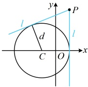
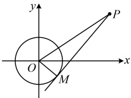
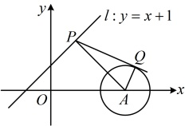

解法2：作为小题，也可直接代圆上一点处的切线方程结论来求切线l的方程，

由圆上一点处切线方程结论，切线 l 的方程为  $ (2-1)(x-1)+(3-1)(y-1)=5 $，化简得： $ x+2y-8=0 $。

答案： $ x+2y-8=0 $

【反思】求圆 C 的过点 P 的切线 l，当点 P 在圆 C 上时，可由  $ CP \perp $ 切线 l 求出 l 的斜率，结合点 P 写出 l 的方程。那如果点 P 在圆 C 外部，又怎样求过 P 的切线方程呢？我们将通过后面的变式来详细分析。

【变式】已知圆  $ C:(x+1)^{2}+y^{2}=4 $，若过点  $ P(1,3) $ 的直线 l 与圆 C 相切，则 l 的方程为 ___.

解析：求圆的过某点的切线，先判断该点与圆的位置关系， $ (1+1)^{2}+3^{2}=13>4\Rightarrow $点P在圆C外，

解析：求圆的过某点的切线，先判断该点与圆的位置关系， $ (1+1)+3=15>4\Rightarrow $点P在圆C外，如图，过P的切线有2条，怎样求其方程？已有点P，求l的方程还差斜率，故考虑设斜率，但需单独讨论斜率不存在的情况，

当 $ l\in\mathbb{R} $

当 $l$ 过点 $P$ 且斜率不存在时，其方程为 $x=1$，圆心 $C(-1,0)$ 到 $l$ 的距离 $d=2=r \Rightarrow l$ 与圆 $C$ 相切，满足题意；当 $l$ 过点 $P$ 且斜率存在时，可设其斜率为 $k$，则 $l$ 的方程为 $y-3=k(x-1)$，即 $kx-y+3-k=0$，圆心 $C$ 到 $l$ 的距离 $d=\frac{|-k+3-k|}{\sqrt{k^2+(-1)^2}}=\frac{|3-2k|}{\sqrt{k^2+1}}$，

因为 $l$ 与圆 $C$ 相切，所以 $d = r$，故 $\frac{|3 - 2k|}{\sqrt{k^2 + 1}} = 2$，解得：$k = \frac{5}{12}$。

所以直线 l 的方程为  $ \frac{5}{12}x - y + 3 - \frac{5}{12} = 0 $，化简得：  $ 5x - 12y + 31 = 0 $；

综上所述，直线 l 的方程为 x=1 或  $ 5x-12y+31=0 $。

答案：x=1 或  $ 5x-12y+31=0 $

【反思】求圆 C 的过点 P 的切线 l，当点 P 在圆 C 外时，常设切线的斜率为 k，结合点 P 写出切线 l 的方程，由圆心到直线 l 的距离 d = r 建立方程求 k，但别忘了单独考虑 l 的斜率不存在的情况.

【例 9】过圆  $ O: x^2 + y^2 = 1 $ 外的点  $ P(3,2) $ 作圆  $ O $ 的一条切线，切点为  $ M $，则  $ |PM| = $ （ ）

A. 2

B.  $ 2\sqrt{3} $

C.  $ \sqrt{13} $

D. 4

解析：如图，直接求  $ |PM| $ 不易，但  $ |OM| $ 已知， $ |OP| $ 也好求，故考虑到  $ \triangle POM $ 中用勾股定理求  $ |PM| $，由题意， $ PM $ 是圆  $ O $ 的切线，所以  $ OM \perp PM $，

又  $ |OM| = 1 $， $ |PO| = \sqrt{3^2 + 2^2} = \sqrt{13} $，所以  $ |PM| = \sqrt{|PO|^2 - |OM|^2} = \sqrt{(\sqrt{13})^2 - 1^2} = 2\sqrt{3} $。

答案：B

【反思】求切线长，常到如图所示的 $ \triangle POM $中用勾股定理计算，其核心是求 $ \left|PO\right| $，

故在与切线长有关的最值问题中，常将切线长的最值转化为$|PO|$的最值来分析，比如下面的变式1. 另外，与切线有关的其它量（例如切线夹角、切点弦长等）的计算，也常转化为$|PO|$来分析，后面的变式2，3会涉及.

【变式1】由直线$l: y = x + 1$上的一点向圆$x^2 + y^2 - 6x + 8 = 0$引切线，则切线长的最小值为（ ）

A. 3          B. $2\sqrt{2}$      C. $\sqrt{7}$        D. $\sqrt{6}$

解析：$x^2 + y^2 - 6x + 8 = 0 \Rightarrow (x - 3)^2 + y^2 = 1$，所以圆心为$A(3,0)$，半径$r = 1$，

如图，设$P$为直线$l: y = x + 1$上一点，$PQ$与$\odot A$相切于点$Q$，

所求即为  $ |PQ| $ 的最小值， $ P $ 是动点， $ Q $ 也随  $ P $ 而运动，不方便直接研究  $ |PQ| $ 的最小值，怎么办呢？可考虑到  $ \triangle PAQ $ 中用勾股定理，转化为  $ |PA| $ 来分析，

由图可知， $ PQ \perp AQ $，且  $ |AQ| = 1 $，所以  $ |PQ| = \sqrt{|PA|^2 - |AQ|^2} = \sqrt{|PA|^2 - 1} $ ①，

