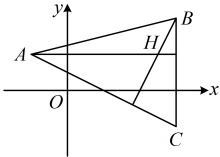

因为$l_{2}$的倾斜角为$135^{\circ}$，所以其斜率$k_{2}=\tan135^{\circ}=-1$，从而$k_{1}k_{2}=1\times(-1)=-1$，故$l_{1}\perp l_{2}$。

答案：A

【反思】判断斜率存在的两直线 $ l_1 $与 $ l_2 $是否垂直，就看它们的斜率之积 $ k_1k_2 $是否等于-1。相应的，若已知 $ l_1 \perp l_2 $，也可由 $ k_1k_2 = -1 $来建立方程求参，我们来看下面的变式1和变式2。

【变式1】（多选）若直线 $ l_{1} $的斜率 $ k_{1}=\frac{3}{4} $，直线 $ l_{2} $经过 $ A(3a,6) $， $ B(0,a^{2}+1) $两点，且 $ l_{1}\perp l_{2} $，则实数a的值可能为（）

A. -1 B. 1 C. -5 D. 5

解析：条件给出  $ l_1 \perp l_2 $，可尝试由  $ k_1 k_2 = -1 $ 来建立方程求解参数  $ a $，

因为直线  $ l_1 $ 的斜率  $ k_1 = \frac{3}{4} \neq 0 $，且  $ l_1 \perp l_2 $，所以  $ l_2 $ 的斜率存在，设为  $ k_2 $，则  $ k_1 k_2 = \frac{3}{4} k_2 = -1 $ ①，

又因为直线  $ l_2 $ 经过  $ A(3a,6) $， $ B(0,a^2 + 1) $ 两点，所以  $ k_2 = \frac{a^2 + 1 - 6}{0 - 3a} = \frac{5 - a^2}{3a} $，

代入①得  $ \frac{3}{4} \times \frac{5 - a^2}{3a} = -1 $，解得： $ a = -1 $ 或 5。

答案：AD

【变式2】已知点  $ A(-2,2) $， $ B(6,4) $， $ H(5,2) $，且 H 是  $ \triangle ABC $ 的垂心，则点 C 的坐标为（）

A.  $ (6,2) $ B.  $ (-2,2) $ C.  $ (-4,-2) $ D.  $ (6,-2) $

解析：条件给出  $ H $ 为  $ \triangle ABC $ 的垂心，垂心是任意两条高的交点，于是在  $ AH \perp BC $， $ BH \perp AC $， $ CH \perp AB $ 中任选两个来翻译，都能建立方程求  $ C $ 的坐标。注意到  $ A $， $ H $ 纵坐标相等，所以  $ AH \perp y $ 轴，故  $ AH \perp BC $ 最容易翻译，于是我们不妨选  $ AH \perp BC $ 和  $ BH \perp AC $ 来翻译，

因为  $ H $ 是  $ \triangle ABC $ 的垂心，所以  $ AH \perp BC $， $ BH \perp AC $，

因为 $A$，$H$ 纵坐标都为 2，所以 $AH \perp y$ 轴，结合 $AH \perp BC$ 可得 $BC \parallel y$ 轴，故 $B$，$C$ 的横坐标相等，可设 $C(6,y)$，则 $k_{AC} = \frac{y-2}{6-(-2)} = \frac{y-2}{8}$，又 $k_{BH} = \frac{2-4}{5-6} = 2$，且 $BH \perp AC$，所以 $k_{BH}k_{AC} = 2 \cdot \frac{y-2}{8} = -1$，解得：$v = -2$，故点 $C$ 的坐标为 $(6, -2)$。

答案：D

## 补充、拓展

一些特殊的多边形（如平行四边形、长方形、正方形、直角梯形、直角三角形等）中有丰富的平行、垂直关系，所以在证明多边形为这些特殊多边形时，往往需要证明平行、垂直，这就可以用本节的斜率来处理了，下面我们通过类型V来拓展.

类型V：用斜率判断几何图形的形状

【例 16】已知四边形  $ ABCD $ 的四个顶点分别为  $ A(4,4) $， $ B(-2,5) $， $ C(2,-1) $， $ D(8,-2) $，试判断四边形  $ ABCD $ 的形状，并给出证明.

解：（直接由所给坐标不易找到判断的方向，可考虑先在坐标系下画出A，B，C，D四点，并由此猜测四边形