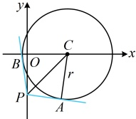
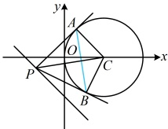

故只需求  $ |PA|_{\min} $，显然当  $ PA \perp I $ 时， $ |PA| $ 最小，此时  $ |PA| $ 即为点  $ A $ 到  $ I $ 的距离，

 $ y = x + 1 $ 可化为  $ x - y + 1 = 0 $，所以  $ |PA|_{\min} = \frac{|3 - 0 + 1|}{\sqrt{1^2 + (-1)^2}} = 2\sqrt{2} $，代入①得  $ |PQ|_{\min} = \sqrt{(2\sqrt{2})^2 - 1} = \sqrt{7} $。

答案：C

【变式2】（2023·新课标Ⅰ卷）过点(0,-2)与圆 $ x^{2}+y^{2}-4x-1=0 $相切的两直线的夹角为 $ \alpha $，则 $ \sin\alpha= $（）

A. 1 B.  $ \frac{\sqrt{15}}{4} $ C.  $ \frac{\sqrt{10}}{4} $ D.  $ \frac{\sqrt{6}}{4} $

解析： $ x^2 + y^2 - 4x - 1 = 0 \Rightarrow (x - 2)^2 + y^2 = 5 $，圆心为  $ C(2,0) $，半径  $ r = \sqrt{5} $，记  $ P(0, -2) $，两切点分别为  $ A $,  $ B $，如图， $ PA $,  $ PB $ 的夹角  $ \alpha = \pi - \angle APB $，所以  $ \sin \alpha = \sin(\pi - \angle APB) = \sin \angle APB $，

注意到 $\angle APB = 2\angle APC$，故要求 $\sin\angle APB$，可先在 $\mathrm{Rt}\triangle PAC$ 中求 $\sin\angle APC$ 和 $\cos\angle APC$，再用倍因为 $|PC| = \sqrt{(0-2)^2 + (-2-0)^2} = 2\sqrt{2}$，$|AC| = r = \sqrt{5}$，

所以 $ |PA|=\sqrt{|PC|^2-|AC|^2}=\sqrt{3} $，从而 $ \cos\angle APC=\frac{|PA|}{|PC|}=\frac{\sqrt{3}}{2\sqrt{2}} $，

 $ \sin\angle APC=\frac{|AC|}{|PC|}=\frac{\sqrt{5}}{2\sqrt{2}} $，故 $ \sin\angle APB=\sin2\angle APC=2\sin\angle APC\cos\angle APC $

 $ =2\times\frac{\sqrt{5}}{2\sqrt{2}}\times\frac{\sqrt{3}}{2\sqrt{2}}=\frac{\sqrt{15}}{4} $，所以 $ \sin\alpha=\frac{\sqrt{15}}{4} $。

答案：B

【变式 3】过直线  $ x + y + 1 = 0 $ 上任意一点 P 作直线 PA，PB 与圆  $ x^2 + y^2 - 2x = 0 $ 相切，A，B 为切点，则  $ |AB| $ 的最小值为___.

解法 1： $ x^{2}+y^{2}-2x=0\Rightarrow(x-1)^{2}+y^{2}=1 $，所以该圆的圆心为  $ C(1,0) $，半径 r=1，

怎样算|AB|？观察发现|AB|等于△PAC的斜边PC上的高的2倍，故先算该高，可用等面积法，设点A到直线PC的距离为h，则 $ S_{\triangle PAC} = \frac{1}{2}|PA| \cdot |AC| = \frac{1}{2}|PC| \cdot h $，所以 $ h = \frac{|PA| \cdot |AC|}{|PC|} = \frac{|PA|}{|PC|} = \frac{\sqrt{|PC|^2 - 1}}{|PC|} = \sqrt{1 - \frac{1}{|PC|^2}} $，故 $ |AB| = 2h = 2\sqrt{1 - \frac{1}{|PC|^2}} $，可发现，当|PC|最小时，|AB|也最小，而 $ |PC|_{\min} $即为点C到直线 $ x + y + 1 = 0 $的距离，由图可知， $ |PC|_{\min} = \frac{|1 + 0 + 1|}{\sqrt{1^2 + 1^2}} = \sqrt{2} $，所以 $ |AB|_{\min} = 2\sqrt{1 - \frac{1}{(\sqrt{2})^2}} = \sqrt{2} $。

解法2： $ x^{2}+y^{2}-2x=0\Rightarrow(x-1)^{2}+y^{2}=1 $，所以该圆的圆心为 $ C(1,0) $，半径 $ r=1 $，

注意到 $AB$ 是切点弦，故也可先用结论求出切点弦方程，再按直线被圆截得的弦长来分析 $|AB|$ 的最小值，

设 $P(a,-a-1)$，由切点弦方程结论，直线 $AB$ 的方程为 $ax+(-a-1)y-2\cdot\frac{a+x}{2}=0$，即 $(a-1)x-(a+1)y-a=0$，

设圆心 $C$ 到直线 $AB$ 的距离为 $d$，则 $|AB|=2\sqrt{r^{2}-d^{2}}=2\sqrt{1-d^{2}}$，且 $d=\frac{|a-1-a|}{\sqrt{(a-1)^{2}+(a+1)^{2}}}=\frac{1}{\sqrt{2a^{2}+2}}$ ①，

要求 $|AB|_{\min}$ 的最小值，只需求 $d_{\max}$，由①可知当 $a=0$ 时，$d$ 取得最大值 $\frac{\sqrt{2}}{2}$，所以 $|AB|_{\min}=2\sqrt{1-\left(\frac{\sqrt{2}}{2}\right)^{2}}=\sqrt{2}$。