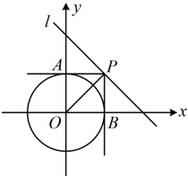
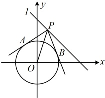
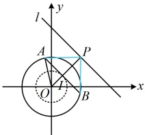

答案： $ \sqrt{2} $

【反思】从例9及其变式1，2，3可以看出，无论是切线长，切线夹角，还是切点弦长，最终都回归到圆外的点P到圆心的距离上来，这是这类切线有关问题的共性，下面我们再来看一个综合性的变式4.

【变式4】（多选）若 $A$，$B$ 为圆 $O: x^2 + y^2 = 1$ 上两点，$P$ 为直线 $l: x + y - 2 = 0$ 上一动点，则（ ）

A. 直线 $l$ 与圆 $O$ 相离

B. 当 $A$，$B$ 为两定点时，满足 $\angle APB = \frac{\pi}{2}$ 的点 $P$ 最多有 2 个

C. 当 $|AB| = \sqrt{3}$ 时，$|\overrightarrow{PA} + \overrightarrow{PB}|$ 的最大值是 $2\sqrt{2} + 1$

D. 当 $PA$，$PB$ 为圆 $O$ 的两条切线时，直线 $AB$ 过定点 $\left(\frac{1}{2}, \frac{1}{2}\right)$

解析：A 项，圆心 O 到直线 l 的距离  $ d = \frac{|-2|}{\sqrt{1^2 + 1^2}} = \sqrt{2} > r = 1 $，所以直线 l 与圆 O 相离，故 A 项正确；

B 项， $ \angle APB = \frac{\pi}{2} $ 怎样翻译？我们不妨先画图，并尝试找出一种使  $ \angle APB = \frac{\pi}{2} $ 的情况再来分析，

B 项， $ \angle APB = \frac{\pi}{2} $怎样翻译？我们不妨先画图，并尝试找出一种使  $ \angle APB = \frac{\pi}{2} $ 的情况再来分析，

如图1，因为O到 $ l $的距离为 $ \sqrt{2} $，所以当 $ OP \perp l $时， $ |OP| = \sqrt{2} $，过 $ P $作圆 $ O $的两条切线，切点分别为 $ A $， $ B $，

则 $ \triangle AOP $和 $ \triangle BOP $都是等腰直角三角形，故此时就满足 $ \angle APB = \frac{\pi}{2} $，可以想象，对于直线 $ l $上其它位置的点 $ P $，

如图2， $ \angle APB $的最大值（ $ PA $， $ PB $与圆 $ O $相切时取得）都小于 $ \frac{\pi}{2} $，所以满足 $ \angle APB = \frac{\pi}{2} $的点 $ P $最多只有1个，

且只有当 $ A $， $ B $在如图1所示的两个位置时才有，否则没有，故B项错误；

C项，点P可沿直线l运动到无穷远处，可以想象 $ \left|\overrightarrow{PA}+\overrightarrow{PB}\right| $能无限大，若要严格分析，可用AB中点表示 $ \overrightarrow{PA}+\overrightarrow{PB} $再看，如图3，取AB中点I，连接OI，PI，OA，则 $ OI\perp AB $，且 $ \left|\overrightarrow{PA}+\overrightarrow{PB}\right|=\left|2\overrightarrow{PI}\right|=2\left|\overrightarrow{PI}\right| $，条件给出 $ |AB|=\sqrt{3} $，可用它找到点I的轨迹，

因为 $ |AB|=\sqrt{3} $，所以 $ |AI|=\frac{\sqrt{3}}{2} $，从而 $ |OI|=\sqrt{|OA|^2-|AI|^2}=\frac{1}{2} $，故点 $ I $的轨迹是以 $ O $为圆心， $ \frac{1}{2} $为半径的圆，当 $ P $在 $ l $上运动时， $ |PI| $可以无限大，所以 $ |PI| $没有最大值，从而 $ |\overrightarrow{PA}+\overrightarrow{PB}| $没有最大值，故 $ C $项错误； $ D $顶 $ AR $是切点弦所在直线，可因切点弦方程结论写出其方程，再看否定占

 $ x + y - 2 = 0 \Rightarrow y = 2 - x $，所以可设  $ P(a, 2 - a) $，由切点弦方程结论，直线 AB 的方程为  $ ax + (2 - a)y = 1 $，整理得： $ a(x - y) + 2y - 1 = 0 $，令  $ \begin{cases} x - y = 0 \\ 2y - 1 = 0 \end{cases} $ 可得  $ x = y = \frac{1}{2} $，所以直线 AB 过定点  $ \left( \frac{1}{2}, \frac{1}{2} \right) $，故 D 项正确.

图1

图2

答案：AD

图3

