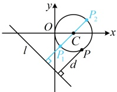
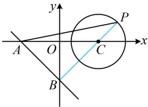

类型V：直线与圆有关的最值问题

【例 10】已知 P 是圆  $ C:(x-1)^2+y^2=1 $ 上的动点，则点 P 到直线  $ l:x+y+2=0 $ 的距离  $ d $ 的取值范围是___.

解析：所求为圆上动点到定直线距离的取值范围，可尝试画出图形，看能否直接找到该距离的最大、最小值，由题意，圆  $ C $ 的圆心为  $ C(1,0) $，半径  $ r=1 $，如图，过  $ C $ 作直线  $ l $ 的垂线交圆  $ C $ 于  $ P_1 $， $ P_2 $ 两点，对圆  $ C $ 上任意的点  $ P $，当  $ P $ 与  $ P_1 $ 重合时，点  $ P $ 到直线  $ l $ 的距离  $ d $ 最小，且最小值为  $ d_{c-l} - r $，其中  $ d_{c-l} $ 是圆心  $ C $ 到直线  $ l $ 的距离，因为  $ d_{c-l} = \frac{|1+2|}{\sqrt{1^2+1^2}} = \frac{3\sqrt{2}}{2} $，所以  $ d_{\min} = d_{c-l} - r = \frac{3\sqrt{2}}{2} - 1 $；当  $ P $ 与  $ P_2 $ 重合时，点  $ P $ 到直线  $ l $ 的距离  $ d $ 最大，且最大值为  $ d_{c-l} + r = \frac{3\sqrt{2}}{2} + 1 $；所以  $ d $ 的取值范围是  $ \left[\frac{3\sqrt{2}}{2} - 1, \frac{3\sqrt{2}}{2} + 1\right] $。答案： $ \left[\frac{3\sqrt{2}}{2} - 1, \frac{3\sqrt{2}}{2} + 1\right] $

【反思】当直线  $ l $ 与圆  $ C $ 相离时，圆  $ C $ 上的点到直线  $ l $ 距离的取值范围是  $ [d_{c-l} - r, d_{c-l} + r] $，其中  $ d_{c-l} $ 是圆心  $ C $ 到直线  $ l $ 的距离， $ r $ 为圆  $ C $ 的半径。这是一个基础最值模型，由此可演变出一系列最值问题，我们来看两个变式。

【变式 1】（2018·新课标Ⅲ卷）直线  $ x + y + 2 = 0 $ 分别与  $ x $ 轴， $ y $ 轴交于  $ A $， $ B $ 两点，点  $ P $ 在圆  $ (x-2)^2 + y^2 = 2 $ 上，则  $ \triangle ABP $ 面积的取值范围是（ ）

A.  $ [2,6] $

B.  $ [4,8] $

C.  $ [\sqrt{2}, 3\sqrt{2}] $

D.  $ [2\sqrt{2}, 3\sqrt{2}] $

解析：在  $ x + y + 2 = 0 $ 中令  $ x = 0 $ 得  $ y = -2 $，令  $ y = 0 $ 得  $ x = -2 $，所以  $ A(-2,0) $， $ B(0, -2) $，故  $ |AB| = 2\sqrt{2} $， $ |AB| $ 不变，故可考虑以  $ AB $ 为底边计算  $ \triangle ABP $ 的面积，这样就只需分析其高的取值范围，记  $ \triangle ABP $ 的  $ AB $ 边上的高为  $ h $，则  $ S_{\triangle ABP} = \frac{1}{2}|AB| \cdot h = \sqrt{2}h $ ①，如图，直线  $ AB $ 与圆  $ C $ 相离，于是问题又回到了例 10 的模型上，圆  $ C $ 的圆心为  $ C(2,0) $，半径  $ r = \sqrt{2} $，圆心  $ C $ 到直线  $ AB $ 的距离  $ d = \frac{|2 + 2|}{\sqrt{1^2 + 1^2}} = 2\sqrt{2} $，所以当  $ P $ 在圆  $ C $ 上运动时，有  $ d - r \leq h \leq d + r $，故  $ \sqrt{2} \leq h \leq 3\sqrt{2} $，结合①得  $ 2 \leq S_{\triangle ABP} = \sqrt{2}h \leq 6 $，所以  $ \triangle ABP $ 面积的取值范围是  $ [2,6] $。

答案：A

【变式 2】设 $P$, $Q$ 分别是直线 $l: 4x - 3y - 11 = 0$ 和圆 $C: (x + 2)^2 + (y - 2)^2 = 4$ 上的动点，则 $|PQ|$ 的最小值是（ ）

A. 1          B. 3          C. 5          D. 7

解析：P，Q都在动，不易直接看出何时|PQ|最小，可考虑先取定一个，取定谁？直线上的动点到定点距离的最小值容易分析，故先取定Q，考虑P在直线l上运动的情形，

由题意，圆C的圆心为C(-2,2)，半径r=2，如图1，对圆C上任意的点Q，当P在l上运动时，

总有|PQ|≥d_{Q-l}，其中d_{Q-l}表示点Q到直线l的距离，故只需求d_{Q-l}的最小值，问题又回到了例10的模型，