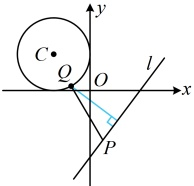
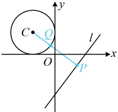

因为圆心 $C$ 到 $l$ 的距离 $d = \frac{|4 \times (-2) - 3 \times 2 - 11|}{\sqrt{4^2 + (-3)^2}} = 5$，所以 $d_{Q-l} \geq d - r = 5 - 2 = 3$，结合 $|PQ| \geq d_{Q-l}$ 可得 $|PQ| \geq 3$，取等的情形如图 2，所以 $|PQ|$ 的最小值为 3。

图1

图2

答案：B

【例 11】（2023·全国乙卷）已知实数 x, y 满足  $ x^{2} + y^{2} - 4x - 2y - 4 = 0 $，则 x - y 的最大值是（ ）

A.  $ 1 + \frac{3\sqrt{2}}{2} $ B. 4 C.  $ 1 + 3\sqrt{2} $ D. 7

解法 1：目标式 $x - y$ 中 $x, y$ 都是一次项，这与直线方程中 $x, y$ 的情况类似，但这里不是方程，而只是一个代数式，怎么办呢？可考虑设其为 $t$，构造一个方程出来，再作观察，

由 $x^2 + y^2 - 4x - 2y - 4 = 0$ 可得 $(x - 2)^2 + (y - 1)^2 = 9$，所以该方程表示圆心为 $C(2,1)$，半径 $r = 3$ 的圆，

设 $t = x - y$，则 $x - y - t = 0$，因为 $x, y$ 还满足圆 $C$ 的方程，所以直线 $x - y - t = 0$ 与该圆有交点，

从而圆心 $C$ 到直线的距离 $d = \frac{|2 - 1 - t|}{\sqrt{1^2 + (-1)^2}} \leq 3$，解得：$1 - 3\sqrt{2} \leq t \leq 1 + 3\sqrt{2}$，故 $(x - y)_{\max} = 1 + 3\sqrt{2}$。

解法2：按解法1将圆的方程化为 $ (x-2)^2+(y-1)^2=9 $后，注意到这是平方和为常数结构，也可考虑三角换元，

由 $ (x-2)^2+(y-1)^2=9 $可得 $ \left(\frac{x-2}{3}\right)^2+\left(\frac{y-1}{3}\right)^2=1 $，令 $ \begin{cases} \frac{x-2}{3}=\cos\theta \\ \frac{y-1}{3}=\sin\theta \end{cases} $，则 $ \begin{cases} x=2+3\cos\theta \\ y=1+3\sin\theta \end{cases} $， $ \theta\in\mathbf{R} $，

所以 $ x-y=2+3\cos\theta-1-3\sin\theta=1-3\sqrt{2}\sin\left(\theta-\frac{\pi}{4}\right) $，故当 $ \sin\left(\theta-\frac{\pi}{4}\right)=-1 $时， $ x-y $取得最大值 $ 1+3\sqrt{2} $。

答案：C

【反思】①当题干给出x，y满足某圆的方程，让求另一个关于x，y的代数式的最值时，可考虑设该代数式等于t，构造一个方程，根据该方程代表的曲线（包括直线）与圆有交点来求t的范围.

②在 $ (x-a)^{2}+(y-b)^{2}=r^{2} $的条件下求关于x，y的某代数式的最值（或范围），可借助三角换元 $ \left\{\begin{aligned}x&=a+r\cos\theta\\ y&=b+r\sin\theta\end{aligned}\right. $将x，y用 $ \theta $表示，从而将关于x，y的二元代数式化为单变量函数来分析.

【变式】已知实数 $x$，$y$ 满足 $(x-2)^2+(y-3)^2=1$，则 $\frac{y}{x+1}$ 的取值范围是 ___。

解法1：观察发现已知和所求与上面的例11类似，能像上面那样设 $ \frac{y}{x+1} $为t处理吗？我们来试试，

设 $ t=\frac{y}{x+1} $，则 $ tx-y+t=0 $，因为x，y还满足 $ (x-2)^2+(y-3)^2=1 $，此方程表示圆心为 $ C(2,3) $，半径 $ r=1 $的圆，

所以直线 $ tx-y+t=0 $与该圆有交点，故圆心到直线的距离 $ d=\frac{|t\cdot2-3+t|}{\sqrt{t^2+(-1)^2}}\leq r=1\Rightarrow\frac{9-\sqrt{17}}{8}\leq t\leq\frac{9+\sqrt{17}}{8} $，