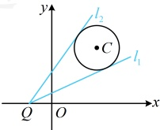

所以 $ \frac{y}{x+1} $的取值范围是 $ \left[\frac{9-\sqrt{17}}{8},\frac{9+\sqrt{17}}{8}\right] $.

解法2：看到所给等式是平方和为常数结构，想到通过三角换元将目标二元代数式化为一元函数分析，令$\begin{cases}x=2+\cos\theta\\y=3+\sin\theta\end{cases}$，$\theta\in\mathbf{R}$，则$\frac{y}{x+1}=\frac{3+\sin\theta}{2+\cos\theta+1}=\frac{3+\sin\theta}{3+\cos\theta}$①，

如何求式①的取值范围？直接分析该式不易，观察发现 $ \sin\theta $和 $ \cos\theta $都是一次的，由此联想到辅助角公式，我们先将其设为 $ m $，再通过变形把 $ \sin\theta $和 $ \cos\theta $拿到一起，

令 $ \frac{3+\sin\theta}{3+\cos\theta}=m $，则 $ 3+\sin\theta=3m+m\cos\theta $，所以 $ \sin\theta-m\cos\theta=3m-3 $，从而 $ \sqrt{1+m^2}\sin(\theta+\varphi)=3m-3 $，

故 $ \sin(\theta+\varphi)=\frac{3m-3}{\sqrt{1+m^2}} $，因为 $ -1\leq\sin(\theta+\varphi)\leq1 $，所以 $ -1\leq\frac{3m-3}{\sqrt{1+m^2}}\leq1 $，即 $ \frac{|3m-3|}{\sqrt{1+m^2}}\leq1 $，

解得： $ \frac{9-\sqrt{17}}{8}\leq m\leq\frac{9+\sqrt{17}}{8} $，所以 $ \frac{y}{x+1} $的取值范围是 $ \left[\frac{9-\sqrt{17}}{8},\frac{9+\sqrt{17}}{8}\right] $。

解法3：注意到 $ \frac{y}{x+1} $可看成 $ \frac{y-0}{x-(-1)} $，于是它表示点 $ P(x,y) $与点 $ Q(-1,0) $的连线斜率，故也可考虑画图分析。

设 $ P(x,y) $， $ Q(-1,0) $，则 $ P $为圆 $ C:(x-2)^2+(y-3)^2=1 $上的动点，且 $ \frac{y}{x+1}=k_{PQ} $，

如图，当 $ P $在圆 $ C $上运动时， $ k_{PQ} $应介于两条切线 $ l_1 $和 $ l_2 $的斜率之间，

故只需求出这两条切线的斜率， $ \frac{y}{x+1} $的范围就有了，如何求切线斜率，已有点Q，可直接设斜率，写出切线的

方程，按  $ d = r $ 翻译直线与圆相切，建立方程求所设斜率，

设圆  $ C $ 的过点  $ Q $ 的切线的斜率为  $ k $（由图可知两切线斜率都存在），则切线的方程为  $ y - 0 = k[x - (-1)] $，

kx-y+k=0，圆心 C 到该切线的距离  $ d=\frac{|k\cdot2-3+k|}{\sqrt{k^{2}+(-1)^{2}}}=r=1 $，解得： $ k=\frac{9\pm\sqrt{17}}{8} $，

所以当 $P$ 在圆 $C$ 上运动时，$\frac{9-\sqrt{17}}{8}\leq k_{PQ}\leq\frac{9+\sqrt{17}}{8}$，

又 $ \frac{y}{x+1}=k_{PQ} $，所以 $ \frac{y}{x+1} $的取值范围是 $ \left[\frac{9-\sqrt{17}}{8},\frac{9+\sqrt{17}}{8}\right] $.

答案： $ \left[\frac{9-\sqrt{17}}{8},\frac{9+\sqrt{17}}{8}\right] $

## 补充、拓展

在上一节，我们初步提到了设而不求的思想，为了进一步强化大家对这种思想的理解，这里我们设计了一个类型VI来作为本节的拓展题型.

类型VI：设而不求的处理思想

【例 12】已知圆  $ C: x^{2} + y^{2} - 2x + t = 0 $，直线  $ l: 2x + y = 0 $.

（1）若直线 l 与圆 C 相切，求实数 t 的值；

（2）若直线  $ l $ 与圆  $ C $ 交于  $ A $， $ B $ 两点，且  $ \overrightarrow{OA} \cdot \overrightarrow{OB} = -1 $，其中  $ O $ 为原点，求圆  $ C $ 的半径。

解：（1） $ x^2 + y^2 - 2x + t = 0 \Leftrightarrow (x-1)^2 + y^2 = 1 - t $，所以  $ t < 1 $，且圆  $ C $ 的圆心为  $ C(1,0) $，半径  $ r = \sqrt{1-t} $，若直线  $ l $ 与圆  $ C $ 相切，则圆心  $ C $ 到直线  $ l $ 的距离  $ d = r $，即  $ \frac{|2 \times 1 + 0|}{\sqrt{2^2 + 1^2}} = \sqrt{1-t} $，解得： $ t = \frac{1}{5} $。