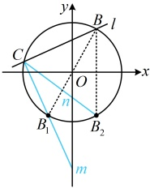

代入①得  $ k_{1}+k_{2}=\frac{2kx_{1}x_{2}+(4-2k)(x_{1}+x_{2})-2[k(x_{1}+x_{2})+8-4k]}{x_{1}x_{2}-2(x_{1}+x_{2})+4}=\frac{2kx_{1}x_{2}+(4-4k)(x_{1}+x_{2})+8k-16}{x_{1}x_{2}-2(x_{1}+x_{2})+4} $ ②，

（只含  $ x_{1}+x_{2} $ 和  $ x_{1}x_{2} $ 了，于是可将直线 l 的方程代入圆 O 的方程，结合韦达定理计算它们）

将  $ y = kx + 4 - 2k $ 代入  $ x^{2} + y^{2} = 4 $ 整理得： $ (1 + k^{2})x^{2} - 4k(k - 2)x + 4k^{2} - 16k + 12 = 0 $ ③，

（直线 l 与圆 O 有 2 个交点，则上述方程应满足  $ \Delta > 0 $，由此可对 k 的范围进行限制，但经尝试，这里  $ \Delta $ 比较难算，于是我们换个思路，按圆心到直线的距离 d < r 来翻译直线 l 与圆 O 有 2 个交点）

因为直线 l 与圆 O 有 2 个交点，所以圆心 O 到直线 l 的距离  $ d=\frac{|4-2k|}{\sqrt{k^{2}+1}}<2 $，解得： $ k>\frac{3}{4} $，

对方程③，由韦达定理， $ x_{1}+x_{2}=\frac{4k(k-2)}{1+k^{2}} $， $ x_{1}x_{2}=\frac{4k^{2}-16k+12}{1+k^{2}} $，

代入②得  $ k_{1}+k_{2}=\frac{2kx_{1}x_{2}+(4-4k)(x_{1}+x_{2})+8k-16}{x_{1}x_{2}-2(x_{1}+x_{2})+4}=\frac{2k\cdot\frac{4k^{2}-16k+12}{1+k^{2}}+(4-4k)\cdot\frac{4k(k-2)}{1+k^{2}}+8k-16}{\frac{4k^{2}-16k+12}{1+k^{2}}-2\cdot\frac{4k(k-2)}{1+k^{2}}+4} $

= $ \frac{2k(4k^{2}-16k+12)+4k(4-4k)(k-2)+(8k-16)(1+k^{2})}{4k^{2}-16k+12-8k(k-2)+4(1+k^{2})}=\frac{8k^{3}-32k^{2}+24k+(8k-16)[2k(1-k)+1+k^{2}]}{16} $

= $ \frac{8k^{3}-32k^{2}+24k+(8k-16)(2k+1-k^{2})}{16}=\frac{8k^{3}-32k^{2}+24k+16k^{2}+8k-8k^{3}-32k-16+16k^{2}}{16}=\frac{-16}{16}=-1 $，

所以  $ k_{1}+k_{2} $ 是定值 -1.

【反思】不仅  $ x_1 + x_2 $， $ x_1x_2 $， $ y_1 + y_2 $， $ y_1y_2 $ 可以通过联立直线和圆的方程，结合韦达定理来计算，只要是关于  $ x_1 $ 和  $ x_2 $， $ y_1 $ 和  $ y_2 $ 结构对称的式子，往往都可以结合韦达定理进行计算。例如本题的  $ x_1, y_2 + x_2, y_1 $，又比如  $ \frac{1}{x_1} + \frac{1}{x_2} $， $ \frac{1}{x_1^2} + \frac{1}{x_2^2} $ 等。

【变式2】已知圆 O 的圆心为坐标原点，且经过点  $ A(\sqrt{5},2) $.

（1）求圆O的方程：

（2）已知不过原点且不与坐标轴垂直的直线 $l$ 与圆 $O$ 交于 $B, C$ 两点，点 $B$ 关于原点的对称点为 $B_1$，点 $B$ 关于 $x$ 轴的对称点为 $B_2$，直线 $B_1C$，$B_2C$ 在 $y$ 轴上的截距分别是 $m$，$n$，证明：$mn$ 为定值，并求该定值.

解：（1）由题意，圆  $ O $ 的半径  $ r = |OA| = \sqrt{(\sqrt{5})^2 + 2^2} = 3 $，所以圆  $ O $ 的方程为  $ x^2 + y^2 = 9 $。

（2）（条件涉及直线  $ B_1C $ 和  $ B_2C $ 在 y 轴上的截距，考虑先写出这两条直线的方程，求出对应的截距。要写  $ B_1C $ 和  $ B_2C $ 的方程，可考虑用  $ B_1 $， $ B_2 $， $ C $ 的坐标，而  $ B_1 $， $ B_2 $ 的坐标都与  $ B $ 有关，故直接设  $ B $， $ C $ 的坐标）

设  $ B(x_1, y_1) $， $ C(x_2, y_2) $，如图，因为直线  $ l $ 不过原点且不与坐标轴垂直，所以  $ x_1 \ne \pm x_2 $，因为  $ B_1 $， $ B_2 $ 分别与  $ B $ 关于原点、 $ x $ 轴对称，所以  $ B_1(-x_1, -y_1) $， $ B_2(x_1, -y_1) $，因为  $ x_1 \ne \pm x_2 $，所以  $ x_1 \pm x_2 \ne 0 $，故直线  $ B_1C $ 和  $ B_2C $ 的斜率都存在，

直线  $ B_1C $ 的斜率  $ k_{B_1C} = \frac{y_2 - (-y_1)}{x_2 - (-x_1)} = \frac{y_2 + y_1}{x_2 + x_1} $，所以其方程为  $ y - y_2 = \frac{y_2 + y_1}{x_2 + x_1}(x - x_2) $，令  $ x = 0 $ 得  $ y - y_2 = \frac{y_2 + y_1}{x_2 + x_1} \cdot (-x_2) $，所以  $ y = y_2 - \frac{(y_2 + y_1)x_2}{x_2 + x_1} = \frac{y_2(x_2 + x_1) - (y_2 + y_1)x_2}{x_2 + x_1} = \frac{x_1y_2 - x_2y_1}{x_1 + x_2} $，故直线  $ B_1C $ 在  $ y $ 轴上的截距  $ m = \frac{x_1y_2 - x_2y_1}{x_1 + x_2} $ ①，

