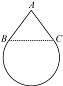

4.（2025·云南模拟）

若  $ P(1,2) $ 为圆  $ O: x^{2} + y^{2} = 9 $ 的弦 AB 的中点，则直线 AB 的方程是（）

A.  $ x-2y+5=0 $ B.  $ 2x-y+4=0 $

C.  $ x+2y-5=0 $ D.  $ 2x+y-4=0 $

## B组 强化能力

### 5. （2025·浙江杭州模拟）

若直线 $ l:y=kx+1 $与圆 $ C:(x-2)^{2}+y^{2}=9 $相交于 $ A,B $两点，则 $ |AB| $的取值范围是___.

### 6. （2025·重庆模拟）

6. (2025·重庆模拟)

圆心在射线  $ y = \frac{x}{2} (x \geq 0) $ 上，与 y 轴相切，且被 x 轴所截得的弦长为  $ 2\sqrt{3} $ 的圆的方程为___。

## 数·高中数学一本通

### 7. （2025·广东惠州二调）

已知“水滴”的表面是一个由圆锥的侧面和部分球面（常称为“球冠”）所围成的几何体。如图所示，将“水滴”的轴截面看成由线段 AB，AC 和优弧 BC 所围成的平面图形，其中点 B，C 所在直线与水平面平行，AB 和 AC 与圆弧相切。已知“水滴”的“竖直高度”与“水平宽度”（“水平宽度”指的是平行于水平面的直线。截轴截面所得线段的长度的最大值）的比值为  $ \frac{4}{3} $，则  $ \sin \angle BAC = $（ ）

A.  $ \frac{3}{5} $ B.  $ \frac{4}{5} $ C.  $ \frac{16}{25} $ D.  $ \frac{24}{25} $