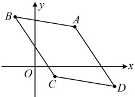
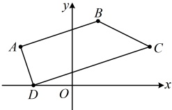

ABCD 的形状，再进行证明）如图，可猜测四边形 ABCD 为平行四边形，下面给出证明，

（要证 $ABCD$ 是平行四边形，只需证其两组对边分别平行，而对于对边平行，又可由它们的斜率相等来证）

由题意，$k_{AB} = \frac{5-4}{-2-4} = -\frac{1}{6}$，$k_{CD} = \frac{-2-(-1)}{8-2} = -\frac{1}{6}$，

$k_{BC} = \frac{-1-5}{2-(-2)} = -\frac{3}{2}$，$k_{AD} = \frac{-2-4}{8-4} = -\frac{3}{2}$，

所以 $k_{AB} = k_{CD} \ne k_{BC}$，$k_{BC} = k_{AD} \ne k_{AB}$，从而 $AB \parallel CD$，$BC \parallel AD$，

故四边形 ABCD 是平行四边形.

【反思】给出多边形顶点坐标，让分析其形状，常先画出图形，猜测其形状，再证明。证明时，若涉及平行、垂直，则可考虑用斜率处理，本题涉及的是平行，我们再来看一个涉及垂直的变式。

【变式】已知点  $ A(-4,3) $， $ B(2,5) $， $ C(6,3) $， $ D(-3,0) $，判断并证明四边形  $ ABCD $ 的形状。

解：A，B，C，D四点在坐标系下如图，可猜想四边形ABCD是直角梯形，下面给出证明，

（要证 ABCD 是直角梯形，需要证明三点：①AB∥CD；②AD 与 BC 不平行；③ $ AD \perp CD $）

由题意， $ k_{AB}=\frac{5-3}{2-(-4)}=\frac{1}{3} $， $ k_{CD}=\frac{0-3}{-3-6}=\frac{1}{3} $，

 $ k_{AD} = \frac{0 - 3}{-3 - (-4)} = -3 $， $ k_{BC} = \frac{3 - 5}{6 - 2} = -\frac{1}{2} $，所以  $ k_{AB} = k_{CD} \neq k_{AD} $，故  $ AB \parallel CD $，又  $ k_{AD} \neq k_{BC} $，所以 AD 与 BC 不平行，故四边形 ABCD 是梯形，因为  $ k_{AD} k_{CD} = -3 \times \frac{1}{3} = -1 $，所以  $ AD \perp CD $，故四边形 ABCD 是直角梯形.

## 强化训练

## A 组 夯实基础

1.（2025·广西南宁期末）

若一条直线的斜率等于 $ \sqrt{3} $，则该直线的倾斜角是（）

A.  $ \frac{\pi}{6} $ B.  $ \frac{\pi}{4} $ C.  $ \frac{\pi}{3} $ D.  $ \frac{2\pi}{3} $

2.（2025·河南南阳期中）

已知直线  $ l $ 的斜率为  $ -\sqrt{3} $，则直线  $ l $ 的一个方向向量的坐标为（ ）

A.  $ \boldsymbol{a}=(-1,-\sqrt{3}) $ B.  $ \boldsymbol{b}=(\sqrt{3},-1) $

C.  $ \boldsymbol{c}=(-\sqrt{3},-1) $ D.  $ \boldsymbol{d}=(\sqrt{3},-3) $