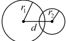
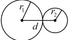
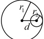
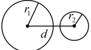
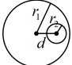

# 2.5.2 圆与圆的位置关系

习题：P1

## 知识梳理

## 知识点 1：圆与圆的位置关系

<table border=1 style='margin: auto; word-wrap: break-word;'><tr><td rowspan="2" colspan="2">位置关系</td><td rowspan="2">图示</td><td rowspan="2">交点个数</td><td colspan="2">判定方法</td></tr><tr><td style='text-align: center; word-wrap: break-word;'>几何法</td><td style='text-align: center; word-wrap: break-word;'>代数法</td></tr><tr><td colspan="2">相交</td><td style='text-align: center; word-wrap: break-word;'></td><td style='text-align: center; word-wrap: break-word;'>2</td><td style='text-align: center; word-wrap: break-word;'>$ |r_1-r_2|&lt;d&lt;r_1+r_2 $</td><td style='text-align: center; word-wrap: break-word;'>$ \Delta&gt;0 $</td></tr><tr><td rowspan="2">相切</td><td style='text-align: center; word-wrap: break-word;'>外切</td><td style='text-align: center; word-wrap: break-word;'></td><td rowspan="2">1</td><td style='text-align: center; word-wrap: break-word;'>$ d=r_1+r_2 $</td><td rowspan="2">$ \Delta=0 $</td></tr><tr><td style='text-align: center; word-wrap: break-word;'>内切</td><td style='text-align: center; word-wrap: break-word;'></td><td style='text-align: center; word-wrap: break-word;'>$ d=|r_1-r_2| $</td></tr><tr><td rowspan="2">相离</td><td style='text-align: center; word-wrap: break-word;'>外离</td><td style='text-align: center; word-wrap: break-word;'></td><td rowspan="2">0</td><td style='text-align: center; word-wrap: break-word;'>$ d&gt;r_1+r_2 $</td><td rowspan="2">$ \Delta&lt;0 $</td></tr><tr><td style='text-align: center; word-wrap: break-word;'>内含</td><td style='text-align: center; word-wrap: break-word;'></td><td style='text-align: center; word-wrap: break-word;'>$ d&lt;|r_1-r_2| $</td></tr></table>

注：①几何法中的 d 指的是两圆圆心之间的距离（简称圆心距）， $ r_{1} $， $ r_{2} $ 分别指两圆半径.

②代数法指的是将两圆的方程联立，消去x（或y）后可得到一个一元二次方程，根据该方程的判别式 $ \Delta $的正负情况判断两圆的交点个数。此法比几何法麻烦一些，所以实际解题时，一般用几何法。

③特别地，当 $ r_{1}=r_{2} $时，两圆不会出现内切或内含的情况.若两圆的圆心距d=0且 $ r_{1}=r_{2} $，则两圆重合.

## 知识点 2：两圆的公共弦

当两个圆相交时，两个交点连线的线段叫公共弦.

设圆  $ C_{1}: x^{2} + y^{2} + D_{1}x + E_{1}y + F_{1} = 0 $ ①，

圆  $ C_{2}: x^{2} + y^{2} + D_{2}x + E_{2}y + F_{2} = 0 $ ②，

若两圆相交，则它们有一条公共弦，由 $ ①-② $可得 $ (D_{1}-D_{2})x+(E_{1}-E_{2})y+(F_{1}-F_{2})=0 $，该方程即为公共弦所在直线的方程.

## 知识点1

【例1】已知圆 $ C_{1}:x^{2}+y^{2}=9 $，圆 $ C_{2}:(x-4)^{2}+(y-3)^{2}=4 $，则圆 $ C_{1} $与圆 $ C_{2} $的位置关系是（）

A. 内含 B. 外切 C. 相交 D. 外离

解析：判断圆与圆的位置关系，先计算圆心距，再与半径的和以及差的绝对值比较，圆  $ C_{1} $ 的圆心为  $ C_{1}(0,0) $，半径  $ r_{1}=3 $，圆  $ C_{2} $ 的圆心为  $ C_{2}(4,3) $，半径  $ r_{2}=2 $，所以圆心距  $ d=\sqrt{(4-0)^{2}+(3-0)^{2}}=5 $，因为  $ r_{1}+r_{2}=3+2=5 $，所以  $ d=r_{1}+r_{2} $，故圆  $ C_{1} $ 与圆  $ C_{2} $ 外切.

答案：B

## 知识点2

【例2】若圆 $ C_{1} $: $ x^{2}+y^{2}=4 $与圆 $ C_{2} $: $ x^{2}+y^{2}+2y-6=0 $相交于 $ A $, $ B $,则公共弦 $ AB $所在的直线方程为___.

解析：求两圆的公共弦所在直线的方程，直接用两圆方程作差即可，

 $$ (x^{2}+y^{2})-(x^{2}+y^{2}+2y-6)=4-0, $$ 

整理得：y=1

所以公共弦 AB 所在的直线的方程为 y=1

答案：y=1

## 知识点3

【例 3】圆  $ O: x^{2} + y^{2} = 10 $ 与圆  $ C: x^{2} + y^{2} - x - 3y = 0 $ 的公切线条数为___；公切线的方程是___。

解析：两圆公切线的条数由两圆的位置关系确定，故先判断两圆的位置关系，