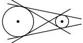
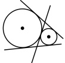
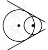
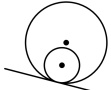
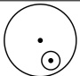
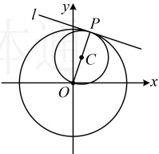

为什么呢？设两圆的交点分别为  $ A(x_1, y_1) $， $ B(x_2, y_2) $，则  $ A $， $ B $ 同时在圆  $ C_1 $ 和  $ C_2 $ 上，它们的坐标都满足①和②，自然也满足  $ (D_1 - D_2)x + (E_1 - E_2)y + (F_1 - F_2) = 0 $，两点定一线，所以上述方程就是公共弦  $ AB $ 所在直线的方程。

注：要使得相减后的方程表示直线，需先将 $ x^{2} $与 $ y^{2} $的系数调整一致再相减，否则相减后的方程含二次项.

## 知识点 3：两圆的公切线

两圆的公切线是指与两圆都相切的直线，公切线的条数由两圆的位置关系决定。

圆 $O$ 的圆心为原点，半径 $r_1 = \sqrt{10}$，

圆 $C$ 的方程可化为 $\left(x - \frac{1}{2}\right)^2 + \left(y - \frac{3}{2}\right)^2 = \frac{5}{2}$，

圆心为 $C\left(\frac{1}{2}, \frac{3}{2}\right)$，半径 $r_2 = \frac{\sqrt{10}}{2}$，

因为 $|OC| = \sqrt{\left(\frac{1}{2}\right)^2 + \left(\frac{3}{2}\right)^2} = \frac{\sqrt{10}}{2} = \left|r_1 - r_2\right|$，

所以两圆内切，故两圆只有 1 条公切线；

怎样求公切线的方程？如图，可发现公切线 $l$ 与圆心连线 $OC$ 垂直，且过两圆的切点 $P$，

故可通过求 $OC$ 的斜率得到 $l$ 的斜率，结合点 $P$ 写出 $l$ 的方程，

$k_{OC} = \frac{\frac{3}{2} - 0}{\frac{1}{2} - 0} = 3$，所以 $l$ 的斜率为 $-\frac{1}{3}$，

联立 $\begin{cases} x^2 + y^2 = 10 \\ x^2 + y^2 - x - 3y = 0 \end{cases}$ 解得：$\begin{cases} x = 1 \\ y = 3 \end{cases}$，

所以 $P(1,3)$，故两圆的公切线 $l$ 的方程为

$y - 3 = -\frac{1}{3}(x - 1)$，即 $x + 3y - 10 = 0$。

答案：1；$x + 3y - 10 = 0$

<table border=1 style='margin: auto; word-wrap: break-word;'><tr><td style='text-align: center; word-wrap: break-word;'>位置关系</td><td style='text-align: center; word-wrap: break-word;'>图示</td><td style='text-align: center; word-wrap: break-word;'>公切线条数</td></tr><tr><td style='text-align: center; word-wrap: break-word;'>外离</td><td style='text-align: center; word-wrap: break-word;'></td><td style='text-align: center; word-wrap: break-word;'>4</td></tr><tr><td style='text-align: center; word-wrap: break-word;'>外切</td><td style='text-align: center; word-wrap: break-word;'></td><td style='text-align: center; word-wrap: break-word;'>3</td></tr><tr><td style='text-align: center; word-wrap: break-word;'>相交</td><td style='text-align: center; word-wrap: break-word;'></td><td style='text-align: center; word-wrap: break-word;'>2</td></tr><tr><td style='text-align: center; word-wrap: break-word;'>内切</td><td style='text-align: center; word-wrap: break-word;'></td><td style='text-align: center; word-wrap: break-word;'>1</td></tr><tr><td style='text-align: center; word-wrap: break-word;'>内含</td><td style='text-align: center; word-wrap: break-word;'></td><td style='text-align: center; word-wrap: break-word;'>0</td></tr></table>

## 本节核心题型

本节的核心知识是圆与圆的位置关系，我们设计了类型Ⅰ来帮大家巩固判断圆与圆的位置关系这一基础知识，以及涉及一些简单的应用；另外，基于两圆位置关系还能衍生出一些常见的题型，例如公共弦长的计算及求公共弦所在直线的方程、公切线方程的计算、两圆上动点之间距离的最值问题等，为此我们分别设计了类型Ⅱ、Ⅲ、Ⅳ来为大家讲解每一类问题的处理方法，请大家跟着例题、解析、反思去学习吧。

类型 I：圆与圆的位置关系的判断与应用

【例4】已知圆 $ C_{1} $: $ x^{2}+y^{2}-4=0 $，圆 $ C_{2} $: $ x^{2}+y^{2}-4x+4y-8=0 $，则两圆的位置关系是（）

A. 外离 B. 外切 C. 相交 D. 内切