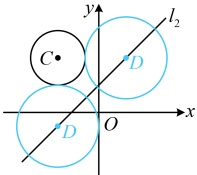
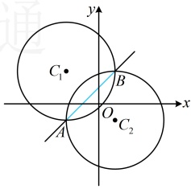

所以点 $C$ 到直线 $l_1$ 的距离 $d = \frac{|k \cdot (-3) - 4 + k|}{\sqrt{k^2 + (-1)^2}} = \frac{|2k + 4|}{\sqrt{k^2 + 1}}$，

因为直线  $ l_1 $ 与圆  $ C $ 相切，所以  $ d = r_1 $，故  $ \frac{|2k + 4|}{\sqrt{k^2 + 1}} = 2 $，解得： $ k = -\frac{3}{4} $，代入①化简得： $ 3x + 4y + 3 = 0 $；

综上所述，直线  $ l_1 $ 的方程为  $ x = -1 $ 或  $ 3x + 4y + 3 = 0 $。

（2）（如图，已有圆 $D$ 的半径，求其方程只差圆心，已知圆心 $D$ 在直线 $l_2$ 上，故可根据 $l_2$ 的方程将 $D$ 的坐标设为单变量形式，翻译圆 $C$ 与圆 $D$ 外切就能建立关于所设变量的方程）

由题意，直线 $l_2$ 的方程可化为 $y = x + 2$，点 $D$ 在 $l_2$ 上，所以可设

由题意，直线  $ l_2 $ 的方程可化为  $ y = x + 2 $，点  $ D $ 在  $ l_2 $ 上，所以可设点  $ D(a, a+2) $，则  $ |CD| = \sqrt{[a - (-3)]^2 + (a+2 - 4)^2} = \sqrt{2a^2 + 2a + 13} $，

因为圆  $ C $ 与圆  $ D $ 外切，且两圆的半径分别为  $ r_1 = 2 $， $ r_2 = 3 $，

所以  $ |CD| = r_1 + r_2 $，即  $ \sqrt{2a^2 + 2a + 13} = 2 + 3 $，解得： $ a = -3 $ 或 2，

所以圆心  $ D $ 的坐标为  $ (-3, -1) $ 或  $ (2, 4) $，

故圆  $ D $ 的方程为  $ (x+3)^2 + (y+1)^2 = 9 $ 或  $ (x-2)^2 + (y-4)^2 = 9 $。

## 类型Ⅱ：两圆的公共弦问题

【例 5】已知圆  $ C_1: x^2 + y^2 + 4x - 4y - 1 = 0 $ 与圆  $ C_2: x^2 + y^2 - 2x + 2y - 7 = 0 $ 相交于两点  $ A $,  $ B $, 则  $ AB $ 的直线方程为___,  $ |AB| = $ ___.

解析：求两相交圆的公共弦所在直线的方程，只需将两圆方程作差即可，

将两圆方程作差得： $ x^2 + y^2 + 4x - 4y - 1 - (x^2 + y^2 - 2x + 2y - 7) = 0 - 0 $，

整理得： $ x - y + 1 = 0 $，所以直线 AB 的方程为  $ x - y + 1 = 0 $，怎么求  $ \left| AB \right| $? 如图，

AB 可看成直线 AB 被圆  $ C_1 $（或  $ C_2 $）截得的弦，故可用公式  $ L = 2\sqrt{r^2 - d^2} $ 计算，

圆  $ C_1 $ 的方程可化为  $ (x + 2)^2 + (y - 2)^2 = 9 $，所以  $ C_1(-2, 2) $， $ r = 3 $，

点  $ C_1 $ 到直线 AB 的距离  $ d = \frac{\left| -2 - 2 + 1 \right|}{\sqrt{1^2 + (-1)^2}} = \frac{3\sqrt{2}}{2} $，

所以  $ \left| AB \right| = 2\sqrt{r^2 - d^2} = 2\sqrt{3^2 - \left( \frac{3\sqrt{2}}{2} \right)^2} = 3\sqrt{2} $。

答案： $ x - y + 1 = 0 $， $ 3\sqrt{2} $

【反思】求两相交圆的公共弦AB所在直线的方程，可直接对两圆的方程作差，消去 $ x^2 $和 $ y^2 $，所得结果即为直线AB的方程。而求公共弦长 $ |AB| $，则可按直线AB被两圆中的任何一个圆截得的弦长处理。若已知公共弦的长度，也可利用这种方法反解圆中的参数，我们来看下面的变式1。

【变式1】圆 $ C_{1} $: $ x^{2}+y^{2}=4 $与圆 $ C_{2} $: $ x^{2}+y^{2}-4x+4y=a $的公共弦长为 $ 2\sqrt{2} $，则a的值为（）

A. 12 或 4 B. 12 或 -4 C. 16 或 4 D. 16 或 -4

解析：题干给出公共弦长，先将两圆的方程作差，得到公共弦所在直线的方程，再按直线被圆截得的弦长处理，将圆  $ C_{1} $ 与圆  $ C_{2} $ 的方程作差可得  $ x^{2} + y^{2} - (x^{2} + y^{2} - 4x + 4y) = 4 - a $，整理得： $ 4x - 4y + a - 4 = 0 $ ①，由题意，圆  $ C_{1} $ 的圆心为  $ C_{1}(0,0) $，半径  $ r_{1} = 2 $，所以  $ C_{1} $ 到直线①的距离  $ d = \frac{|4 \times 0 - 4 \times 0 + a - 4|}{\sqrt{4^{2} + (-4)^{2}}} = \frac{|a - 4|}{4\sqrt{2}} $，故直线①被圆  $ C_{1} $ 截得的弦长  $ L = 2\sqrt{r_{1}^{2} - d^{2}} = 2\sqrt{2^{2} - \left(\frac{|a - 4|}{4\sqrt{2}}\right)^{2}} = 2\sqrt{4 - \frac{(a - 4)^{2}}{32}} $，