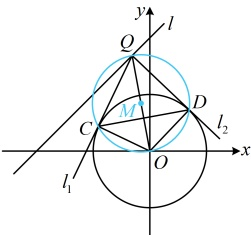

由题意， $ L = 2\sqrt{2} $，所以 $ 2\sqrt{4 - \frac{(a-4)^2}{32}} = 2\sqrt{2} $，解得： $ a = 12 $或-4，此时结合选项已可得出选B，但请注意到此求得的 $ a $不一定能使 $ C_2 $的方程表示圆，也不一定满足 $ C_1 $与 $ C_2 $相交，故还需检验这两点，当 $ a = 12 $时， $ C_2 $的方程可化为 $ (x - 2)^2 + (y + 2)^2 = 20 $， $ C_2 $表示圆，且圆心为 $ C_2(2, -2) $，半径 $ r_2 = 2\sqrt{5} $，此时 $ \left|C_1 C_2\right| = \sqrt{(2 - 0)^2 + (-2 - 0)^2} = 2\sqrt{2} $， $ \left|r_1 - r_2\right| = 2\sqrt{5} - 2 $， $ r_1 + r_2 = 2\sqrt{5} + 2 $，所以 $ \left|r_1 - r_2\right| < \left|C_1 C_2\right| < r_1 + r_2 $，满足圆 $ C_1 $与 $ C_2 $相交；当 $ a = -4 $时， $ C_2 $的方程可化为 $ (x - 2)^2 + (y + 2)^2 = 4 $， $ C_2 $表示圆，且圆心为 $ C_2(2, -2) $，半径 $ r_2 = 2 $，此时 $ \left|C_1 C_2\right| = \sqrt{(2 - 0)^2 + (-2 - 0)^2} = 2\sqrt{2} $， $ \left|r_1 - r_2\right| = 0 $， $ r_1 + r_2 = 4 $，所以 $ \left|r_1 - r_2\right| < \left|C_1 C_2\right| < r_1 + r_2 $，满足圆 $ C_1 $与 $ C_2 $相交；综上所述， $ a $的值为12或-4。

答案：B

【变式 2】已知点  $ O(0,0) $， $ A(1,0) $， $ B(4,0) $，动点  $ P $ 满足  $ |PB| = 2|PA| $，记动点  $ P $ 的轨迹为曲线  $ \Gamma $。

（1）求曲线  $ \Gamma $ 的轨迹方程；

（2）已知动点  $ Q $ 在直线  $ l: y = x + 4 $ 上，过点  $ Q $ 作曲线  $ \Gamma $ 的两条切线  $ l_1 $， $ l_2 $ 分别切于  $ C $， $ D $ 两点，证明：直线  $ CD $ 经过定点，并求出定点坐标。

解：（1）（已知条件涉及$|PA|$和$|PB|$，它们容易用$P$的坐标计算，故直接设$P$的坐标，翻译已知条件建立方程）

设$P(x,y)$，则$|PA|=\sqrt{(x-1)^2+y^2}$，$|PB|=\sqrt{(x-4)^2+y^2}$，由题意，$|PB|=2|PA|$，

所以$\sqrt{(x-4)^2+y^2}=2\sqrt{(x-1)^2+y^2}$，整理得：$x^2+y^2=4$，故曲线$\Gamma$的轨迹方程为$x^2+y^2=4$。

（2）（要找直线 CD 所过的定点，需先写出其方程，怎么写？若无思路，不妨画图来看看. 如图， $ l_{1} $， $ l_{2} $ 均与曲线  $ \Gamma $ 相切，所以  $ OC \perp l_{1} $， $ OD \perp l_{2} $，故 C，D 都在以  $ OQ $ 为直径的圆上，而直线  $ CD $ 恰好为该圆与曲线  $ \Gamma $ 的公共弦所在直线，故可按两圆公共弦所在直线的求法来求直线  $ CD $ 的方程）

因为  $ l_{1} $， $ l_{2} $ 与曲线  $ \Gamma $ 相切于 C，D 两点，所以  $ \angle OCQ = \angle ODQ = 90^\circ $，故 C，D 都在以  $ OQ $ 为直径的圆上，

由题意，可设  $ Q(a, a+4) $，则  $ OQ $ 中点为  $ M\left(\frac{a}{2}, \frac{a+4}{2}\right) $， $ |OM| = \sqrt{\left(\frac{a}{2}\right)^2 + \left(\frac{a+4}{2}\right)^2} $，

以  $ OQ $ 为直径的圆的标准方程为  $ \left(x - \frac{a}{2}\right)^2 + \left(y - \frac{a+4}{2}\right)^2 = \left(\frac{a}{2}\right)^2 + \left(\frac{a+4}{2}\right)^2 $，

即  $ x^2 + y^2 - ax - (a+4)y = 0 $，将其与曲线  $ \Gamma $ 的方程作差得

 $ x^2 + y^2 - ax - (a+4)y - (x^2 + y^2) = 0 - 4 $，化简得： $ ax + (a+4)y - 4 = 0 $ ①，

由图可知  $ CD $ 是圆  $ M $ 与曲线  $ \Gamma $ 的公共弦，所以式①即为直线  $ CD $ 的方程，

该方程可化为  $ a(x+y) + 4(y-1) = 0 $，令  $ \begin{cases} x + y = 0 \\ 4(y-1) = 0 \end{cases} $，解得： $ \begin{cases} x = -1 \\ y = 1 \end{cases} $，

所以直线  $ CD $ 经过定点  $ (-1, 1) $

所以直线 CD 经过定点  $ (-1,1) $.

【反思】本题第2问核心是求切点弦所在直线的方程，这一问题的结论在上一节已经提及，这里我们通过解答题的形式给出了该结论的证明方法.

## 类型III：求两圆的公切线方程

【例 6】已知圆  $ O: x^2 + y^2 = 1 $，圆  $ C: (x-3)^2 + y^2 = 4 $，则圆  $ O $ 与圆  $ C $ 的公切线方程为___。（写出一条即可）

解法1：注意到两圆的圆心都在x轴上，图形特征比较清晰，可考虑画图分析几何关系，